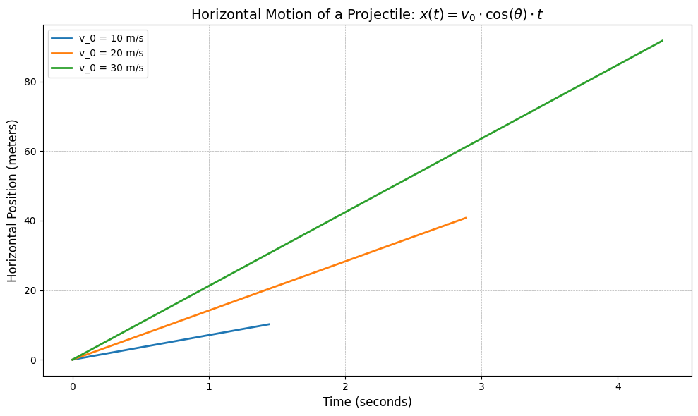
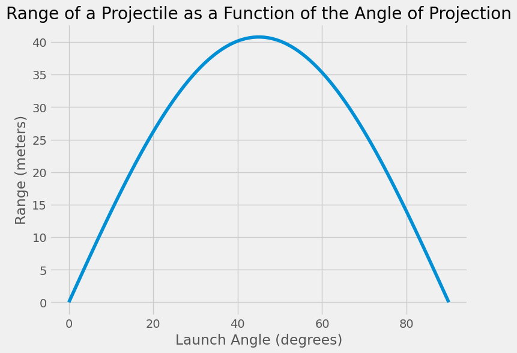

# Problem 1
# Investigating the Range as a Function of the Angle of Projection

## Introduction

Projectile motion is a cornerstone of classical mechanics, describing the path of an object under the influence of gravity. This motion occurs in numerous real-world scenarios, such as sports (e.g., throwing a ball), engineering (e.g., rocket trajectories), and astrophysics (e.g., launching satellites). The task here is to investigate how the horizontal range of a projectile varies with the launch angle, a question that has both theoretical significance and practical implications. 

This analysis is intriguing because it combines simple principles with complex outcomes. The motion of a projectile is governed by both linear and quadratic relationships, making it a versatile topic for exploration. By examining how different initial conditions—such as the initial velocity, gravitational acceleration, and launch height—affect the trajectory, we can develop deeper insights into both idealized and real-world scenarios.

## Motivation

Understanding the range of a projectile as a function of the launch angle is of great importance in a variety of fields. In sports, optimizing the angle of projection can improve performance, such as in basketball, soccer, or golf, where the goal is to reach a target with maximum efficiency. Engineers apply the principles of projectile motion to the design of vehicles such as rockets and missiles, where precise calculations of the launch angle and velocity are crucial for accurate targeting and range estimation.

In addition, this problem serves as an entry point to explore more complex systems, such as the effects of air resistance or uneven terrain on projectile trajectories. By building on this simple model, we can gain a better understanding of how real-world forces and conditions influence the behavior of projectiles. Thus, while the problem might appear straightforward, it offers an opportunity to delve into the complexities of motion in a way that has both practical and theoretical value.

## Theoretical Foundation

### 1. Governing Equations of Motion

The motion of a projectile in the absence of air resistance is governed by Newton's laws of motion. To simplify the analysis, we divide the motion into horizontal and vertical components.
 
- **Horizontal Motion**:
  \[
  x(t) = v_0 \cdot \cos(\theta) \cdot t
  \]
  Where:
  - \(x(t)\) is the horizontal position at time \(t\),
  - \(v_0\) is the initial velocity,
  - \(\theta\) is the launch angle,
  - \(t\) is the time elapsed.

  Since there is no acceleration in the horizontal direction (assuming no air resistance), the horizontal velocity remains constant.

 

  
Show Python Code

  <pre><code>
  import numpy as np
  import matplotlib.pyplot as plt

  # Parameters for the plot
  v_0_values = [10, 20, 30]  # Different initial velocities
  theta = 45  # Launch angle in degrees
  g = 9.81  # Acceleration due to gravity (m/s^2)

  # Create a figure
  plt.figure(figsize=(10, 6))

  # Loop over different initial velocities to plot horizontal motion for each case
  for v_0 in v_0_values:
      t_max = 2 * v_0 * np.sin(np.radians(theta)) / g  # Total time of flight
      t = np.linspace(0, t_max, 1000)  # Time values from 0 to t_max
      x_t = v_0 * np.cos(np.radians(theta)) * t  # Horizontal position equation

      # Plot the horizontal motion for each initial velocity
      plt.plot(t, x_t, label=f'v_0 = {v_0} m/s', linewidth=2)

  # Add labels, title, and grid
  plt.title(r'Horizontal Motion of a Projectile: $x(t) = v_0 \cdot \cos(\theta) \cdot t$', fontsize=14)
  plt.xlabel('Time (seconds)', fontsize=12)
  plt.ylabel('Horizontal Position (meters)', fontsize=12)
  plt.legend(loc='upper left', fontsize=10)
  plt.grid(True, which='both', linestyle='--', linewidth=0.5)

  # Use a default style for better compatibility
  plt.style.use('ggplot')

  # Show the plot
  plt.tight_layout()
  plt.show()
  </code></pre>

This graph shows how horizontal motion changes over time. The **horizontal motion equation** \( x(t) = v_0 \cdot \cos(\theta) \cdot t \) is used to describe it. Here, horizontal distance increases linearly with time \( t \). The graph illustrates how the horizontal distances of projectiles with different initial velocities (10 m/s, 20 m/s, 30 m/s) change over time.

- **Vertical Motion**:  
  \[
  y(t) = v_0 \cdot \sin(\theta) \cdot t - \frac{1}{2} g t^2
  \]

  Where:
  - \( y(t) \) is the **vertical position** at time \( t \),
  - \( v_0 \cdot \sin(\theta) \) is the **vertical component** of the initial velocity,
  - \( g \) is the **gravitational acceleration** (\( \approx 9.81 \, \text{m/s}^2 \) on Earth),
  - \( t \) is the **time elapsed**.
 

The projectile reaches the maximum height when the vertical velocity component becomes zero. From this point, it starts descending until it reaches the ground. The total time of flight can be found by solving the vertical motion equation for when \( y(t) = 0 \).

Show Python Code

<pre><code>
import numpy as np
import matplotlib.pyplot as plt

# Parameters for the plot
v_0 = 20  # Initial velocity in m/s
theta = 45  # Launch angle in degrees
g = 9.81  # Acceleration due to gravity (m/s^2)

# Total time of flight (when y(t) = 0)
t_max = 2 * v_0 * np.sin(np.radians(theta)) / g  # Total time for vertical motion

# Time values from 0 to t_max
t = np.linspace(0, t_max, 1000)

# Vertical position equation: y(t) = v_0 * sin(θ) * t - (1/2) * g * t^2
y_t = v_0 * np.sin(np.radians(theta)) * t - 0.5 * g * t**2

# Create a figure with a clean and modern style
plt.figure(figsize=(10, 6))

# Plot the vertical motion with a clean, minimalistic style
plt.plot(t, y_t, label=r'$y(t) = v_0 \cdot \sin(\theta) \cdot t - \frac{1}{2} g t^2$', color='teal', linewidth=2)

# Highlight the maximum height (where the vertical velocity becomes zero)
t_max_height = v_0 * np.sin(np.radians(theta)) / g
y_max_height = v_0 * np.sin(np.radians(theta)) * t_max_height - 0.5 * g * t_max_height**2

# Use a bold marker for the maximum height
plt.plot(t_max_height, y_max_height, 'o', markersize=10, color='coral')

# Adjusting annotation position for better readability
plt.annotate(f'Max Height: {y_max_height:.2f} m', 
             xy=(t_max_height, y_max_height), 
             xytext=(t_max_height + 0.5, y_max_height + 2),  # Slightly moved up and right
             arrowprops=dict(arrowstyle='->', color='black'),
             fontsize=12, color='black')

# Clean, minimalistic title and labels
plt.title('Vertical Motion of a Projectile', fontsize=16, fontweight='bold', color='darkblue')
plt.xlabel('Time (seconds)', fontsize=12, color='black')
plt.ylabel('Vertical Position (meters)', fontsize=12, color='black')

# Minimalist grid
plt.grid(True, which='both', linestyle='-', linewidth=0.5, color='gray')

# Remove box around the legend
plt.legend(loc='upper right', fontsize=12, frameon=False)

# Tight layout for a cleaner look
plt.tight_layout()

# Show the plot
plt.show()
</code></pre>

This graph shows the **vertical motion** of a projectile. The red point marks the **maximum height** of approximately **10.19 meters**.

### 2. Time of Flight and Range

To determine the time of flight, we set \( y(t) = 0 \), which corresponds to the point when the projectile hits the ground. Solving for \( t \) gives:

\[
t_{\text{total}} = \frac{2 v_0 \cdot \sin(\theta)}{g}
\]

This is the total time the projectile spends in the air. The range \( R \), or the horizontal distance traveled, is then given by:

\[
R = v_0 \cdot \cos(\theta) \cdot t_{\text{total}} = \frac{v_0^2 \cdot \sin(2\theta)}{g}
\]

Thus, the range \( R \) depends on the initial velocity \( v_0 \), the gravitational acceleration \( g \), and the launch angle \( \theta \).

### Example Problem: Projectile Motion

A ball is projected with an initial speed of **20 m/s** at an angle of **30°** above the horizontal.  
Assume there is no air resistance and take the acceleration due to gravity as **9.81 m/s²**.

**Questions:**

1. What is the **total time** the ball stays in the air?
2. How **far horizontally** does the ball travel before hitting the ground?
3. What is the **maximum height** the ball reaches?

---

### Solution:

Given:
- \( v_0 = 20 \, \text{m/s} \)
- \( \theta = 30^\circ \)
- \( g = 9.81 \, \text{m/s}^2 \)

We use the following formulas:

1. **Time of Flight**:
\[
t_{\text{total}} = \frac{2 v_0 \cdot \sin(\theta)}{g} 
\]
\[
t_{\text{total}} = \frac{2 \cdot 20 \cdot \sin(30^\circ)}{9.81} = \frac{20}{9.81} \approx \boxed{2.04 \, \text{seconds}}
\]

2. **Range (Horizontal Distance)**:
\[
R = \frac{v_0^2 \cdot \sin(2\theta)}{g}
\]
\[
R = \frac{400 \cdot \sin(60^\circ)}{9.81} = \frac{400 \cdot 0.866}{9.81} \approx \frac{346.4}{9.81} \approx \boxed{35.3 \, \text{meters}}
\]

3. **Maximum Height**:
\[
H_{\text{max}} = \frac{v_0^2 \cdot \sin^2(\theta)}{2g}
\]
\[
H_{\text{max}} = \frac{400 \cdot \sin^2(30^\circ)}{2 \cdot 9.81} = \frac{400 \cdot 0.25}{19.62} = \frac{100}{19.62} \approx \boxed{5.1 \, \text{meters}}
\]

###  Final Answers:
- **Time of Flight:** 2.04 s  
- **Range:** 35.3 m  
- **Maximum Height:** 5.1 m

### 3. Analysis of the Range as a Function of the Angle of Projection

The range equation \( R = \frac{v_0^2 \cdot \sin(2\theta)}{g} \) shows that the range is a function of the angle \( \theta \). Specifically:

- The function \( \sin(2\theta) \) is maximized when \( 2\theta = 90^\circ \), which corresponds to \( \theta = 45^\circ \). Therefore, the range is maximized when the launch angle is \( 45^\circ \).
- If the angle is less than or greater than 45°, the range decreases.
- This means that, for a given initial velocity, the optimal launch angle for maximizing the range is 45°.

However, the behavior of the range is also influenced by other factors, such as the initial velocity \( v_0 \) and the acceleration due to gravity \( g \). For example, increasing the initial velocity \( v_0 \) will increase the range, while increasing \( g \) (such as on a planet with stronger gravity) will reduce the range.
##  Analysis of the Range as a Function of the Angle of Projection

The range equation:

\[
R = \frac{v_0^2 \cdot \sin(2\theta)}{g}
\]

shows that the range is a function of the launch angle \( \theta \). This equation tells us several important things:

- The function \( \sin(2\theta) \) reaches its maximum value when \( 2\theta = 90^\circ \), or \( \theta = 45^\circ \).
- Therefore, the **maximum range** occurs when the projectile is launched at a **45°** angle.
- If the angle is **less than or greater than 45°**, the range decreases.

---

###  Range vs. Launch Angle

The plot below shows how the range changes with the angle of projection (assuming \( v_0 = 20 \, \text{m/s} \)):

Show Python Code

<pre><code>
import numpy as np
import matplotlib.pyplot as plt

v0 = 20  # m/s
g = 9.81  # m/s^2

angles_deg = np.linspace(0, 90, 500)
angles_rad = np.radians(angles_deg)
R = (v0**2) * np.sin(2 * angles_rad) / g

plt.figure(figsize=(10, 5))
plt.plot(angles_deg, R, color='orange')
plt.title('Range vs. Launch Angle')
plt.xlabel('Launch Angle (degrees)')
plt.ylabel('Range (meters)')
plt.grid(True)
plt.tight_layout()
plt.savefig("image-7.png", dpi=300)
plt.show()
</code></pre>

- The graph is symmetric about **45°**.
- Launch angles like **30°** and **60°** produce the **same range**.

---

### Why are 30° and 60° the same?

This is because:

\[
\sin(2 \cdot 30^\circ) = \sin(60^\circ) = \sin(120^\circ) = \sin(2 \cdot 60^\circ)
\]

So for any two angles that add up to **90°**, the range will be the same.

---

###  Real-World Considerations

- Increasing the **initial velocity** \( v_0 \) will increase the range.
- Increasing **gravitational acceleration** \( g \) (e.g., on Jupiter) will **decrease** the range.
- On the **Moon**, where \( g \approx 1.62 \, \text{m/s}^2 \), the same launch parameters would yield a **much longer range**.

---

### Think About It

> What would happen if **air resistance** were considered?  
> Would **45° still be the optimal angle** for maximum range?

## Practical Applications

### 1. Real-World Adaptations

In real-world applications, projectile motion is not always idealized. For instance:

- **Uneven Terrain**: If a projectile is launched from a height or lands on uneven terrain, the equations above need to be adjusted to account for changes in the initial position and the varying height of the landing spot.
- **Air Resistance**: The presence of air resistance complicates the analysis, as it introduces a force that opposes the motion of the projectile, affecting both the horizontal and vertical components of the velocity. This effect is typically modeled by differential equations, but a simple analytic solution is not available. Numerical methods are often used to simulate these cases.
- **Wind**: Wind can alter the direction and speed of the projectile, affecting both range and trajectory. This factor can be modeled as an additional force applied to the projectile, changing the equations of motion.

### 2. Computational Simulations

A computational tool or simulation can be developed to model projectile motion, allowing for easy visualization of the range as a function of the angle of projection for various initial velocities and gravitational accelerations.

Below is a simple Python code to simulate and plot the range as a function of the angle of projection for various initial velocities:

Show Python Code

<pre><code>
import numpy as np
import matplotlib.pyplot as plt

# Parameters
g = 9.81  # acceleration due to gravity (m/s^2)
v_0 = 20  # initial velocity in m/s

# Function to calculate the range
def calculate_range(v_0, theta):
    return (v_0**2 * np.sin(2 * np.radians(theta))) / g

# Angles of projection
angles = np.linspace(0, 90, 100)

# Calculate range for each angle
ranges = [calculate_range(v_0, angle) for angle in angles]

# Plot the range vs angle
plt.figure(figsize=(8, 6))
plt.plot(angles, ranges)
plt.title('Range of a Projectile as a Function of the Angle of Projection')
plt.xlabel('Launch Angle (degrees)')
plt.ylabel('Range (meters)')
plt.grid(True)
plt.show()
</code></pre>

## Conclusion

In this analysis, we explored the fundamental equations governing projectile motion and derived the relationship between the range and the launch angle. We found that the range is maximized at an angle of 45°, which is intuitive from both a theoretical and practical standpoint. By considering other factors like initial velocity and gravitational acceleration, we can predict how these variables influence the trajectory of a projectile.

The idealized model of projectile motion provides a solid foundation for understanding the basic principles at play. However, real-world applications often require additional considerations, such as air resistance and uneven terrain. As a result, more sophisticated models and computational simulations are necessary for accurately predicting the behavior of projectiles in more complex environments.

This investigation not only deepens our understanding of basic mechanics but also highlights the versatility and applicability of projectile motion in various domains, from sports and engineering to space exploration.
