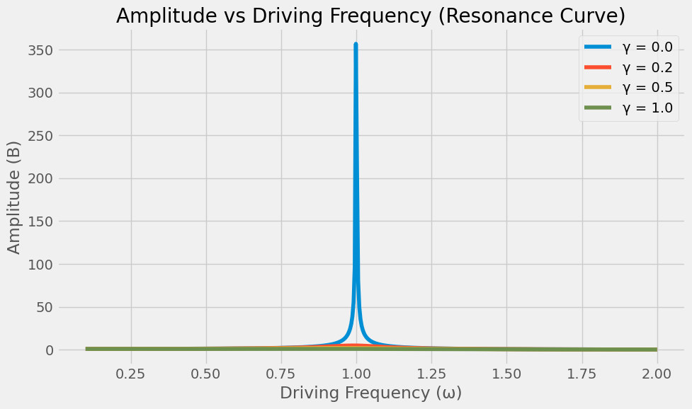
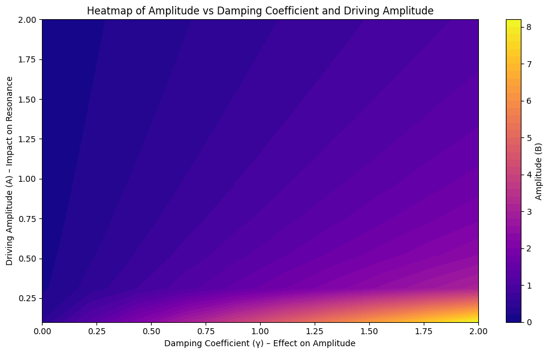
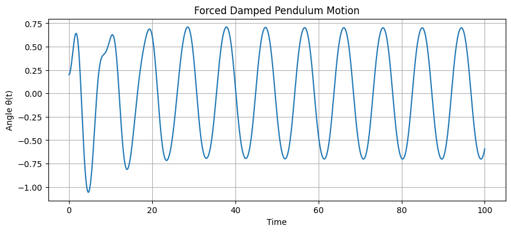
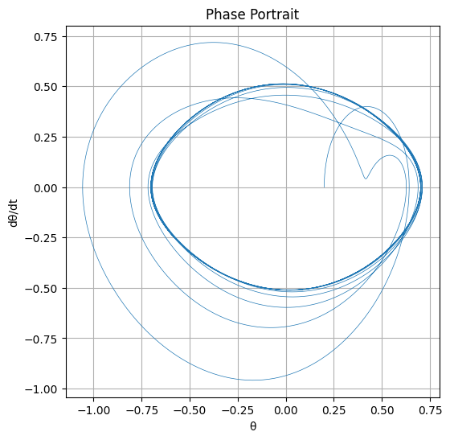
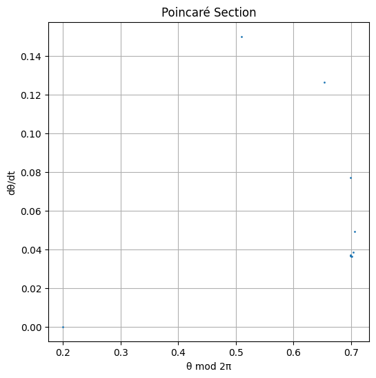

# Problem 2
# Investigating the Dynamics of a Forced Damped Pendulum

## 1. Theoretical Foundation

### Governing Equation

The motion of a forced damped pendulum is governed by the following nonlinear second-order differential equation:

\[
\frac{d^2\theta}{dt^2} + \gamma \frac{d\theta}{dt} + \omega_0^2 \sin(\theta) = A \cos(\omega t)
\]

Where:
- \(\theta(t)\) is the angular displacement,
- \(\gamma\) is the damping coefficient,
- \(\omega_0 = \sqrt{\frac{g}{l}}\) is the natural frequency of the pendulum,
- \(A\) is the amplitude of the external driving force,
- \(\omega\) is the angular frequency of the external force.

---

### Small-Angle Approximation

For small angles \(\theta \ll 1\), we can approximate \(\sin(\theta) \approx \theta\). The equation becomes linear:

\[
\frac{d^2\theta}{dt^2} + \gamma \frac{d\theta}{dt} + \omega_0^2 \theta = A \cos(\omega t)
\]

This is the equation of a **driven damped harmonic oscillator**.

For small angles (\(\theta \ll 1\)), we can approximate \(\sin(\theta) \approx \theta\), which simplifies the nonlinear equation into a linear one:

\[
\frac{d^2\theta}{dt^2} + \gamma \frac{d\theta}{dt} + \omega_0^2 \theta = A \cos(\omega t)
\]

This is the differential equation of a **driven damped harmonic oscillator**.

This approximation significantly simplifies the analysis of the system, allowing us to use linear system techniques. It is valid when the pendulum undergoes small oscillations. Under this condition, the system's response becomes periodic, and important characteristics such as amplitude, frequency, and phase shift can be computed analytically.

Moreover, this model is not only applicable to mechanical pendulums but also widely used to describe analogous systems in other fields, such as AC electrical circuits, vibrating structural elements, and biomechanical oscillations. 

Now that the equation has been linearized under the small-angle approximation, we can proceed to solve it analytically using classical methods for linear differential equations.

### Solution Method (for Small-Angle Approximation)

Once the equation is linearized under the small-angle assumption, we obtain:

\[
\frac{d^2\theta}{dt^2} + \gamma \frac{d\theta}{dt} + \omega_0^2 \theta = A \cos(\omega t)
\]

This second-order linear nonhomogeneous differential equation is typically solved by breaking the solution into two parts:

\[
\theta(t) = \theta_h(t) + \theta_p(t)
\]

- \(\theta_h(t)\): The homogeneous solution (natural response, dependent on initial conditions)
- \(\theta_p(t)\): The particular solution (steady-state response due to the driving force)

---

#### Homogeneous Solution

The homogeneous equation is:

\[
\frac{d^2\theta}{dt^
This equation describes the behavior of a **damped harmonic oscillator**. Its general solution is given by:

\[
\theta_h(t) = e^{-\frac{\gamma t}{2}} \left(C_1 \cos(\omega_d t) + C_2 \sin(\omega_d t)\right)
\]

Here, \(\omega_d\) is the **damped natural frequency**, defined as:

\[
\omega_d = \sqrt{\omega_0^2 - \left(\frac{\gamma}{2}\right)^2}
\]

This solution represents the **transient behavior** of the system, which decays over time depending on the initial conditions.

It reflects the natural response of the system, determined solely by the initial state. Due to the damping term, the oscillations gradually decrease in amplitude, indicating that the system loses energy over time.

Depending on the value of the damping coefficient \(\gamma\), different types of motion can be observed:

- **Underdamped** (\(\gamma < 2\omega_0\)): Oscillatory motion persists but with decreasing amplitude.
- **Critically damped** (\(\gamma = 2\omega_0\)): The system returns to equilibrium in the shortest time without oscillating.
- **Overdamped** (\(\gamma > 2\omega_0\)): The system slowly returns to equilibrium without oscillations.

These three regimes have important implications for the system's stability and energy dissipation.

---

### Approximate Solution

We solve the linearized ODE using a trial solution:

\[
\theta(t) = \theta_h(t) + \theta_p(t)
\]

Where:
- \(\theta_h(t)\) is the homogeneous solution (damped free oscillation),
- \(\theta_p(t)\) is the particular solution (steady-state response to the driving force).

The steady-state (particular) solution is:

\[
\theta_p(t) = B \cos(\omega t - \delta)
\]

With amplitude:

\[
B = \frac{A}{\sqrt{(\omega_0^2 - \omega^2)^2 + \gamma^2 \omega^2}}
\]

And phase lag:

\[
\tan(\delta) = \frac{\gamma \omega}{\omega_0^2 - \omega^2}
\]
This particular solution represents the **steady-state response** of the system under the influence of a periodic external force. Unlike the homogeneous (transient) solution, which decays over time due to damping, the particular solution persists and oscillates at the same frequency as the driving force.

The amplitude \(B\) depends on the damping coefficient \(\gamma\), the driving frequency \(\omega\), and the natural frequency \(\omega_0\). Therefore, the system’s response changes significantly depending on how close \(\omega\) is to \(\omega_0\).

---
### Resonance

Resonance occurs when the system absorbs energy most efficiently from the driving force:

- **Underdamped resonance frequency**:

\[
\omega_r = \sqrt{\omega_0^2 - \frac{\gamma^2}{2}}
\]

At resonance, the amplitude \(B\) is maximized, and the energy stored in the system oscillates at large values.

---
### Resonance Behavior

When the driving frequency \(\omega\) approaches the system's natural frequency \(\omega_0\), the amplitude reaches its maximum value. This phenomenon is known as **resonance**.

From the amplitude expression:

\[
B = \frac{A}{\sqrt{(\omega_0^2 - \omega^2)^2 + \gamma^2 \omega^2}}
\]

it is clear that the denominator becomes minimal when \(\omega \approx \omega_0\), especially for small \(\gamma\), resulting in a large amplitude.

In the presence of damping, the resonance frequency shifts slightly lower than \(\omega_0\), and is given by:

\[
\omega_r = \sqrt{\omega_0^2 - \frac{\gamma^2}{2}}
\]

At this frequency, the system resonates with the external force and absorbs energy most efficiently. As damping increases, the peak amplitude decreases, and the resonance curve becomes broader and flatter.

Show Python Code

<pre><code>
import numpy as np
import matplotlib.pyplot as plt

# System parameters
omega_0 = 1.0      # Natural frequency
A = 1.0            # Amplitude of the external force

# Different damping coefficients
gammas = [0.0, 0.2, 0.5, 1.0]  # From undamped to highly damped

# Frequency range
omega = np.linspace(0.1, 2.0, 500)

# Plot
plt.figure(figsize=(10, 6))

for gamma in gammas:
    B = A / np.sqrt((omega_0**2 - omega**2)**2 + (gamma**2) * omega**2)
    label = f"γ = {gamma}"
    plt.plot(omega, B, label=label)

plt.title("Amplitude vs Driving Frequency (Resonance Curve)")
plt.xlabel("Driving Frequency (ω)")
plt.ylabel("Amplitude (B)")
plt.legend()
plt.grid(True)
plt.tight_layout()
plt.show()
</code></pre>

### Resonance Curve

The plot shows the amplitude (\(B\)) of the system's steady-state response as a function of the driving frequency (\(\omega\)) for different damping coefficients (\(\gamma\)).

- **Blue (γ = 0.0):** No damping, sharp resonance peak.
- **Orange (γ = 0.2):** Light damping, resonance peak reduces.
- **Yellow (γ = 0.5):** Moderate damping, broader resonance.
- **Green (γ = 1.0):** High damping, minimal resonance effect.

---
## 2. Analysis of Dynamics

### Parameter Influence

- **Damping \(\gamma\)**: Higher damping suppresses oscillations and reduces the resonance peak.
- **Driving amplitude \(A\)**: Larger amplitude can lead to more energy in the system and chaotic behavior in the nonlinear regime.
- **Driving frequency \(\omega\)**: Resonance and dynamic behavior depend critically on matching \(\omega\) with \(\omega_0\).

Show Python Code

<pre><code>
import numpy as np
import matplotlib.pyplot as plt

# System parameters
omega_0 = 1.0  # Natural frequency
A_values = np.linspace(0.1, 2.0, 10)  # Driving amplitude
gamma_values = np.linspace(0.0, 2.0, 10)  # Damping coefficient
omega = np.linspace(0.1, 2.0, 500)  # Frequency range

# Create a meshgrid for plotting
A_grid, gamma_grid = np.meshgrid(A_values, gamma_values)

# Calculate amplitude (B)
B_grid = np.zeros_like(A_grid)

# Calculate for all omega values
for i in range(len(A_values)):
    for j in range(len(gamma_values)):
        B = A_values[i] / np.sqrt((omega_0**2 - omega**2)**2 + (gamma_values[j]**2) * omega**2)
        # Take the mean amplitude
        B_grid[i, j] = np.mean(B)

# Plot heatmap
plt.figure(figsize=(10, 6))

# Update color palette and levels
plt.contourf(gamma_grid, A_grid, B_grid, levels=50, cmap='plasma')
plt.colorbar(label='Amplitude (B)')

plt.title('Heatmap of Amplitude vs Damping Coefficient and Driving Amplitude')
plt.xlabel('Damping Coefficient (γ) – Effect on Amplitude')
plt.ylabel('Driving Amplitude (A) – Impact on Resonance')
plt.tight_layout()
plt.show()
</code></pre>

This heatmap shows how the system's amplitude (\(B\)) changes with the **damping coefficient (\(\gamma\))** and **driving amplitude (\(A\))**. Darker colors represent lower amplitudes, while lighter colors indicate higher amplitudes.

---

### From Regular to Chaotic Motion

In the nonlinear regime (\(\sin(\theta)\) not approximated), the pendulum exhibits:

- **Periodic motion**: For small \(A\) and \(\gamma\).
- **Quasiperiodic motion**: Motion composed of multiple frequencies.
- **Chaotic motion**: Sensitive dependence on initial conditions; non-repeating trajectory.
### Differences Between Periodic and Chaotic Motion

#### **Periodic Motion**:
Periodic motion is a type of motion where the system moves in a regular and repeating manner. When the initial conditions are the same, the motion repeats in the same way each time.

**Example**: Spring system or a pendulum swinging with small angles.

#### **Chaotic Motion**:
Chaotic motion is sensitive to initial conditions and is unpredictable. Small changes can lead to large differences, making the motion irregular.

**Example**: Weather patterns and the double pendulum.

---

### **Quasiperiodic Motion**
Quasiperiodic motion consists of a combination of multiple frequencies. The system exhibits regular motion but creates a complex pattern due to the influence of multiple frequencies.

**Example**: Vibrating guitar strings and rotating fluids.

---

## 3. Practical Applications

### Real-World Relevance

- **Energy harvesting**: Using resonance in oscillators to extract ambient energy.
- **Suspension bridges**: Analyzing dynamic load responses (e.g., Tacoma Narrows Bridge).
- **RLC circuits**: Analogous system with voltage in place of angular displacement.
- **Biomechanics**: Human walking rhythm can exhibit similar synchronization effects.

---

## 4. Implementation (Python Simulation)

Show Python Code

<pre><code>
import numpy as np
import matplotlib.pyplot as plt
from scipy.integrate import solve_ivp

# Parameters
gamma = 0.2        # damping
omega0 = 1.5       # natural frequency
A = 1.2            # driving amplitude
omega = 2/3        # driving frequency

# ODE system: dtheta/dt = omega, domega/dt = ...
def pendulum(t, y):
    theta, omega_dot = y
    dtheta_dt = omega_dot
    domega_dt = -gamma * omega_dot - omega0**2 * np.sin(theta) + A * np.cos(omega * t)
    return [dtheta_dt, domega_dt]

# Time range
t_span = (0, 100)
t_eval = np.linspace(*t_span, 10000)

# Initial conditions
y0 = [0.2, 0.0]  # initial angle, initial angular velocity

# Solve ODE
sol = solve_ivp(pendulum, t_span, y0, t_eval=t_eval)

# Plotting
plt.figure(figsize=(10, 4))
plt.plot(sol.t, sol.y[0])
plt.title("Forced Damped Pendulum Motion")
plt.xlabel("Time")
plt.ylabel("Angle θ(t)")
plt.grid()
plt.show()
</code></pre>

---

### Phase Diagram

Show Python Code

<pre><code>
plt.figure(figsize=(6, 6))
plt.plot(sol.y[0], sol.y[1], lw=0.5)
plt.title("Phase Portrait")
plt.xlabel("θ")
plt.ylabel("dθ/dt")
plt.grid()
plt.show()
</code></pre>

---

### Poincaré Section

Show Python Code

<pre><code>
# Sample once per driving period
T_drive = 2 * np.pi / omega
points = np.arange(0, t_span[1], T_drive)
theta_sampled = np.interp(points, sol.t, sol.y[0])
omega_sampled = np.interp(points, sol.t, sol.y[1])

plt.figure(figsize=(6, 6))
plt.plot(theta_sampled % (2 * np.pi), omega_sampled, 'o', markersize=1)
plt.title("Poincaré Section")
plt.xlabel("θ mod 2π")
plt.ylabel("dθ/dt")
plt.grid()
plt.show()
</code></pre>

---

## 5. Extensions and Limitations

### Limitations
- Small-angle approximation fails for large oscillations.
- Real systems might involve nonlinear damping or non-periodic forces.
- Numerical instability for very stiff systems or long-time integration.

### Possible Extensions
- Introduce nonlinear damping: \( \propto (\frac{d\theta}{dt})^3 \)
- Replace periodic force with stochastic or pulse-driven input.
- Investigate coupling multiple pendula for synchronization studies.

---

## 6. Conclusion

The forced damped pendulum is a foundational model that demonstrates transitions from order to chaos, governed by tunable parameters. It serves as a rich testing ground for both analytical techniques and computational simulations and has real-world relevance in many domains of science and engineering.

