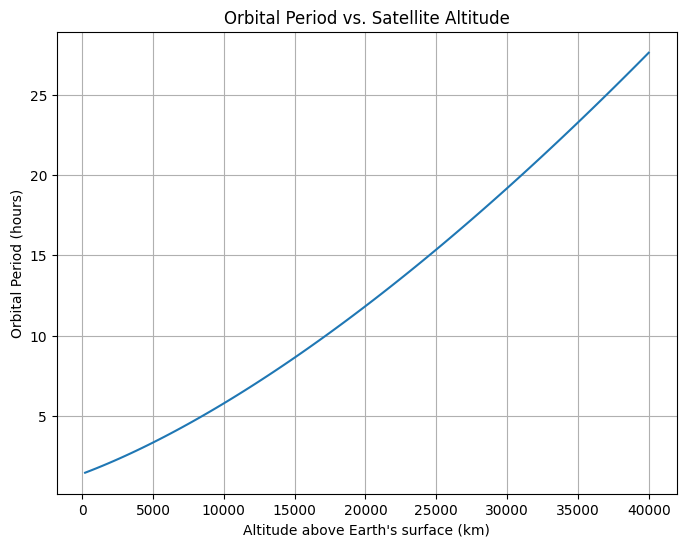
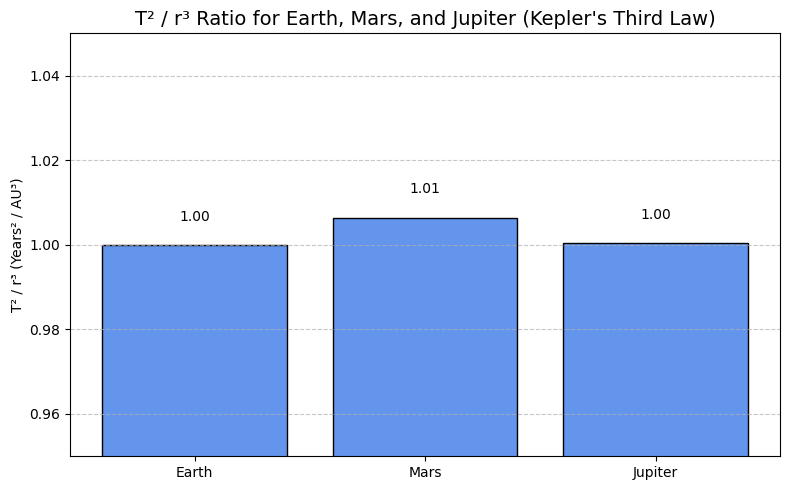
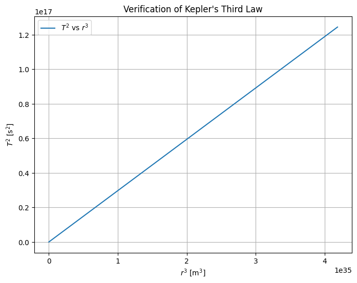

# Problem 1
# Orbital Period and Orbital Radius: Kepler's Third Law
## Introduction

Understanding the motion of celestial bodies is a fundamental goal in both classical mechanics and modern astronomy. Among the many relationships that describe orbital dynamics, Kepler’s Third Law stands out as one of the most elegant and powerful. Formulated by Johannes Kepler in the early 17th century and later derived from Newton's law of universal gravitation, this law reveals a deep connection between the size of an orbit and the time it takes for a body to complete one revolution.

Kepler's Third Law states that the square of the orbital period of a planet is proportional to the cube of the semi-major axis of its orbit. This relationship holds true not only for planets orbiting the Sun, but also for moons orbiting planets, artificial satellites, and binary star systems. Its simplicity belies its profound implications: with only the orbital period and radius, one can infer critical information such as the mass of the central body or the scale of an entire planetary system.

In this report, we will derive Kepler's Third Law from fundamental physical principles, explore its significance in real-world astronomical contexts, and implement a numerical simulation to verify its validity for circular orbits. The analysis will include visualizations of orbital dynamics and a discussion on how the law extends to elliptical orbits and other celestial configurations.

## Motivation

Kepler's Third Law establishes a relationship between the **orbital period** \( T \) and the **orbital radius** \( r \) of a body in circular motion around a much more massive central object (e.g., a planet orbiting a star). This law is fundamental in **celestial mechanics** and is key to calculating planetary masses, satellite trajectories, and interplanetary distances.

---

## Derivation of Kepler's Third Law for Circular Orbits

We begin with Newton's Law of Universal Gravitation and the requirement for centripetal force to sustain circular motion:

**Gravitational force:**
\[
F_g = \frac{G M m}{r^2}
\]

**Centripetal force required for circular motion:**
\[
F_c = \frac{m v^2}{r}
\]

Equating the two forces:
\[
\frac{G M m}{r^2} = \frac{m v^2}{r}
\]

Cancel \( m \) and multiply both sides by \( r \):
\[
\frac{G M}{r} = v^2
\]

The orbital period \( T \) is the time it takes to complete one full orbit:
\[
T = \frac{2 \pi r}{v}
\Rightarrow v = \frac{2 \pi r}{T}
\]

Substitute for \( v^2 \):
\[
\left( \frac{2 \pi r}{T} \right)^2 = \frac{G M}{r}
\Rightarrow \frac{4 \pi^2 r^2}{T^2} = \frac{G M}{r}
\Rightarrow T^2 = \frac{4 \pi^2 r^3}{G M}
\]

 **Kepler's Third Law:**
\[
T^2 \propto r^3
\]
### Explanation and Interpretation
To derive Kepler’s Third Law from first principles, we start with Newton’s Law of Universal Gravitation and the requirement for centripetal force needed to maintain circular motion.

### Assumptions
- The orbit is perfectly circular.
- The mass of the orbiting body \( m \) is much smaller than the central mass \( M \), such that \( M \gg m \).
- The only significant force acting on the orbiting body is the gravitational attraction from the central body.
- Relativistic effects and perturbations from other bodies are neglected.

### Step-by-step Derivation

**Gravitational force:**
\[
F_g = \frac{G M m}{r^2}
\]

**Centripetal force required for circular motion:**
\[
F_c = \frac{m v^2}{r}
\]

Equating gravitational force with the required centripetal force:
\[
\frac{G M m}{r^2} = \frac{m v^2}{r}
\]

Cancel \( m \) from both sides (since \( m \neq 0 \)) and multiply both sides by \( r \):
\[
\frac{G M}{r} = v^2
\]

The orbital period \( T \) is the time it takes to complete one full revolution around the central body:
\[
T = \frac{2 \pi r}{v} \Rightarrow v = \frac{2 \pi r}{T}
\]

Substitute this expression for \( v \) into the earlier equation:
\[
\left( \frac{2 \pi r}{T} \right)^2 = \frac{G M}{r}
\]

\[
\frac{4 \pi^2 r^2}{T^2} = \frac{G M}{r}
\]

Multiply both sides by \( r \) to isolate \( T^2 \):
\[
\frac{4 \pi^2 r^3}{T^2} = G M
\Rightarrow T^2 = \frac{4 \pi^2 r^3}{G M}
\]

---

### Interpretation

This final expression \( T^2 = \frac{4 \pi^2 r^3}{G M} \) shows that the square of the orbital period is directly proportional to the cube of the orbital radius. The proportionality constant \( \frac{4 \pi^2}{G M} \) depends solely on the gravitational constant and the mass of the central object, meaning that for all bodies orbiting the same central mass, the relationship between \( T^2 \) and \( r^3 \) is identical.

This law can also be rearranged to solve for the mass of the central body:

\[
M = \frac{4 \pi^2 r^3}{G T^2}
\]

This is especially important in astronomy and astrophysics, where we can use the motion of satellites, planets, or stars to infer the mass of a central object (e.g., the Sun, a planet, or a black hole) without directly measuring it.

Although this derivation treats force magnitudes as scalar quantities, a full vector analysis confirms that both gravitational and centripetal accelerations point toward the center of the circular path, which validates the scalar approach used here for symmetric circular motion.

---

### Transition

In the following sections, we will explore real-world examples such as planetary orbits and the Moon’s motion, and implement a computational simulation to verify Kepler’s Third Law numerically. Additionally, we will extend this relationship to elliptical orbits using the semi-major axis in place of the orbital radius.

---

## Implications for Astronomy

- If the mass \( M \) of the central object is known, one can predict orbital periods for satellites or planets.
- If the orbital period and radius are measured, one can estimate the mass of the central body:
  \[
  M = \frac{4 \pi^2 r^3}{G T^2}
  \]
- This relation holds remarkably well in planetary systems and is crucial in:
  - Determining stellar and planetary masses.
  - Calculating distances in exoplanet studies.
  - Planning space missions.

### Example: Orbital Periods of Satellites at Different Altitudes

To illustrate the practical application of Kepler’s Third Law, consider a set of artificial satellites orbiting the Earth at different altitudes. We can compute their orbital periods and plot the relationship between orbital radius and period.

The Earth’s radius is approximately \( R_E = 6.371 \times 10^6 \, \text{m} \). We will calculate the total orbital radius \( r = R_E + h \) for different altitudes \( h \) and use Kepler’s Law to find the orbital period \( T \).

According to:

\[
T = 2\pi \sqrt{\frac{r^3}{G M_E}}
\]

This plot helps visualize how even a small change in altitude can significantly affect the orbital period, especially in high orbits such as geostationary satellites.

<strong> Show python code</strong>

<pre><code class="language-python">
import numpy as np
import matplotlib.pyplot as plt

# Constants
G = 6.67430e-11  # gravitational constant (m^3 kg^-1 s^-2)
M_earth = 5.972e24  # mass of Earth (kg)
R_earth = 6.371e6  # radius of Earth (m)

# Altitudes in km for LEO, MEO, and GEO
altitudes_km = np.linspace(200, 40000, 100)  # from 200 km to 40,000 km
radii = R_earth + altitudes_km * 1e3  # convert km to meters

# Compute orbital periods (in seconds)
T = 2 * np.pi * np.sqrt(radii**3 / (G * M_earth))
T_hours = T / 3600  # convert seconds to hours

# Plot
plt.figure(figsize=(8,6))
plt.plot(altitudes_km, T_hours)
plt.xlabel("Altitude above Earth's surface (km)")
plt.ylabel("Orbital Period (hours)")
plt.title("Orbital Period vs. Satellite Altitude")
plt.grid(True)
plt.show()
</code></pre>

---

## Real-World Examples

### 1. **The Moon around Earth**

Given:
- \( r = 3.84 \times 10^8 \, \text{m} \)
- \( T = 27.3 \, \text{days} = 2.36 \times 10^6 \, \text{s} \)

Estimate Earth's mass:
\[
M = \frac{4 \pi^2 r^3}{G T^2} \approx 5.97 \times 10^{24} \, \text{kg}
\]

### 2. **Planets in the Solar System**

| Planet | Orbital Radius (AU) | Orbital Period (Years) | \( T^2/r^3 \) |
|--------|----------------------|-------------------------|---------------|
| Earth  | 1                    | 1                       | 1             |
| Mars   | 1.52                 | 1.88                    | ~1            |
| Jupiter| 5.20                 | 11.86                   | ~1            |

This data shows that \( T^2 / r^3 \) remains approximately constant, confirming Kepler’s Third Law across different planets.

---

### Graphical Visualization

The bar chart below visualizes the value of T² / r³ for Earth, Mars, and Jupiter.  
As expected, the values are all very close to 1, demonstrating the consistency of Kepler’s Third Law.

\[
T^2 / r^3 \approx \text{constant}
\]

<strong>Show python code</strong>

<pre><code class="language-python">
import numpy as np
import matplotlib.pyplot as plt

# Selected planets
planet_names = ["Earth", "Mars", "Jupiter"]
radii_au = np.array([1.00, 1.52, 5.20])  # Orbital radius in AU
periods_years = np.array([1.00, 1.88, 11.86])  # Orbital period in years

# Calculate T² / r³
r_cubed = radii_au**3
T_squared = periods_years**2
kepler_ratio = T_squared / r_cubed

# Create bar chart
plt.figure(figsize=(8, 5))
bars = plt.bar(planet_names, kepler_ratio, color='cornflowerblue', edgecolor='black')

# Add value labels above bars
for bar, value in zip(bars, kepler_ratio):
    plt.text(bar.get_x() + bar.get_width() / 2, bar.get_height() + 0.005,
             f"{value:.2f}", ha='center', va='bottom', fontsize=10)

# Customize plot
plt.title("T² / r³ Ratio for Earth, Mars, and Jupiter (Kepler's Third Law)", fontsize=14)
plt.ylabel("T² / r³ (Years² / AU³)")
plt.ylim(0.95, 1.05)
plt.grid(axis='y', linestyle='--', alpha=0.7)
plt.tight_layout()

# Show plot
plt.show()
</code></pre>

---

## Computational Simulation (Python)

<strong>Show python code

<pre><code class="language-python">
import numpy as np
import matplotlib.pyplot as plt

# Constants
G = 6.67430e-11  # gravitational constant
M = 1.989e30     # mass of the Sun (kg)

# Orbital radii (in meters)
radii = np.linspace(0.1, 5, 100) * 1.496e11  # from 0.1 AU to 5 AU
periods_squared = (4 * np.pi**2 * radii**3) / (G * M)

# Plotting T^2 vs r^3
plt.figure(figsize=(8,6))
plt.plot(radii**3, periods_squared, label=r'$T^2$ vs $r^3$')
plt.xlabel(r'$r^3$ [m$^3$]')
plt.ylabel(r'$T^2$ [s$^2$]')
plt.title("Verification of Kepler's Third Law")
plt.grid(True)
plt.legend()
plt.show()
</code></pre>

---
## Extension to Elliptical Orbits

Kepler's Third Law also holds for elliptical orbits, where the semi-major axis 'a' replaces the circular radius 'r':

T² = (4π² · a³) / (G · M)

This is especially useful for calculating the dynamics of:

- Comets (e.g., Halley's Comet)
- Binary star systems
- Exoplanets orbiting other stars

---

## Conclusion

Kepler's Third Law elegantly links orbital period to orbital size, revealing the gravitational harmony of planetary systems. Whether calculating the mass of Earth from the Moon’s motion or simulating artificial satellite paths, this relationship remains central in both theoretical and applied astronomy.

