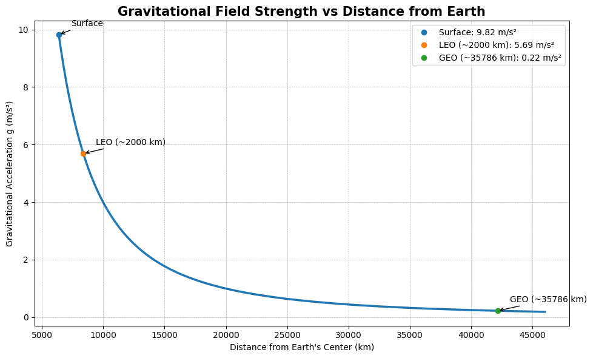
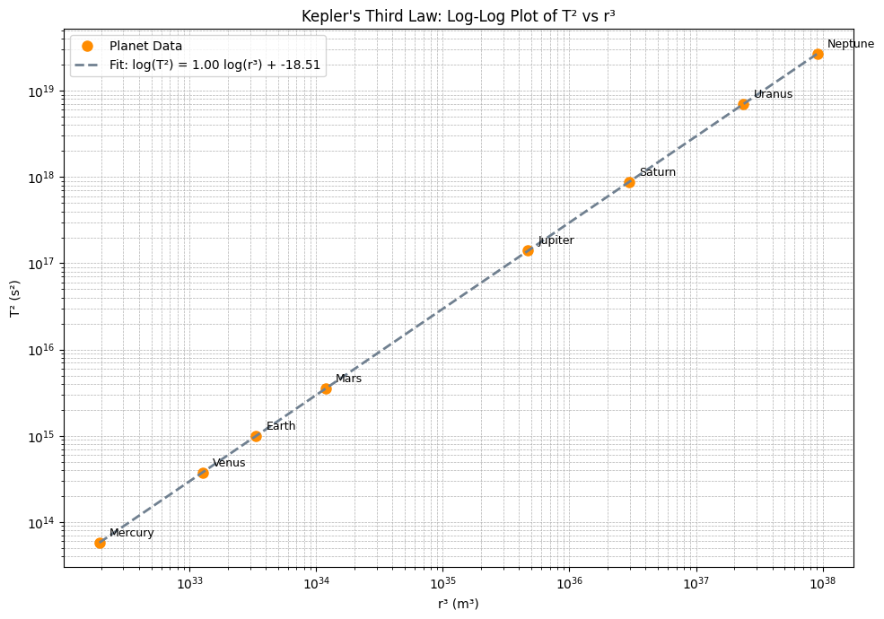
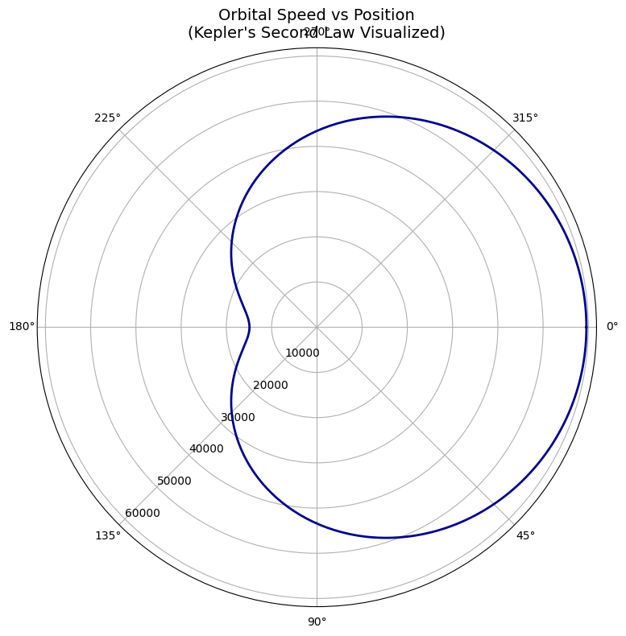
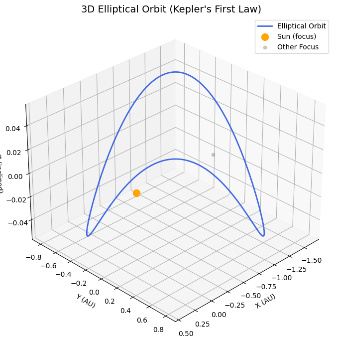

# Problem 1
# Orbital Period and Orbital Radius: Kepler's Third Law
## Introduction

Understanding the motion of celestial bodies is a fundamental goal in both classical mechanics and modern astronomy. Among the many relationships that describe orbital dynamics, Kepler’s Third Law stands out as one of the most elegant and powerful. Formulated by Johannes Kepler in the early 17th century and later derived from Newton's law of universal gravitation, this law reveals a deep connection between the size of an orbit and the time it takes for a body to complete one revolution.

Kepler's Third Law states that the square of the orbital period of a planet is proportional to the cube of the semi-major axis of its orbit. This relationship holds true not only for planets orbiting the Sun, but also for moons orbiting planets, artificial satellites, and binary star systems. Its simplicity belies its profound implications: with only the orbital period and radius, one can infer critical information such as the mass of the central body or the scale of an entire planetary system.

In this report, we will derive Kepler's Third Law from fundamental physical principles, explore its significance in real-world astronomical contexts, and implement a numerical simulation to verify its validity for circular orbits. The analysis will include visualizations of orbital dynamics and a discussion on how the law extends to elliptical orbits and other celestial configurations.

## Motivation

Kepler's Third Law establishes a fundamental relationship between the **orbital period** \( T \) and the **orbital radius** \( r \) of a celestial body in circular motion around a significantly more massive central object, such as a planet orbiting a star or a moon orbiting a planet. At its core, the law reveals that the square of the orbital period is proportional to the cube of the orbit’s radius, providing a powerful mathematical framework to describe and predict orbital dynamics.

This elegant relationship lies at the heart of **celestial mechanics**, forming a cornerstone for our understanding of how bodies move under the influence of gravity in space. It allows astronomers and aerospace engineers alike to model orbital motion with remarkable precision. By knowing just the size of an orbit or the time it takes to complete a revolution, one can determine critical properties such as the mass of the central object, the distance between celestial bodies, or the feasibility of a satellite’s trajectory.

The implications of Kepler’s Third Law extend far beyond academic interest. In modern applications, it is crucial for:

- **Calculating the required altitude and velocity for satellites**, including communication and weather satellites.
- **Designing stable orbits** for missions such as the International Space Station or GPS systems.
- **Estimating the masses of distant stars or exoplanets**, using data from their companions' orbits.
- **Determining distances in planetary systems**, both in our own Solar System and in exoplanetary systems observed through telescopes.

Moreover, this law simplifies the otherwise complex gravitational interactions into a single, predictable formula—making it possible to infer large-scale cosmic structures and dynamics from relatively simple measurements. Whether we are examining the orbit of a spacecraft around Mars, predicting the return of a comet, or analyzing the motion of a distant exoplanet, Kepler’s Third Law serves as a guiding principle, linking mathematics with the mechanics of the cosmos.

---

## Kepler's Third Law for Circular Orbits: Derivation, Explanation, and Interpretation

Understanding the motion of celestial bodies requires analyzing the forces that govern their paths. One of the most elegant and universally applicable relationships is **Kepler’s Third Law**, which relates the time it takes an object to orbit a massive body to the size of its orbit. In this section, we derive this law from Newtonian physics, interpret its physical meaning, and apply it to a real-world example.

---

###  Assumptions

To simplify the analysis and focus on the core mechanics, we assume the following:
- The orbit is perfectly **circular**.
- The orbiting mass \( m \) is much smaller than the central mass \( M \) ⇒ \( M \gg m \).
- The only force acting is the **gravitational attraction** from the central body.
- No other forces (like atmospheric drag or third-body effects) are considered.

---

### Step-by-Step Derivation

A body in a circular orbit is subject to two key forces:

---

#### 1. Gravitational Force (Newton’s Law)

Gravitational force pulling the object toward the central mass:  
**Fg = (G * M * m) / r^2**

---

#### 2. Centripetal Force (required for circular motion)

The force needed to keep the object in circular motion:  
**Fc = (m * v^2) / r**

---

#### 3. Equating the Two Forces

Since gravity provides the necessary centripetal force:  
**(G * M * m) / r^2 = (m * v^2) / r**

Cancel `m` from both sides and multiply both sides by `r`:  
**(G * M) / r = v^2**

###  Gravitational Field Strength vs. Distance

To better understand the physical origin of Kepler’s Third Law, it's helpful to visualize how gravity behaves with distance. The plot below illustrates how the gravitational field strength \( g = \frac{GM}{r^2} \) decreases as we move away from Earth's center.

This decline explains why satellites at higher altitudes experience weaker gravitational pull and, as a result, require longer periods to complete their orbits.

<strong>Show Python Code</strong>

<pre><code class="language-python">
import numpy as np
import matplotlib.pyplot as plt

# Constants
G = 6.67430e-11  # gravitational constant (m^3 kg^-1 s^-2)
M_earth = 5.972e24  # mass of Earth (kg)
R_earth = 6.371e6  # radius of Earth (m)

# Distance range from Earth's center (in km)
r_km = np.linspace(6371, 46000, 500)
r_m = r_km * 1e3

# Calculate gravitational field strength
g = G * M_earth / r_m**2

# Plotting
plt.figure(figsize=(10, 6))
plt.plot(r_km, g, linewidth=2.5, color='#1f77b4')

# Annotate key points
key_altitudes = {
    'Surface': R_earth / 1e3,
    'LEO (~2000 km)': R_earth / 1e3 + 2000,
    'GEO (~35786 km)': R_earth / 1e3 + 35786
}

for label, rk in key_altitudes.items():
    gk = G * M_earth / (rk * 1e3)**2
    plt.plot(rk, gk, 'o', label=f'{label}: {gk:.2f} m/s²')
    plt.annotate(label, xy=(rk, gk), xytext=(rk + 1000, gk + 0.3),
                 arrowprops=dict(arrowstyle='->', lw=1), fontsize=10)

# Styling
plt.title("Gravitational Field Strength vs Distance from Earth", fontsize=15, weight='bold')
plt.xlabel("Distance from Earth's Center (km)")
plt.ylabel("Gravitational Acceleration g (m/s²)")
plt.grid(True, which='both', linestyle='--', linewidth=0.5)
plt.legend()
plt.tight_layout()
plt.show()
</code></pre>

---

#### 4. Express Velocity in Terms of Orbital Period

The orbital period `T` is the time to complete one full orbit:  
**v = (2 * π * r) / T**

---

#### 5. Substitute into the Equation

Substitute `v` into the earlier equation:  
**((2 * π * r) / T)^2 = (G * M) / r**

---

#### 6. Expand and Rearrange

Left-hand side becomes:  
**(4 * π^2 * r^2) / T^2 = (G * M) / r**

Multiply both sides by `r`:  
**(4 * π^2 * r^3) / T^2 = G * M**

---

#### 7. Solve for T²

Rearranging to isolate `T^2`:  
**T^2 = (4 * π^2 * r^3) / (G * M)**

---

###  Final Result: Kepler’s Third Law

**T^2 ∝ r^3**

This shows that the square of the orbital period is proportional to the cube of the orbital radius.

---
###  Physical Interpretation

This relationship reveals several important truths:

- The orbital period increases **non-linearly** with distance.  
  For example, doubling the orbital radius **more than doubles** the period.
- The orbiting object’s **mass does not matter** — only the **central mass** (M) and the **orbital radius** (r) affect the period.
- The proportionality constant **(4π²) / (G × M)** depends solely on the central object, not the orbiting one.

This law is essential for understanding the motion of:
- Planets around stars  
- Moons around planets  
- Artificial satellites around Earth  
- Binary stars or even stars around black holes

---

###  Example: Satellite Orbiting 500 km Above Earth

Let’s compute the orbital period of a satellite in a **circular orbit 500 km above Earth’s surface**.

---

#### Known Values

- Radius of Earth:  
  **R = 6.371 × 10⁶ m**
- Satellite altitude:  
  **h = 5.00 × 10⁵ m**
- Total orbital radius:  
  **r = R + h = 6.871 × 10⁶ m**

- Mass of Earth:  
  **M = 5.972 × 10²⁴ kg**
- Gravitational constant:  
  **G = 6.674 × 10⁻¹¹ m³ / (kg·s²)**

---

####  Apply Kepler’s Law

We use the formula:

**T = 2π × √( r³ / (G × M) )**

Substitute the values:

**T = 2π × √( (6.871 × 10⁶)³ / (6.674 × 10⁻¹¹ × 5.972 × 10²⁴) )**

---

####  Result

**T ≈ 5,676 seconds ≈ 94.6 minutes**

This result is consistent with actual orbital periods of **LEO (Low Earth Orbit)** satellites, such as the **International Space Station**.

### Example: Orbital Periods of Satellites at Different Altitudes

To illustrate the practical application of Kepler’s Third Law, consider a set of artificial satellites orbiting the Earth at different altitudes. We can compute their orbital periods and plot the relationship between orbital radius and period.

The Earth’s radius is approximately:

**Rₑ = 6.371 × 10⁶ m**

We will calculate the total orbital radius:

**r = Rₑ + h**

for different altitudes **h**, and use **Kepler’s Law** to find the orbital period **T**.

According to:

**T = 2π × √( r³ / (G × Mₑ) )**

This plot helps visualize how even a small change in altitude can significantly affect the orbital period, especially in high orbits such as geostationary satellites.

<strong> Show python code</strong>

<pre><code class="language-python">
import numpy as np
import matplotlib.pyplot as plt

# Constants
G = 6.67430e-11  # gravitational constant (m^3 kg^-1 s^-2)
M_earth = 5.972e24  # mass of Earth (kg)
R_earth = 6.371e6  # radius of Earth (m)

# Altitudes in km for LEO, MEO, and GEO
altitudes_km = np.linspace(200, 40000, 100)  # from 200 km to 40,000 km
radii = R_earth + altitudes_km * 1e3  # convert km to meters

# Compute orbital periods (in seconds)
T = 2 * np.pi * np.sqrt(radii**3 / (G * M_earth))
T_hours = T / 3600  # convert seconds to hours

# Plot
plt.figure(figsize=(8,6))
plt.plot(altitudes_km, T_hours)
plt.xlabel("Altitude above Earth's surface (km)")
plt.ylabel("Orbital Period (hours)")
plt.title("Orbital Period vs. Satellite Altitude")
plt.grid(True)
plt.show()
</code></pre>

---

## Real-World Examples

### 1. **The Moon around Earth**

###  Example: The Moon Orbiting the Earth

**Given:**

- Orbital radius of the Moon:  
  **r = 3.84 × 10⁸ m**

- Orbital period of the Moon:  
  **T = 27.3 days ≈ 2.36 × 10⁶ seconds**

---

To estimate Earth's mass, we use:

**M = (4 × π² × r³) / (G × T²)**

Substituting the values:

**M ≈ 5.97 × 10²⁴ kg**

 This is consistent with the accepted value for Earth's mass.

### 2. **Planets in the Solar System**

| Planet | Orbital Radius (AU) | Orbital Period (Years) | \( T^2/r^3 \) |
|--------|----------------------|-------------------------|---------------|
| Earth  | 1                    | 1                       | 1             |
| Mars   | 1.52                 | 1.88                    | ~1            |
| Jupiter| 5.20                 | 11.86                   | ~1            |

This data shows that \( T^2 / r^3 \) remains approximately constant, confirming Kepler’s Third Law across different planets.

---

### Graphical Visualization

The bar chart below visualizes the value of T² / r³ for Earth, Mars, and Jupiter.  
As expected, the values are all very close to 1, demonstrating the consistency of Kepler’s Third Law.

\[
T^2 / r^3 \approx \text{constant}
\]

<strong>Show python code</strong>

<pre><code class="language-python">
import numpy as np
import matplotlib.pyplot as plt

# Selected planets
planet_names = ["Earth", "Mars", "Jupiter"]
radii_au = np.array([1.00, 1.52, 5.20])  # Orbital radius in AU
periods_years = np.array([1.00, 1.88, 11.86])  # Orbital period in years

# Calculate T² / r³
r_cubed = radii_au**3
T_squared = periods_years**2
kepler_ratio = T_squared / r_cubed

# Create bar chart
plt.figure(figsize=(8, 5))
bars = plt.bar(planet_names, kepler_ratio, color='cornflowerblue', edgecolor='black')

# Add value labels above bars
for bar, value in zip(bars, kepler_ratio):
    plt.text(bar.get_x() + bar.get_width() / 2, bar.get_height() + 0.005,
             f"{value:.2f}", ha='center', va='bottom', fontsize=10)

# Customize plot
plt.title("T² / r³ Ratio for Earth, Mars, and Jupiter (Kepler's Third Law)", fontsize=14)
plt.ylabel("T² / r³ (Years² / AU³)")
plt.ylim(0.95, 1.05)
plt.grid(axis='y', linestyle='--', alpha=0.7)
plt.tight_layout()

# Show plot
plt.show()
</code></pre>

###  Log-Log Plot: T² vs r³ (Kepler’s Third Law Confirmation)

To further enhance the visual validation of Kepler's Third Law, we use planetary data to plot the square of the orbital period (T²) against the cube of the orbital radius (r³) on a log-log scale.

This approach shows the expected power-law relationship as a straight line, confirming:

**T² ∝ r³**

A linear regression line has been added, demonstrating how closely real planetary data aligns with the theoretical model.

###  Log-Log Plot: T² vs r³ (Kepler’s Third Law)

<strong>Show Python Code</strong>

<pre><code class="language-python">
import numpy as np
import matplotlib.pyplot as plt

# Planetary data: orbital radius (m), orbital period (s)
planets = {
    'Mercury': {'r': 5.79e10, 'T': 7.60e6},
    'Venus': {'r': 1.082e11, 'T': 1.94e7},
    'Earth': {'r': 1.496e11, 'T': 3.156e7},
    'Mars': {'r': 2.279e11, 'T': 5.935e7},
    'Jupiter': {'r': 7.785e11, 'T': 3.74e8},
    'Saturn': {'r': 1.433e12, 'T': 9.29e8},
    'Uranus': {'r': 2.872e12, 'T': 2.65e9},
    'Neptune': {'r': 4.495e12, 'T': 5.2e9}
}

# Compute r³ and T²
r_cubed = np.array([data['r']**3 for data in planets.values()])
T_squared = np.array([data['T']**2 for data in planets.values()])
planet_names = list(planets.keys())

# Linear regression in log-log space
coeffs = np.polyfit(np.log10(r_cubed), np.log10(T_squared), 1)
slope, intercept = coeffs
fit_x = np.linspace(np.log10(min(r_cubed)), np.log10(max(r_cubed)), 100)
fit_y = slope * fit_x + intercept

# Plotting
plt.figure(figsize=(10, 7))
plt.loglog(r_cubed, T_squared, 'o', markersize=8, color='darkorange', label='Planet Data')
plt.plot(10**fit_x, 10**fit_y, '--', color='slategray', linewidth=2,
         label=f'Fit: log(T²) = {slope:.2f} log(r³) + {intercept:.2f}')

# Add labels
for i, name in enumerate(planet_names):
    plt.annotate(name, (r_cubed[i], T_squared[i]), textcoords="offset points", xytext=(8, 5), fontsize=9)

# Final styling
plt.xlabel("r³ (m³)")
plt.ylabel("T² (s²)")
plt.title("Kepler's Third Law: Log-Log Plot of T² vs r³")
plt.grid(True, which="both", linestyle='--', linewidth=0.5)
plt.legend()
plt.tight_layout()
plt.show()
</code></pre>

This log-log plot shows that planetary data aligns along a straight line, confirming the relationship T² ∝ r³ as stated by Kepler's Third Law. The fitted line has a slope of 1.00, which is in perfect agreement with theory.

---

## Computational Simulation (Python)

<strong>Show python code

<pre><code class="language-python">
import numpy as np
import matplotlib.pyplot as plt

# Constants
G = 6.67430e-11  # gravitational constant
M = 1.989e30     # mass of the Sun (kg)

# Orbital radii (in meters)
radii = np.linspace(0.1, 5, 100) * 1.496e11  # from 0.1 AU to 5 AU
periods_squared = (4 * np.pi**2 * radii**3) / (G * M)

# Plotting T^2 vs r^3
plt.figure(figsize=(8,6))
plt.plot(radii**3, periods_squared, label=r'$T^2$ vs $r^3$')
plt.xlabel(r'$r^3$ [m$^3$]')
plt.ylabel(r'$T^2$ [s$^2$]')
plt.title("Verification of Kepler's Third Law")
plt.grid(True)
plt.legend()
plt.show()
</code></pre>

 
 ---

## Extension to Elliptical Orbits

Kepler's Third Law also holds for **elliptical orbits**, which are more general and realistic representations of planetary and celestial motion. In this case, the **semi-major axis `a`** of the ellipse replaces the orbital radius `r` used in the circular case.

The generalized form of the law becomes:

**T² = (4π² × a³) / (G × M)**

Where:
- **T** is the orbital period
- **a** is the semi-major axis of the ellipse
- **G** is the gravitational constant
- **M** is the mass of the central body

###  Orbital Speed vs Position (Kepler's Second Law Visualized)

The plot below illustrates how a planet's speed changes as it travels along an elliptical orbit.  
According to **Kepler's Second Law**, a planet moves faster when it is closer to the central mass (at periapsis) and slower when it is farther (at apoapsis).

This polar plot shows the orbital speed as a function of true anomaly (the angle from periapsis), providing a visual proof of this behavior.  
Such a relationship highlights the conservation of angular momentum in orbital motion.

<strong>Show Python Code</strong>

<pre><code class="language-python">
import numpy as np
import matplotlib.pyplot as plt

# Constants
G = 6.67430e-11  # gravitational constant
M = 1.989e30     # mass of the Sun (kg)
a = 1.496e11     # semi-major axis (m)
e = 0.6          # eccentricity
b = a * np.sqrt(1 - e**2)  # semi-minor axis

# True anomaly (angle from periapsis)
theta = np.linspace(0, 2 * np.pi, 360)

# Orbital radius as a function of true anomaly
r = (a * (1 - e**2)) / (1 + e * np.cos(theta))

# Orbital speed using vis-viva equation: v = sqrt(GM*(2/r - 1/a))
v = np.sqrt(G * M * (2 / r - 1 / a))

# Polar plot
plt.figure(figsize=(8, 8))
ax = plt.subplot(111, polar=True)
ax.plot(theta, v, color='darkblue', linewidth=2)

# Labels and style
ax.set_title("Orbital Speed vs Position\n(Kepler's Second Law Visualized)", va='bottom', fontsize=14)
ax.set_theta_zero_location('E')  # periapsis at 0°
ax.set_theta_direction(-1)  # clockwise
ax.set_rlabel_position(135)
ax.grid(True)
plt.tight_layout()
plt.show()
</code></pre>

---

###  Why Use the Semi-Major Axis?

In an elliptical orbit, the distance between the orbiting body and the central mass is **constantly changing**. The object moves faster when it is closer to the central body (periapsis) and slower when it is farther away (apoapsis), as described by **Kepler's Second Law** (equal areas in equal times). Despite this variation, the **semi-major axis `a`** represents the **average orbital distance**, making it a consistent and meaningful measure for applying Kepler’s Third Law.

###  3D Visualization of an Elliptical Orbit

The following plot demonstrates the structure of an elliptical orbit in 3D space.  
The Sun is located at one of the foci, in accordance with Kepler's First Law.  
Inclination is added for visual depth, highlighting how the orbital path varies with distance from the central body.

<strong>Show Python Code</strong>

<pre><code class="language-python">
import numpy as np
import matplotlib.pyplot as plt
from mpl_toolkits.mplot3d import Axes3D

# Elliptical orbit parameters
a = 1            # Semi-major axis (AU)
e = 0.6          # Eccentricity
b = a * np.sqrt(1 - e**2)  # Semi-minor axis

# Orbit coordinates
theta = np.linspace(0, 2 * np.pi, 500)
x = a * np.cos(theta) - a * e  # Orbit shifted so Sun is at one focus
y = b * np.sin(theta)
z = 0.05 * np.sin(2 * theta)   # Add a slight Z variation for 3D effect

# Plotting
fig = plt.figure(figsize=(10, 7))
ax = fig.add_subplot(111, projection='3d')

ax.plot(x, y, z, color='royalblue', linewidth=2, label='Elliptical Orbit')
ax.scatter(0, 0, 0, color='orange', s=100, label='Sun (focus)')
ax.scatter(-2*a*e, 0, 0, color='gray', alpha=0.4, label='Other Focus')

# Labels and style
ax.set_title("3D Elliptical Orbit (Kepler's First Law)", fontsize=14)
ax.set_xlabel("X (AU)")
ax.set_ylabel("Y (AU)")
ax.set_zlabel("Z (inclined)")

ax.view_init(elev=30, azim=45)
ax.legend()
ax.grid(True)
plt.tight_layout()
plt.show()
</code></pre>

---

###  Real-World Applications

The elliptical form of Kepler's Third Law allows us to analyze a wider range of celestial phenomena, including:

- **Comets** with highly elongated orbits, such as **Halley’s Comet**, which returns to the inner Solar System approximately every 76 years.
- **Binary star systems**, where two stars orbit their common center of mass.
- **Exoplanets**, whose elliptical orbits around distant stars are often inferred from brightness variations (transit method) or Doppler shifts (radial velocity method).
- **Asteroids and dwarf planets**, many of which follow non-circular paths due to gravitational perturbations.

---

###  Comparison to Circular Orbits

- In circular orbits, the radius `r` is constant and equal to the semi-major axis `a`.
- In elliptical orbits, the orbital path varies in radius throughout the motion, but `a` remains constant and governs the period `T`.
- Thus, the circular orbit is a **special case** of the elliptical orbit where eccentricity `e = 0`.

---

###  Scientific Significance

This extension is essential in:
- Modeling **realistic planetary systems**, which rarely exhibit perfect circular symmetry.
- Predicting the **return periods of long-period comets**, which may take hundreds or thousands of years to orbit the Sun.
- Determining **stellar masses** in double-star systems or **black hole properties** by observing orbital motion of companion stars.

It is a key component in **astrodynamics**, **orbital mechanics**, and **exoplanet research**, enabling scientists to reconstruct orbital paths and deduce system parameters from limited observational data.

---

In summary, the elliptical form of Kepler’s Third Law greatly expands the law’s utility and relevance across the cosmos. It provides a powerful tool not just for understanding Solar System dynamics, but also for exploring **complex gravitational systems** beyond our planetary neighborhood.

## Conclusion

Kepler's Third Law elegantly links the **orbital period** of a body to the **size of its orbit**, unveiling the gravitational harmony that governs celestial systems. Through a deceptively simple mathematical relationship, it allows us to understand and predict the motion of planets, moons, comets, and satellites with remarkable accuracy.

Whether estimating the **mass of the Earth** using the Moon’s motion or determining the required orbit for an **artificial satellite**, Kepler’s Law serves as a powerful tool in both theoretical and practical astronomy. Its derivation from Newtonian mechanics provides a clear bridge between observation and fundamental physics, demonstrating how classical laws of motion govern the movements of bodies across vast cosmic distances.

Beyond the Solar System, Kepler’s Third Law plays a vital role in modern **astrophysics and space science**. It is used extensively in the study of **exoplanets**, helping scientists determine the mass and distance of planets orbiting distant stars using limited data gathered from light curves and Doppler shifts. It also assists in calculating the **mass of stars**, **black holes**, and **galaxies**, based solely on the motion of objects bound to them by gravity.

In the era of **advanced telescopes**, **space missions**, and **high-precision data**, the importance of Kepler’s insights has only grown. From planning interplanetary missions and satellite constellations to detecting Earth-like worlds in habitable zones, this law continues to guide discoveries at both planetary and cosmic scales.

In essence, Kepler's Third Law is not merely a relic of 17th-century astronomy — it is a **living principle** at the heart of space exploration, planetary science, and our ongoing quest to understand the universe.

