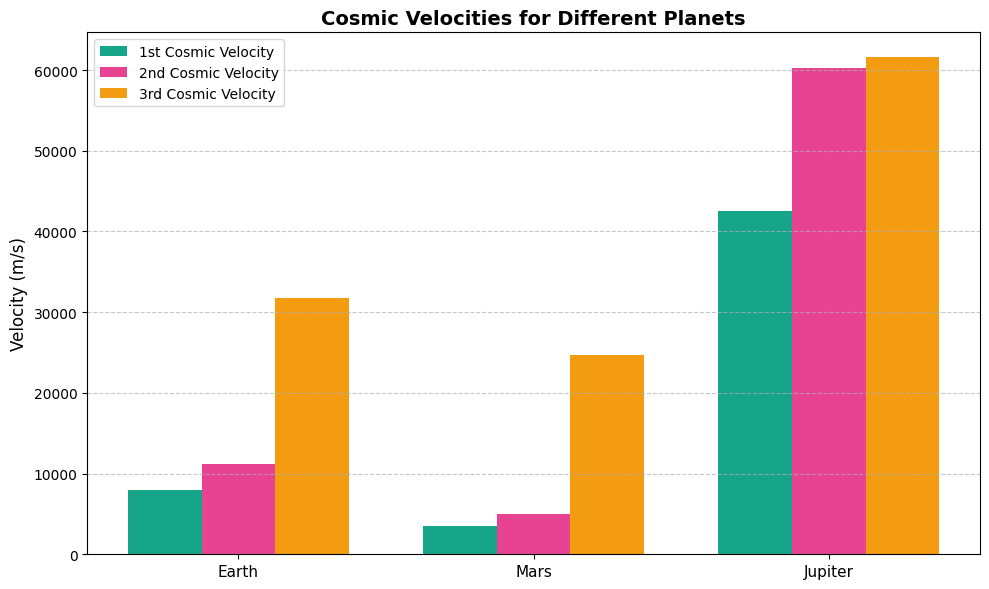
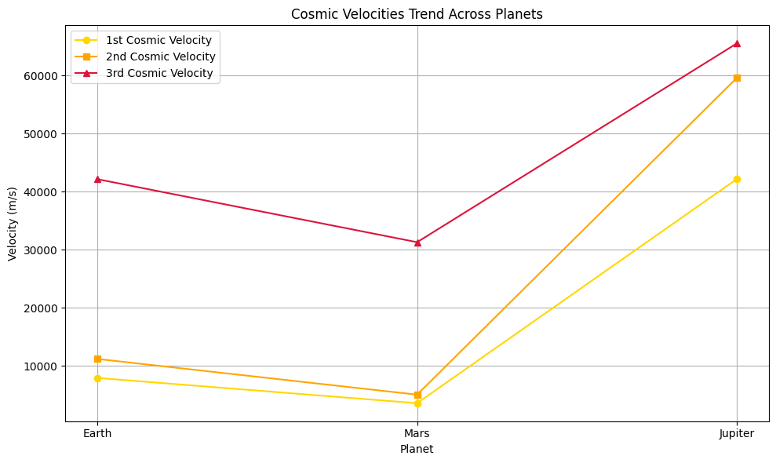
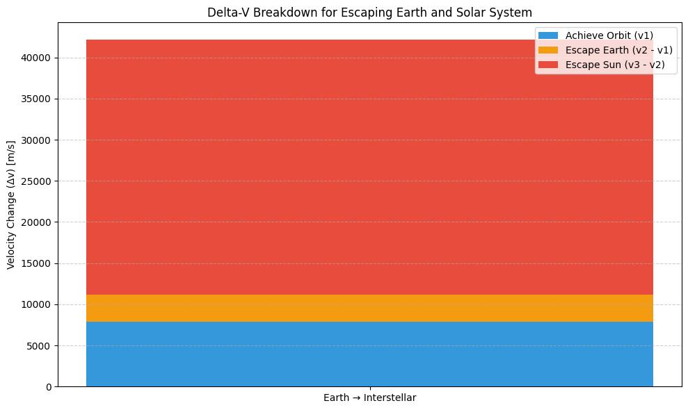
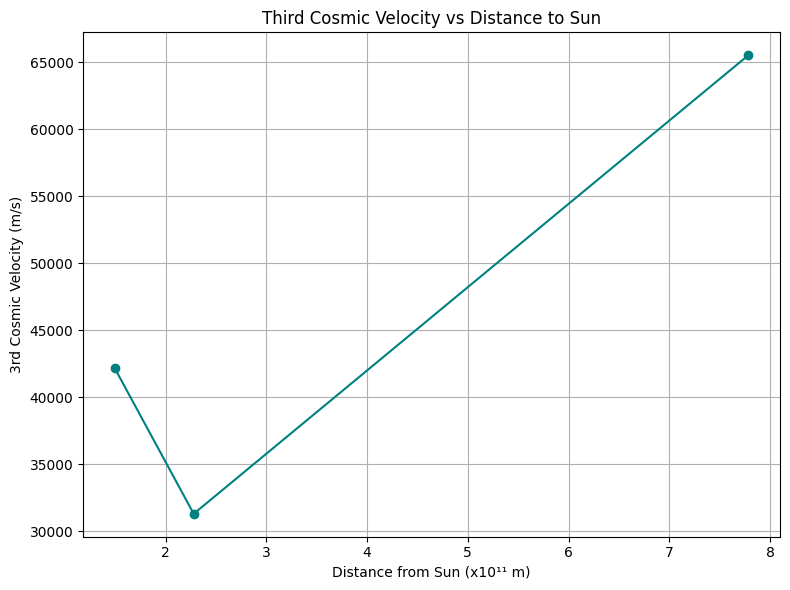

# Problem 2
# Problem 2: Escape Velocities and Cosmic Velocities

---

## Introduction

Throughout human history, space and celestial bodies have aroused profound curiosity, leading to the development of astronomy, physics, and eventually modern space exploration.  
One of the foundational principles governing motion in space is the concept of escape velocity — the minimum speed required to overcome the gravitational pull of a celestial object without further propulsion.  
Building on this, the concepts of first, second, and third cosmic velocities define critical thresholds for orbiting a planet, escaping its gravitational field, and leaving the solar system entirely.

This report examines the physical meanings, mathematical derivations, calculations, and implications of cosmic velocities. It aims to deepen the understanding necessary for successful satellite launches, interplanetary missions, and the pursuit of interstellar travel.

---

## Motivation

Understanding cosmic velocities is essential not only for theoretical physics but also for real-world applications:

- **Satellite Launching**: Achieving the correct orbital speed ensures the satellite remains in stable orbit.
- **Interplanetary Travel**: Missions to Mars, Jupiter, or beyond must overcome both the gravitational pull of Earth and the target planet's characteristics.
- **Interstellar Missions**: Projects like Voyager and future interstellar probes must achieve velocities high enough to exit the solar system.
- **Optimization**: Calculating minimal required velocities allows engineers to minimize fuel consumption and optimize mission costs.

Given the expansion of commercial and governmental space programs, mastering cosmic velocities remains crucial for the future of humanity's presence in space.

---

# Problem Definition

The objective of this study is to:

- Define and physically interpret the first, second, and third cosmic velocities,
- Derive the mathematical formulations,
- Calculate their values for Earth, Mars, and Jupiter,
- Graphically represent and analyze the results,
- Discuss their relevance to space missions.

---

# Theoretical Background

## Energy Conservation in Gravitational Fields

The mechanical energy of an object under a central gravitational field remains conserved:

$$
E_{\text{total}} = KE + PE = \frac{1}{2}mv^2 - \frac{GMm}{r}
$$

Where:

- **KE — Kinetic Energy**  
  Formula: `KE = (1/2) * m * v²`  
  → The energy due to the motion of an object.

- **PE — Gravitational Potential Energy**  
  Formula: `PE = -G * M * m / r`  
  → The energy due to gravitational attraction between two masses.

- **G — Gravitational Constant**  
  `G = 6.67430 × 10⁻¹¹ m³·kg⁻¹·s⁻²`

- **M — Mass of the celestial body**  
  (e.g., Earth, Mars, Jupiter)

- **m — Mass of the object**  
  (e.g., satellite or spacecraft)

- **r — Distance from the center of the celestial body to the object**

Escape and orbital motions arise from the balance of kinetic and potential energies.

---

# Mathematical Analysis

## First Cosmic Velocity (Orbital Velocity)

**Definition**: The minimum speed needed to achieve a stable circular orbit close to the surface of a celestial body.

**Formula**:

$$
v_1 = \sqrt{\frac{GM}{r}}
$$

This velocity ensures the gravitational force provides the necessary centripetal acceleration for circular motion.

---

## Second Cosmic Velocity (Escape Velocity)

**Definition**: The minimum speed needed to overcome the gravitational field of a celestial body without any further propulsion.

**Formula**:

$$
v_2 = \sqrt{2}v_1 = \sqrt{\frac{2GM}{r}}
$$

Here, the object's kinetic energy must completely balance the gravitational potential energy to reach infinity with zero residual speed.

---

## Third Cosmic Velocity (Solar System Escape Velocity)

**Definition**: The speed necessary to escape not just a planet's gravity but also the Sun’s gravitational influence from the planet's location.

**Formulas**:

Orbital velocity of the planet around the Sun:

$$
v_{\text{orbital}} = \sqrt{\frac{GM_{\odot}}{r_{\text{planet}}}}
$$

Total escape velocity:

$$
v_3 = \sqrt{v_2^2 + v_{\text{orbital}}^2}
$$

where:

- \( M_{\odot} \): Mass of the Sun,
- \( r_{\text{planet}} \): Distance of the planet from the Sun.

---

# Numerical Calculations

## Planetary Data

| Planet  | Mass (kg)                  | Radius (m)           | Distance to Sun (m)         |
|:-------:|:---------------------------:|:--------------------:|:---------------------------:|
| Earth   | \(5.972 \times 10^{24}\)     | \(6.371 \times 10^6\) | \(1.496 \times 10^{11}\)     |
| Mars    | \(6.417 \times 10^{23}\)     | \(3.3895 \times 10^6\) | \(2.279 \times 10^{11}\)     |
| Jupiter | \(1.898 \times 10^{27}\)     | \(6.9911 \times 10^7\) | \(7.785 \times 10^{11}\)     |

---

## Python Code Implementation

<strong>Show Python Code</strong>

<pre><code class="language-python">
import numpy as np
import matplotlib.pyplot as plt

G = 6.67430e-11  # Gravitational constant
M_sun = 1.989e30  # Mass of the Sun

# Planetary properties
planets = {
    "Earth": {"mass": 5.972e24, "radius": 6.371e6, "orbit_radius": 1.496e11},
    "Mars": {"mass": 6.417e23, "radius": 3.3895e6, "orbit_radius": 2.279e11},
    "Jupiter": {"mass": 1.898e27, "radius": 6.9911e7, "orbit_radius": 7.785e11}
}

def compute_velocities(mass, radius, orbit_radius):
    v1 = np.sqrt(G * mass / radius)
    v2 = np.sqrt(2) * v1
    v_orbital = np.sqrt(G * M_sun / orbit_radius)
    v3 = np.sqrt(v2**2 + v_orbital**2)
    return v1, v2, v3

results = {planet: compute_velocities(data["mass"], data["radius"], data["orbit_radius"])
           for planet, data in planets.items()}

labels = list(results.keys())
v1_vals, v2_vals, v3_vals = zip(*results.values())

x = np.arange(len(labels))
width = 0.25

colors = ['#17a589', '#e84393', '#f39c12']

fig, ax = plt.subplots(figsize=(10,6))
ax.bar(x - width, v1_vals, width, label='1st Cosmic Velocity', color=colors[0])
ax.bar(x, v2_vals, width, label='2nd Cosmic Velocity', color=colors[1])
ax.bar(x + width, v3_vals, width, label='3rd Cosmic Velocity', color=colors[2])

ax.set_ylabel('Velocity (m/s)')
ax.set_title('Cosmic Velocities for Earth, Mars, and Jupiter')
ax.set_xticks(x)
ax.set_xticklabels(labels)
ax.legend()
ax.grid(True)

plt.tight_layout()
plt.show()
</code></pre>

---

# Graphical Interpretation

The bar chart depicts the first, second, and third cosmic velocities for Earth, Mars, and Jupiter:

- **Earth**: Moderate escape requirements, reflecting a balance between mass and distance to the Sun.
- **Mars**: Lowest velocities, highlighting its suitability for colonization missions.
- **Jupiter**: Extremely high orbital and escape speeds, posing great challenges for deep-space missions.

---

> **Key Insight:**  
> Mars, due to its lower mass and gravitational pull, offers the most energy-efficient path for human exploration and future colonization compared to Earth and Jupiter.

---
## Additional Visualization: Trend Analysis

To better understand the variation of velocity types across different planets, a line chart is provided below:

<strong>Show Python Code</strong>

<pre><code class="language-python">
import numpy as np
import matplotlib.pyplot as plt

# Planet names and cosmic velocity data (in m/s)
planets = ['Earth', 'Mars', 'Jupiter']

# First, second, and third cosmic velocities
v1_vals = [7909.79, 3552.44, 42176.74]     # 1st cosmic velocity
v2_vals = [11179.14, 5022.62, 59614.36]    # 2nd cosmic velocity
v3_vals = [42145.38, 31284.93, 65529.10]   # 3rd cosmic velocity

# Create figure
plt.figure(figsize=(10, 6))

# Plot each velocity type
plt.plot(planets, v1_vals, marker='o', color='gold', label='1st Cosmic Velocity')
plt.plot(planets, v2_vals, marker='s', color='orange', label='2nd Cosmic Velocity')
plt.plot(planets, v3_vals, marker='^', color='crimson', label='3rd Cosmic Velocity')

# Add labels and title
plt.title('Cosmic Velocities Trend Across Planets')
plt.xlabel('Planet')
plt.ylabel('Velocity (m/s)')
plt.legend()
plt.grid(True)

# Display plot
plt.tight_layout()
plt.show()
</code></pre>

### Observations:

- **Earth** shows moderate velocity requirements due to its balanced mass and position.
- **Mars** has the lowest velocity thresholds, reinforcing its suitability for exploration.
- **Jupiter** demands the highest values due to its immense mass, especially for v1 and v2.

> **Insight:** The rapid rise in all velocity types for Jupiter illustrates the exponential cost (in energy and fuel) for missions targeting gas giants.

# Discussion: Importance for Space Missions

Understanding and calculating cosmic velocities is crucial for:

- **Launching satellites** into stable orbits (first cosmic velocity).
- **Designing missions** to Moon, Mars, and other celestial bodies (second cosmic velocity).
- **Developing probes** capable of interstellar travel (third cosmic velocity).

Mastery of these principles enables better mission planning, fuel efficiency, and extended space exploration capabilities.
### Visual Insight: Δv Breakdown for Earth-to-Interstellar Missions

The plot below illustrates the total velocity change (Δv) required for a spacecraft to:

1. Reach Earth orbit,
2. Escape Earth’s gravity,
3. Escape the Sun’s gravitational pull.

Each mission stage is represented by a color-coded bar segment.

<strong>Show Python Code</strong>

<pre><code class="language-python">
import matplotlib.pyplot as plt
import numpy as np

# Mission stages and delta-v components (in m/s)
stages = ['Low Earth Orbit', 'Escape Earth Gravity', 'Escape Solar System']
v1 = 7909.79  # First cosmic velocity (LEO)
v2 = 11179.14  # Second cosmic velocity
v3 = 42145.38  # Third cosmic velocity

# Delta-vs for each step
dv1 = v1
dv2 = v2 - v1
dv3 = v3 - v2

dv_values = np.array([dv1, dv2, dv3])
labels = ['Achieve Orbit (v1)', 'Escape Earth (v2 - v1)', 'Escape Sun (v3 - v2)']

# Plotting stacked bar
fig, ax = plt.subplots(figsize=(10, 6))
bottoms = 0
colors = ['#3498db', '#f39c12', '#e74c3c']

for i in range(len(dv_values)):
    ax.bar(['Earth → Interstellar'], [dv_values[i]], bottom=bottoms, color=colors[i], label=labels[i])
    bottoms += dv_values[i]

# Labels and formatting
ax.set_ylabel('Velocity Change (Δv) [m/s]')
ax.set_title('Delta-V Breakdown for Escaping Earth and Solar System')
ax.legend()
ax.grid(True, axis='y', linestyle='--', alpha=0.6)
plt.tight_layout()
plt.show()
</code></pre>

- The largest Δv requirement is clearly for escaping the Sun, not Earth — which surprises many.
- Achieving orbit is significant, but only the **first step** in a much larger velocity budget.
- This kind of analysis is essential for long-term interplanetary and interstellar planning.

> **Insight:** Most of the energy in interstellar missions is not spent leaving Earth, but leaving the gravitational influence of the Sun.

### Visual Insight: Third Cosmic Velocity vs Solar Distance

To illustrate how solar distance and planetary mass together affect the third cosmic velocity, the following plot compares Earth, Mars, and Jupiter.
### Visual Insight: Third Cosmic Velocity vs Solar Distance

To visualize the relationship between planetary distance from the Sun and the third cosmic velocity, refer to the plot below.

<strong>Show Python Code</strong>

<pre><code class="language-python">
import numpy as np
import matplotlib.pyplot as plt

# Distances from the Sun (in meters)
distances = np.array([1.496e11, 2.279e11, 7.785e11])  # Earth, Mars, Jupiter

# Third cosmic velocities (in m/s)
v3 = np.array([42145.38, 31284.93, 65529.10])

# Scaled distances for readability
distances_scaled = distances / 1e11

# Plot
plt.figure(figsize=(8, 6))
plt.plot(distances_scaled, v3, marker='o', color='teal', linestyle='-')

# Labels and title
plt.title('Third Cosmic Velocity vs Distance to Sun')
plt.xlabel('Distance from Sun (x10¹¹ m)')
plt.ylabel('3rd Cosmic Velocity (m/s)')
plt.grid(True)
plt.tight_layout()
plt.show()
</code></pre>

- **Mars**, despite being farther from the Sun, requires the **least energy** to escape the solar system due to its lower mass.
- **Earth** sits in the middle with moderate escape demands.
- **Jupiter**, though farther out, requires the **most energy** due to its massive gravity.

> **Insight:** Escape effort depends not just on distance from the Sun, but also heavily on the planet’s mass. High-mass bodies like Jupiter significantly increase departure energy requirements — even when farther away.

---

# Conclusion

Cosmic velocities are fundamental in spaceflight dynamics and mission design.  
They define the critical speed thresholds that spacecraft must achieve to enter orbit, escape a planet’s gravitational field, or even leave the solar system entirely.  
These thresholds are not just theoretical constructs — they are practical parameters that influence every aspect of aerospace engineering, from rocket design and propulsion requirements to mission duration and energy consumption.

Through the analysis of the first, second, and third cosmic velocities, it becomes evident that escaping a celestial body's gravitational influence is a stepwise process, each stage requiring significantly more energy.  
For example, the majority of the total energy expenditure in an interstellar mission is dedicated not to escaping Earth's gravity, but the Sun’s — a fact that highlights the immense challenge of interstellar travel.

As propulsion technologies continue to advance — such as ion drives, nuclear thermal engines, or potential future concepts like solar sails and fusion propulsion — humanity's ability to overcome these velocity thresholds will become more efficient and cost-effective.  
Mastering cosmic velocities is not only a technical necessity but also a gateway to the next era of exploration: from establishing a permanent human presence on Mars, to launching deep-space probes that may one day reach other stars.

In conclusion, a deep understanding of cosmic velocities is essential for the continued progress of space exploration.  
They serve as the backbone for navigation, fuel budgeting, and the very possibility of reaching new worlds.

---

