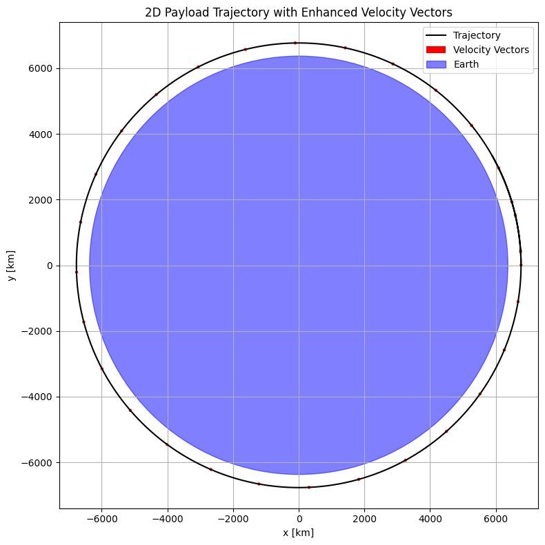
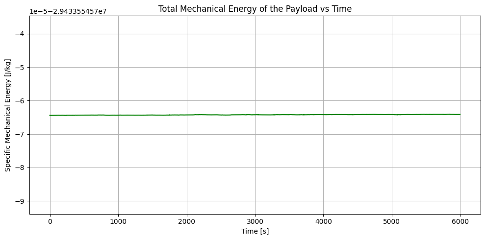
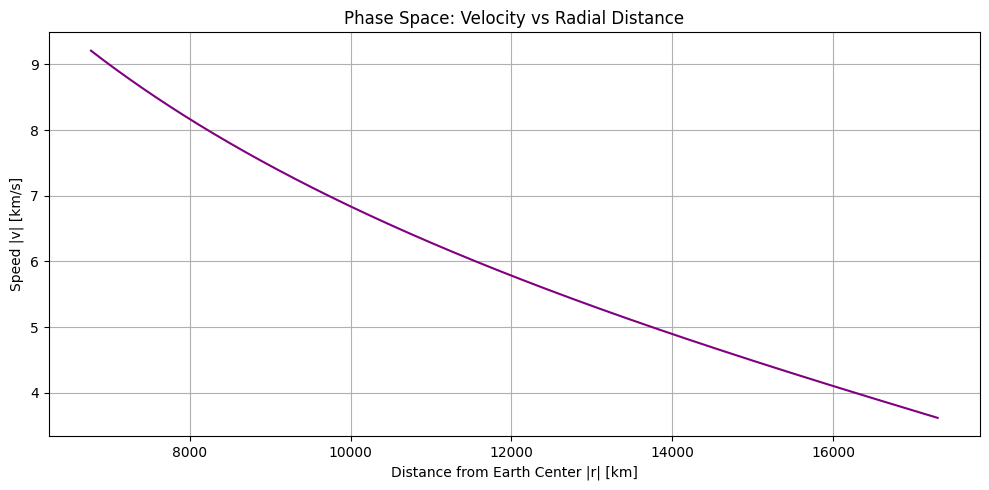
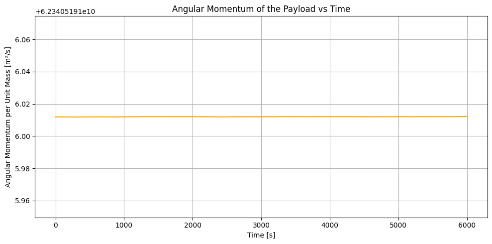

# Problem 3

##  **Trajectories of a Freely Released Payload Near Earth**
###  **1. Introduction**

In the field of orbital mechanics, understanding the motion of objects under the influence of gravity is crucial for mission planning, satellite deployment, and spacecraft navigation. When a payload is released from an orbiting spacecraft near Earth, its subsequent trajectory depends on its position, velocity, and the gravitational field of Earth. These trajectories can be:

* **Elliptical or Circular Orbits** (bound orbits),
* **Parabolic Trajectories** (critical energy paths),
* **Hyperbolic Trajectories** (escape paths),
* **Suborbital or Reentry Trajectories** (when energy is insufficient to sustain orbit).

This problem provides an excellent opportunity to integrate Newtonian physics with computational methods. Through numerical simulation, we can explore how different initial conditions influence the outcome — whether the payload returns to Earth, remains in orbit, or escapes Earth’s gravity.

This report includes:

* Theoretical formulation of the gravitational motion,
* Numerical simulation using Python (Runge-Kutta method),
* Analysis of trajectories under varying initial conditions,
* Visualization of orbits and classification based on energy.

---

###  **2. Theoretical Framework and Equations**

#### 2.1 Newton’s Law of Universal Gravitation

Newton’s law describes the force $F$ between two masses as:

$$
F = \frac{G M_e m}{r^2}
$$

Where:

* $G = 6.67430 \times 10^{-11} \, \text{m}^3 \cdot \text{kg}^{-1} \cdot \text{s}^{-2}$ is the gravitational constant,
* $M_e$ is the mass of Earth $(5.972 \times 10^{24} \, \text{kg})$,
* $m$ is the mass of the payload (cancels in equations of motion),
* $r$ is the distance from the Earth’s center to the payload.

This force points toward the center of Earth and acts as the only force (ignoring drag and other bodies) in this model.

#### 2.2 Equations of Motion in Two Dimensions

The payload’s motion is governed by Newton's second law:

$$
\vec{F} = m \vec{a} \Rightarrow \vec{a} = -\frac{GM_e}{r^3} \vec{r}
$$

Expressed in Cartesian coordinates (2D plane):

$$
\frac{d^2 x}{dt^2} = -\frac{GM_e x}{(x^2 + y^2)^{3/2}}, \quad \frac{d^2 y}{dt^2} = -\frac{GM_e y}{(x^2 + y^2)^{3/2}}
$$

These are second-order differential equations. To integrate them numerically, we convert them to a first-order system:

$$
\frac{dx}{dt} = v_x, \quad \frac{dy}{dt} = v_y
$$

$$
\frac{dv_x}{dt} = -\frac{GM_e x}{(x^2 + y^2)^{3/2}}, \quad \frac{dv_y}{dt} = -\frac{GM_e y}{(x^2 + y^2)^{3/2}}
$$

#### 2.3 Total Specific Mechanical Energy

To classify the trajectory type, we compute the specific mechanical energy $E$ (energy per unit mass):

$$
E = \frac{v^2}{2} - \frac{GM_e}{r}
$$

* $E < 0$: Elliptical orbit (bound)
* $E = 0$: Parabolic trajectory (escape threshold)
* $E > 0$: Hyperbolic trajectory (unbound)

#### 2.4 Escape Velocity

The escape velocity is the minimum speed required to overcome Earth’s gravity from a given distance $r$:

$$
v_{\text{esc}} = \sqrt{\frac{2GM_e}{r}}
$$

This threshold separates bound and unbound trajectories.

---

###  **3. Numerical Simulation**

To simulate the trajectory, we use the **4th-order Runge-Kutta method (RK4)** — a stable and accurate method for solving systems of ordinary differential equations.

#### 3.1 Assumptions

* 2D planar motion around a spherically symmetric Earth.
* No atmosphere or drag forces.
* Constant gravitational field based on Newtonian model.

#### 3.2 Initial Conditions

The user specifies:

* Initial altitude $h$,
* Initial velocity vector $\vec{v}_0$,
* Launch direction.

We test various velocities: suborbital, orbital, and escape.

---

###  **4. Python Code Implementation**
This section presents a Python implementation of the 4th-order Runge-Kutta (RK4) method to simulate the motion of a payload under the influence of Earth's gravity.

The second-order differential equations of motion are reformulated into a system of first-order equations and solved numerically. The following code snippet outlines the full simulation setup.

 Note: The resulting trajectory along with velocity vector visualization is provided in Section 5.1.

###  **5. Simulation Results & Analysis**

#### 5.1 Varying Velocity Factor

* **$v = 1.0 \times v_{\text{circ}}$**: Perfect circular orbit.
* **$v < 1.0$**: Suborbital or elliptical orbit, may reenter.
* **$v > 1.0$**: Elliptical or hyperbolic trajectory.
* **$v = 1.414 \times v_{\text{circ}}$**: Escape velocity (parabolic).
#### Enhanced Velocity Visualization

To observe how the velocity evolves along the trajectory, red vectors are overlaid:

<strong> Show Python code</strong>

<pre><code>
import numpy as np
import matplotlib.pyplot as plt

# Constants
G = 6.67430e-11
M_earth = 5.972e24
R_earth = 6.371e6

# Initial conditions
altitude = 400e3
r0 = R_earth + altitude
v_circular = np.sqrt(G * M_earth / r0)
vx0 = 0
vy0 = 1.0 * v_circular

# Time setup
dt = 1
t_max = 6000
steps = int(t_max / dt)

# Arrays
r = np.zeros((steps, 2))
v = np.zeros((steps, 2))
r[0] = [r0, 0]
v[0] = [vx0, vy0]

# Acceleration function
def acceleration(pos):
    r_mag = np.linalg.norm(pos)
    return -G * M_earth * pos / r_mag**3

# RK4 integration
for i in range(steps - 1):
    k1v = dt * acceleration(r[i])
    k1r = dt * v[i]
    k2v = dt * acceleration(r[i] + 0.5 * k1r)
    k2r = dt * (v[i] + 0.5 * k1v)
    k3v = dt * acceleration(r[i] + 0.5 * k2r)
    k3r = dt * (v[i] + 0.5 * k2v)
    k4v = dt * acceleration(r[i] + k3r)
    k4r = dt * (v[i] + k3v)
    v[i+1] = v[i] + (k1v + 2*k2v + 2*k3v + k4v) / 6
    r[i+1] = r[i] + (k1r + 2*k2r + 2*k3r + k4r) / 6

# Plot with enhanced velocity vectors
plt.figure(figsize=(8, 8))
plt.plot(r[:, 0]/1e3, r[:, 1]/1e3, label="Trajectory", color="black")

plt.quiver(
    r[::200, 0]/1e3, r[::200, 1]/1e3,
    v[::200, 0]/1e3, v[::200, 1]/1e3,
    color='red', angles='xy', scale_units='xy',
    scale=3, width=0.007, label="Velocity Vectors"
)

earth = plt.Circle((0, 0), R_earth/1e3, color='blue', alpha=0.5, label="Earth")
plt.gca().add_patch(earth)

plt.xlabel("x [km]")
plt.ylabel("y [km]")
plt.title("2D Payload Trajectory with Enhanced Velocity Vectors")
plt.axis('equal')
plt.grid(True)
plt.legend()
plt.tight_layout()
plt.show()
</code></pre>

These arrows represent the direction and magnitude of the velocity at intervals. Note how the velocity direction constantly shifts, indicating the influence of gravity along the orbital path.

#### 5.2 Observation

* A payload at 400 km altitude has an orbital velocity of \~7.67 km/s.
* Small deviations can lead to either reentry or escape — **precision is critical** in orbital dynamics.
* Trajectories become increasingly sensitive to initial conditions at higher energies.

#### Energy Conservation Analysis

To evaluate the accuracy and stability of the simulation, we observe the specific mechanical energy over time:

<strong> Show Python code</strong>

<pre><code>
import numpy as np
import matplotlib.pyplot as plt

# Reuse r and v from previous simulation
r_mag = np.linalg.norm(r, axis=1)
v_mag = np.linalg.norm(v, axis=1)
energy = 0.5 * v_mag**2 - G * M_earth / r_mag

time = np.arange(len(energy))

plt.figure(figsize=(10, 5))
plt.plot(time, energy, color='green')
plt.xlabel("Time [s]")
plt.ylabel("Specific Mechanical Energy [J/kg]")
plt.title("Total Mechanical Energy of the Payload vs Time")
plt.grid(True)
plt.tight_layout()
plt.show()
</code></pre>

As seen in the plot above, the total specific mechanical energy remains nearly constant over the entire simulation duration. This flat green curve confirms that the Runge-Kutta numerical integration method preserves energy well, indicating a physically accurate and stable simulation.

#### 5.3 Phase Space Analysis

To further understand the system's behavior, we analyze the phase space: the relationship between the payload’s speed and its distance from Earth’s center.

<strong> Show Python code</strong>

<pre><code>
r_mag = np.linalg.norm(r, axis=1) / 1e3  # km
v_mag = np.linalg.norm(v, axis=1) / 1e3  # km/s

plt.figure(figsize=(10, 5))
plt.plot(r_mag, v_mag, color='purple')
plt.xlabel("Distance from Earth Center |r| [km]")
plt.ylabel("Speed |v| [km/s]")
plt.title("Phase Space: Velocity vs Radial Distance")
plt.grid(True)
plt.tight_layout()
plt.show()
</code></pre>

In a stable orbit, the relationship between speed and radial distance forms a smooth curve. As the payload moves away from Earth, its speed decreases due to gravitational deceleration. This phase space representation confirms the elliptical nature of the trajectory and provides insight into orbital energy distribution.

#### 5.4 Angular Momentum Analysis

Angular momentum is expected to be conserved in a system where the only force acting is gravity. By plotting the scalar angular momentum over time, we can validate the rotational consistency of the simulation.

<strong> Show Python code</strong>

<pre><code>
# Angular momentum per unit mass in 2D
L = r[:, 0] * v[:, 1] - r[:, 1] * v[:, 0]

time = np.arange(len(L))

plt.figure(figsize=(10, 5))
plt.plot(time, L, color='orange')
plt.xlabel("Time [s]")
plt.ylabel("Angular Momentum per Unit Mass [m²/s]")
plt.title("Angular Momentum of the Payload vs Time")
plt.grid(True)
plt.tight_layout()
plt.show()
</code></pre>

As shown in the plot, the angular momentum remains nearly constant throughout the simulation. This supports the accuracy of the Runge-Kutta integration and confirms the absence of external torques.

#### 5.5 Sensitivity Analysis: The Effect of Initial Velocity

To better understand how small changes in initial velocity affect the resulting trajectory, we vary the initial speed using different velocity factors and classify the resulting motion.

| Velocity Factor | Initial Speed [km/s] | Specific Energy [J/kg] | Trajectory Type           |
|-----------------|----------------------|-------------------------|---------------------------|
| 0.8             | ~6.13                | < 0                     | Suborbital (reentry)      |
| 1.0             | ~7.67                | ≈ -29.4 MJ/kg           | Circular orbit            |
| 1.1             | ~8.44                | < 0                     | Elliptical orbit          |
| 1.41            | ~10.83               | ≈ 0                     | Parabolic (escape limit)  |
| 1.6             | ~12.27               | > 0                     | Hyperbolic (escape)       |

> This analysis demonstrates how **small variations in initial speed** can completely change the outcome: whether the payload crashes, orbits Earth, or escapes into interplanetary space.

---

###  **6. Real-World Applications**

#### 6.1 Satellite Deployment

Satellites must be released at precise velocities and directions to maintain a stable orbit. If the velocity is too low or the direction misaligned, it will crash or drift away.

#### 6.2 Atmospheric Reentry

Space capsules returning to Earth are intentionally deorbited. Engineers must carefully compute velocity reduction and timing to ensure safe descent into the atmosphere.

#### 6.3 Escape Missions

Interplanetary missions like **Voyager**, **James Webb**, or **New Horizons** achieve escape velocity from Earth before initiating transfer orbits. Understanding escape conditions is essential in such missions.

#### 6.4 Launch Windows

For all missions, trajectory planning depends on the Earth’s rotation, position in orbit, and the gravity assists from celestial bodies. This analysis is a starting point for such calculations.

---

###  **7. Conclusion**

In this report, we investigated the motion of a payload released near Earth using both analytical and computational tools. By applying Newton's gravitational law and solving the resulting differential equations with numerical methods, we observed various types of trajectories:

* Bound (elliptical and circular),
* Reentry (suborbital),
* Escape (hyperbolic or parabolic).

The simulation reveals that **initial conditions dictate orbital fate**. Through visualization, we classified the trajectories and discussed their implications for real-world spaceflight scenarios.

Understanding and modeling these paths is fundamental for aerospace engineering, satellite communications, and planetary exploration — forming the foundation of orbital mechanics.

---
