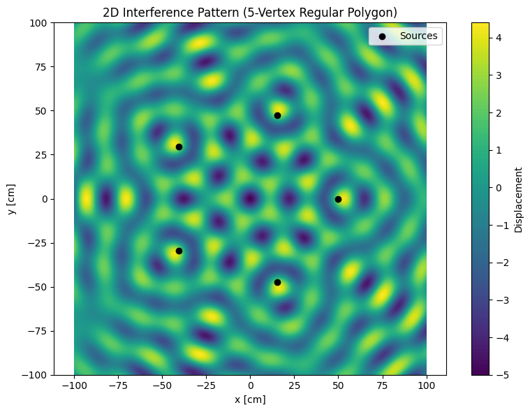
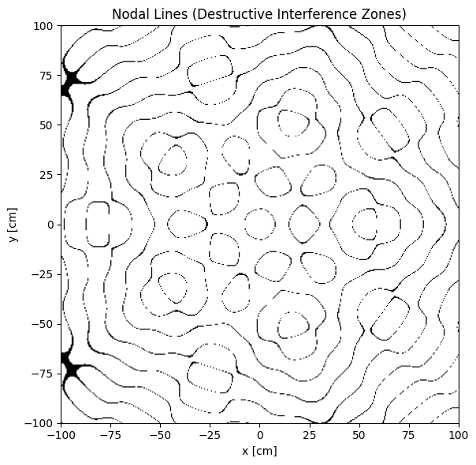
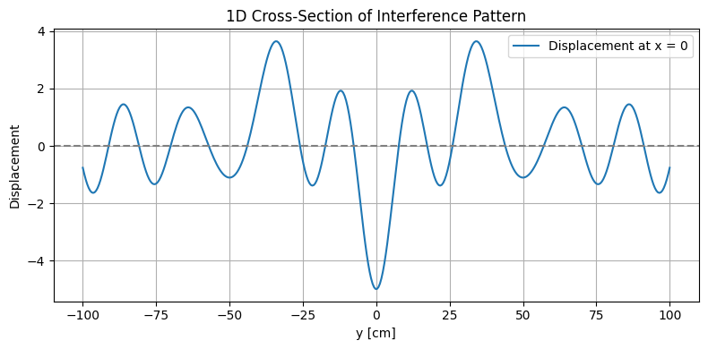
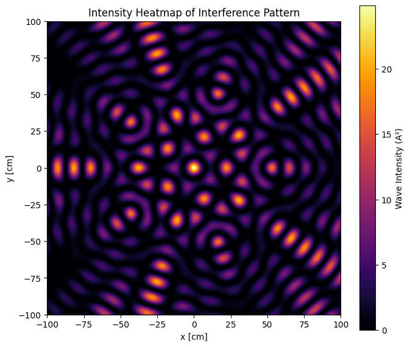

# Problem 1
# Problem 1: Interference Patterns on a Water Surface

## 1. Introduction

Wave phenomena are at the heart of many branches of physics and engineering. Whether in the form of ripples on a pond, sound propagating through the air, or electromagnetic radiation traversing the vacuum of space, waves are fundamental carriers of energy and information. One of the most fascinating and informative behaviors of waves is **interference**—a process where two or more wavefronts overlap and combine, leading to patterns of amplification and cancellation depending on their phase relationship.

The concept of interference is central to our understanding of wave behavior. It demonstrates the **principle of superposition**, which states that when multiple waves coexist in space, the resulting displacement at any point is the algebraic sum of the individual displacements. This can lead to **constructive interference**, where waves reinforce each other, or **destructive interference**, where they cancel out.

The importance of interference transcends academic theory. It has direct applications in:

- **Optics**, through devices like diffraction gratings, holography, and interferometers,
- **Acoustics**, where speaker arrays and room designs are optimized based on interference zones,
- **Telecommunications**, particularly in phased array antennas and signal multiplexing,
- **Quantum physics**, where probability waves interfere, as famously illustrated in the double-slit experiment.

Historically, wave interference was pivotal in the **wave-particle duality debate**. Thomas Young’s double-slit experiment in 1801 provided compelling evidence that light behaves as a wave, shaking the foundations of Newtonian optics and laying the groundwork for modern quantum mechanics.

In this study, we explore interference in a more tangible, visual form: circular water waves originating from point sources arranged in symmetric configurations. Water surfaces are ideal for demonstrating interference because they are two-dimensional, intuitive, and visually rich. By simulating such systems, we can examine how the number and arrangement of wave sources—specifically those placed at the vertices of regular polygons—impact the resulting interference patterns.

This approach offers a hands-on, computational perspective on core wave principles. It allows us to:

- Visualize how **wavefront geometry** affects interference,
- Understand how **symmetry and spacing** influence pattern formation,
- Relate simulated outcomes to **real-world systems** involving sound, light, and radio waves.

Through careful modeling and analysis, this project deepens our understanding of wave interaction and provides insight into the universal nature of interference, across both classical and modern physics contexts.

---

## 2. Motivation

Studying wave interference on a water surface provides an accessible and visual method for grasping wave behavior. The circular ripples created by point sources mimic a wide range of physical systems. This simulation allows us to explore:

- How wavefronts from multiple coherent sources interact,
- The impact of source geometry and arrangement on the resulting patterns,
- The emergence of symmetry, nodes, and anti-nodes in the interference field.

Applications of wave interference are widespread:

-  **Noise-canceling headphones** use destructive interference to neutralize ambient sound.
-  **Satellite communication** relies on constructive interference from phased antenna arrays.
-  **Concert hall acoustics** are optimized by minimizing unwanted interference patterns.
-  **Medical imaging** (ultrasound, MRI) uses wave interference to form detailed internal images.

Simulating wave interference in a controlled setup helps build intuition for advanced topics in electromagnetism, quantum mechanics, and engineering.

---

## 3. Theoretical Background

The displacement ψᵢ(r, t) at a point **r** on the water surface due to a point source *i* at position **rᵢ** is:

$$
\psi_i(\vec{r}, t) = A \cos\left(k \left| \vec{r} - \vec{r}_i \right| - \omega t + \phi_i\right)
$$

Where:

- A: amplitude of the wave  
- k = 2π / λ — wave number (λ is the wavelength)  
- ω = 2π f — angular frequency (f is the frequency)  
- |r − rᵢ| — distance between point and source  
- φᵢ — initial phase

For N coherent sources, the total displacement is:

$$
\Psi(\vec{r}, t) = \sum_{i=1}^{N} \psi_i(\vec{r}, t)
$$

### Complex Form (Optional)

The wave can also be expressed in complex form:

$$
\psi_i(\vec{r}, t) = A e^{i\left(k |\vec{r} - \vec{r}_i| - \omega t + \phi_i\right)}
$$

Taking the real part yields the physical wave:

$$
\Psi(\vec{r}, t) = \text{Re} \left[ \sum_{i=1}^{N} \psi_i(\vec{r}, t) \right]
$$

This form is helpful in handling phase shifts and performing Fourier analysis.

---

## 4. Simulation Description

We simulate interference patterns using coherent wave sources placed at the vertices of a regular polygon (e.g., triangle, square, pentagon).

### Parameters

- **Number of Sources (N)**: 5 (regular pentagon)
- **Amplitude (A)**: 1
- **Wavelength**: 20 units
- **Frequency**: 1 Hz
- **Phase Difference**: All sources in phase
- **Grid Size**: 400x400
- **Radius**: 50 units from origin
- **Snapshot Time**: \( t = 0 \)

---

## 5. Python Simulation Code

The following Python code simulates the interference pattern generated by five coherent point sources arranged in a regular pentagon. All sources emit waves with equal amplitude, wavelength, and phase. The resulting displacement is computed across a 2D grid, and a single 2D contour plot is used to visualize the interference pattern clearly and efficiently.

<strong>Show Python Code</strong>

<pre><code>import numpy as np
import matplotlib.pyplot as plt

# Wave parameters
A = 1                       # Amplitude
wavelength = 20             # Wavelength (in arbitrary units)
k = 2 * np.pi / wavelength  # Wave number
omega = 2 * np.pi           # Angular frequency (corresponds to f = 1 Hz)
N = 5                       # Number of sources (regular pentagon)
radius = 50                 # Distance of sources from origin
size = 400                  # Grid resolution

# Create a 2D grid of spatial coordinates
x = np.linspace(-100, 100, size)
y = np.linspace(-100, 100, size)
X, Y = np.meshgrid(x, y)

# Determine source positions based on regular polygon geometry
angles = np.linspace(0, 2 * np.pi, N, endpoint=False)
sources = [(radius * np.cos(a), radius * np.sin(a)) for a in angles]

# Calculate total wave displacement using superposition
t = 0  # Time snapshot
Psi = np.zeros_like(X)
for sx, sy in sources:
    r = np.sqrt((X - sx)**2 + (Y - sy)**2)  # Distance from source to each point
    Psi += A * np.cos(k * r - omega * t)    # Add wave contribution

# Plot the 2D interference pattern with a new color map
plt.figure(figsize=(8, 6))
contour = plt.contourf(X, Y, Psi, levels=100, cmap='viridis')  # Color map changed here
plt.colorbar(label='Displacement')
plt.scatter(*zip(*sources), color='black', label='Sources')  # Mark source positions
plt.title('2D Interference Pattern (5-Vertex Regular Polygon)')
plt.xlabel('x [cm]')
plt.ylabel('y [cm]')
plt.axis('equal')
plt.legend()
plt.tight_layout()
plt.show()
</code></pre>

**Explanation Figure 1:**

- The `cmap='viridis'` line changes the color palette from `coolwarm` to `viridis`, which is perceptually uniform and colorblind-friendly.
- You may also try other colormaps like `plasma`, `inferno`, `magma`, or `cividis` for alternative visual styles.

---

## 6. Results and Discussion

The resulting interference pattern from five sources arranged in a pentagon exhibits:

*  **Radial symmetry** centered around the origin.
*  **Alternating constructive and destructive zones**, creating concentric ripples and spokes.
*  **Rotational symmetry** consistent with the geometry of the polygon (72° intervals).

To further analyze the **destructive interference**, we can identify the **nodal lines**—regions where the total wave displacement is nearly zero due to complete phase cancellation. These zones form clear patterns of darkness in the overall interference field.

**Figure 2: Nodal Lines Map — Regions of Destructive Interference**  
The binary map below highlights where destructive interference occurs. These areas correspond to the "quiet zones" or wave nulls observed in multi-source systems.

<strong>Show Python Code</strong>

<pre><code>import numpy as np
import matplotlib.pyplot as plt

# Parameters
A = 1
wavelength = 20
k = 2 * np.pi / wavelength
omega = 2 * np.pi
N = 5  # Number of sources (regular pentagon)
radius = 50
size = 400

# Create grid
x = np.linspace(-100, 100, size)
y = np.linspace(-100, 100, size)
X, Y = np.meshgrid(x, y)

# Define source positions (vertices of a regular pentagon)
angles = np.linspace(0, 2 * np.pi, N, endpoint=False)
sources = [(radius * np.cos(a), radius * np.sin(a)) for a in angles]

# Superposition at time t = 0
t = 0
Psi = np.zeros_like(X)
for sx, sy in sources:
    r = np.sqrt((X - sx)**2 + (Y - sy)**2)
    Psi += A * np.cos(k * r - omega * t)

# Threshold-based nodal line detection
threshold = 0.1
nodal_mask = np.abs(Psi) < threshold

# Plot binary nodal line map
plt.figure(figsize=(8, 6))
plt.imshow(nodal_mask, extent=[-100, 100, -100, 100], cmap='Greys', origin='lower')
plt.title("Nodal Lines (Destructive Interference Zones)")
plt.xlabel("x [cm]")
plt.ylabel("y [cm]")
plt.tight_layout()
plt.show()
</code></pre>

### Comparative Analysis

| Polygon  | Symmetry      | Pattern Characteristics                 |
| -------- | ------------- | --------------------------------------- |
| Triangle | 3-fold (120°) | Spiral wavefronts, large lobes          |
| Square   | 4-fold (90°)  | Grid-like nodal lines                   |
| Pentagon | 5-fold (72°)  | Star-like central region, dense pattern |

---

## 7. Real-World Applications

* **LIGO interferometers** detect gravitational waves via fringe shifts.
* **Phased-array antennas** enhance signal directionality using constructive interference.
* **Holography** records 3D interference on 2D surfaces.
* **Architectural acoustics** employ interference management to reduce echo and noise.

To illustrate the localized behavior of wave interference in practical applications such as sensors or detectors, a 1D cross-sectional profile of the wave displacement is shown below.

**Figure 3: 1D Cross-Section of the Interference Pattern**  
This graph displays the wave displacement along the y-axis at \( x = 0 \). Each peak and trough reflects zones of constructive or destructive interference, respectively—similar to how precision detectors like LIGO sense displacement.

<strong>Show Python Code</strong>

<pre><code>import numpy as np
import matplotlib.pyplot as plt

# Parameters
A = 1
wavelength = 20
k = 2 * np.pi / wavelength
omega = 2 * np.pi
N = 5
radius = 50
size = 400

# Grid
x = np.linspace(-100, 100, size)
y = np.linspace(-100, 100, size)
X, Y = np.meshgrid(x, y)

# Source positions
angles = np.linspace(0, 2 * np.pi, N, endpoint=False)
sources = [(radius * np.cos(a), radius * np.sin(a)) for a in angles]

# Superposition
t = 0
Psi = np.zeros_like(X)
for sx, sy in sources:
    r = np.sqrt((X - sx)**2 + (Y - sy)**2)
    Psi += A * np.cos(k * r - omega * t)

# 1D Cross-section along x = 0
center_index = size // 2
y_line = Y[:, center_index]
psi_line = Psi[:, center_index]

# Plot
plt.figure(figsize=(8, 4))
plt.plot(y_line, psi_line, label='Displacement at x = 0')
plt.axhline(0, color='gray', linestyle='--')
plt.title("1D Cross-Section of Interference Pattern")
plt.xlabel("y [cm]")
plt.ylabel("Displacement")
plt.grid(True)
plt.legend()
plt.tight_layout()
plt.show()
</code></pre>

---

## 8. Suggestions for Future Work

- **Time-Dependent Animation**: Animate wavefront propagation.
- **Phase Shift Variations**: Explore dynamic or fixed phase differences.
 -**Asymmetric Configurations**: Study irregular or random source placements.
- **Energy Damping**: Simulate realistic wave attenuation over time.

To explore how wave energy is distributed spatially across the surface, we visualize the **intensity** of the interference pattern. This is calculated as the square of the total wave displacement.

**Figure 4: Intensity Heatmap of the Interference Pattern**  
The heatmap below shows areas of high and low energy concentration, indicating strong constructive and destructive interference respectively.

<strong>Show Python Code</strong>

<pre><code>import numpy as np
import matplotlib.pyplot as plt

# Reuse Psi from previous calculation
intensity = Psi**2  # Intensity is proportional to displacement squared

# Plot intensity heatmap
plt.figure(figsize=(7, 6))
plt.imshow(intensity, extent=[-100, 100, -100, 100], origin='lower', cmap='inferno')
plt.title("Intensity Heatmap of Interference Pattern")
plt.xlabel("x [cm]")
plt.ylabel("y [cm]")
plt.colorbar(label='Wave Intensity (A²)')
plt.tight_layout()
plt.show()
</code></pre>

## 9. Conclusion

This project demonstrates the beauty and complexity of wave interference on a water surface. Key insights include:

- The structure of interference patterns depends strongly on source geometry.
- Symmetry plays a central role in determining nodal and antinodal arrangements.
- Numerical simulations offer a powerful lens through which to understand fundamental physics.

By placing coherent point sources at the vertices of a regular polygon, we were able to simulate and visualize structured interference fields with rich symmetry. From contour plots to intensity maps, each visualization revealed a different aspect of how waves combine, amplify, or cancel out.

These results have direct parallels in real-world systems — from phased-array antennas to quantum wave functions — and highlight the foundational role interference plays across physics and engineering.

Overall, this study reinforces the value of computational modeling in education and research, and provides a platform for future exploration into time dynamics, damping effects, and phase-shift phenomena in wave systems.

