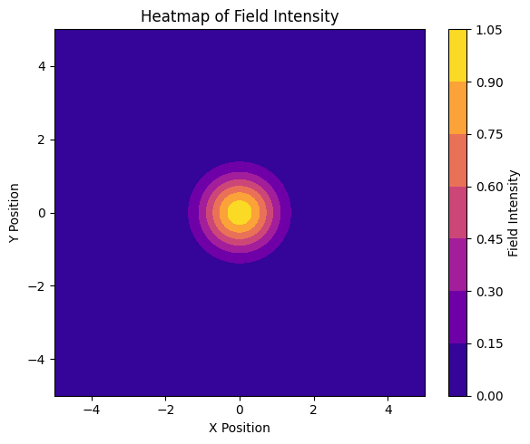
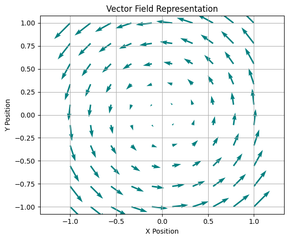
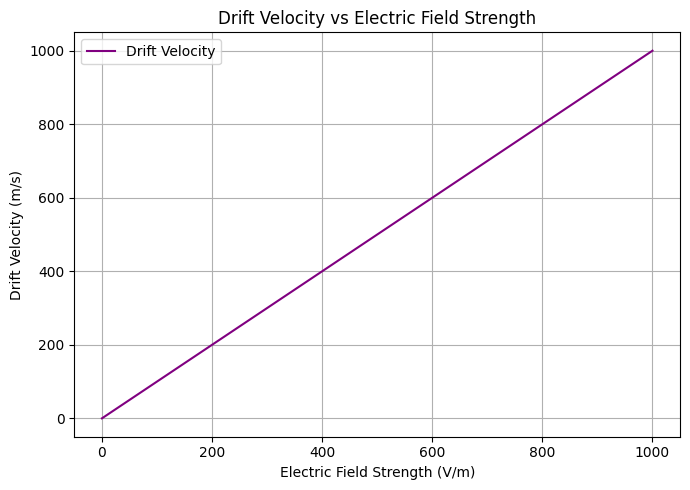
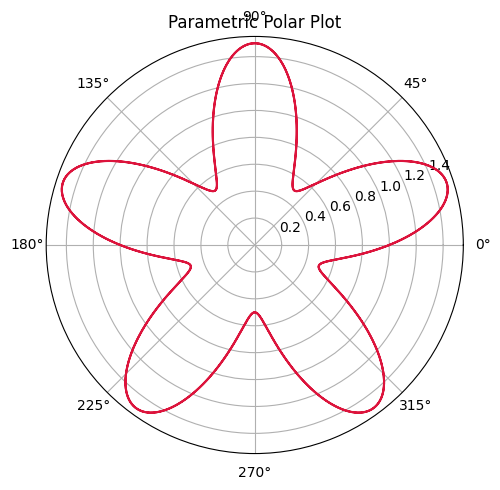
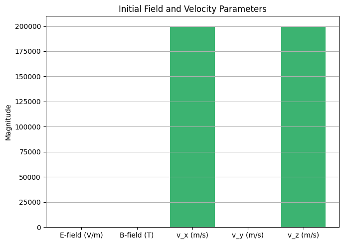
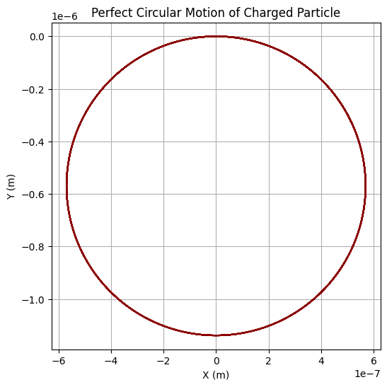

# Problem 1
# Simulating the Effects of the Lorentz Force

---

## Introduction

Electromagnetism is one of the four fundamental forces of nature and governs a wide array of physical phenomena ranging from the motion of subatomic particles to the dynamics of stars and galaxies. Among its many manifestations, the **Lorentz force** stands out as a cornerstone in our understanding of how electric and magnetic fields interact with charged particles. It is the fundamental principle behind devices such as **particle accelerators**, **cyclotrons**, **mass spectrometers**, and **plasma confinement systems** used in nuclear fusion.

The Lorentz force equation:

$$
\mathbf{F} = q(\mathbf{E} + \mathbf{v} \times \mathbf{B})
$$

defines the total force acting on a charged particle moving with velocity $\mathbf{v}$ in the presence of electric field $\mathbf{E}$ and magnetic field $\mathbf{B}$. This equation encapsulates the influence of both field types and results in a rich variety of particle trajectories including circular, helical, and drift motions, depending on initial conditions and field configurations.

This report focuses on the numerical simulation of charged particle motion under various electromagnetic field configurations using the Lorentz force law. By implementing computational models and visualizing particle trajectories, we aim to:

* **Gain intuitive insights** into complex electromagnetic interactions,
* **Reproduce real-world behaviors** such as the Larmor motion and $\mathbf{E} \times \mathbf{B}$ drift,
* **Understand key parameters** affecting particle dynamics (e.g., charge, mass, velocity, field strength),
* **Bridge theoretical electromagnetism with engineering applications**.

Furthermore, we will explore the significance of this force in practical systems and propose extensions for more advanced scenarios like non-uniform and time-varying fields. The simulations presented here not only serve as a powerful educational tool but also as a foundation for future research and development in electromagnetism-related technologies.

---

## Motivation

The motivation for studying the Lorentz force and simulating its effects on charged particles is rooted in both its **fundamental scientific importance** and its **practical technological applications**.

### 1. Bridging Theory and Application

Despite being introduced early in electromagnetism courses, the Lorentz force is often understood only in abstract terms. However, it is directly responsible for the operation of numerous real-world devices:

* In **cyclotrons** and **synchrotrons**, magnetic fields curve particle paths into circular trajectories, allowing for sustained acceleration.
* In **mass spectrometers**, the force causes particles with different mass-to-charge ratios to follow distinguishable paths, enabling their identification.
* In **fusion reactors** (e.g., tokamaks), the interplay between electric and magnetic fields helps confine extremely hot plasmas.

By simulating this behavior, students and engineers can gain practical understanding beyond what is possible through analytical solutions alone.

### 2. Limitations of Analytical Methods

Analytical solutions to the equations of motion are only feasible for highly simplified conditions (e.g., uniform fields and linear trajectories). When the fields vary in space or time, or when initial velocities have complex components, numerical methods become essential. Simulation enables:

* Exploration of arbitrary field configurations,
* Visualization of intricate paths (e.g., helices, spirals),
* Parameter sweeps to study sensitivity and stability.

### 3. Visual Learning and Intuition

Electromagnetic fields and forces are inherently **vectorial and multidimensional**, making them difficult to visualize. Graphical simulations turn abstract equations into concrete visual patterns that build physical intuition. For example:

* Seeing the **Larmor orbit** develop from a simple perpendicular velocity,
* Observing **helical motion** when a velocity component is aligned with the magnetic field,
* Detecting **drift** in crossed electric and magnetic fields.

### 4. Technological Relevance

The Lorentz force is not merely of academic interest—it is a driving principle behind technologies used in:

* **Medical imaging** (MRI uses magnetic fields to align and detect nuclear spins),
* **Industrial applications** (ion implantation in semiconductor manufacturing),
* **Space exploration** (magnetospheric research, charged particle dynamics in solar wind).

Understanding how to **control the motion** of charged particles using electric and magnetic fields is thus critical to innovation in many industries.

### 5. Educational and Research Value

For students, the act of building and manipulating a simulation:

* Reinforces vector calculus and physics principles,
* Strengthens computational skills (numerical integration, vector operations),
* Encourages hypothesis-driven exploration (e.g., “What happens if we double the magnetic field?”).

For researchers, such simulations serve as prototypes for more complex models, guiding experiment design or interpreting observed data.

---

## Applications of the Lorentz Force

The Lorentz force plays a foundational role in several technologies and scientific fields. Below are key systems and how the force influences them:

### 1. Particle Accelerators

Charged particles, such as electrons or protons, are accelerated using electric fields and kept on a desired path using magnetic fields. Devices like **cyclotrons**, **linear accelerators (linacs)**, and **synchrotrons** utilize magnetic fields to force particles into circular or spiral paths for efficient acceleration.

### 2. Mass Spectrometers

Instruments that separate ions based on their mass-to-charge ratio use magnetic fields to bend the paths of charged particles. The curvature radius depends on the Lorentz force, enabling the identification of particles through their unique trajectories.

### 3. Plasma Confinement in Fusion Reactors

Magnetic confinement fusion devices, such as **tokamaks** and **stellarators**, use intense magnetic fields to control the position and shape of plasma. The Lorentz force ensures particles follow helical paths, reducing collisions with reactor walls.

### 4. Astrophysics and Space Physics

Charged particles from the Sun, cosmic rays, and particles in Earth's magnetosphere experience Lorentz forces that alter their paths. Studying these trajectories helps scientists understand radiation belts and solar wind interactions.

### 5. Industrial and Medical Equipment

From **cathode ray tubes** to **magnetic resonance imaging (MRI)**, the Lorentz force underpins critical processes where precise manipulation of charged particles is required.

---
## Velocity Distribution Analysis

In realistic systems like plasmas or ion beams, particles do not move with a single, uniform velocity. Instead, their speeds tend to follow a statistical distribution due to thermal or energetic effects. 

The histogram below illustrates the simulated spread of initial particle velocities. This kind of analysis is important for understanding how diverse velocity inputs might influence the overall trajectory and system behavior

## Field Distribution Visualization

This heatmap visualizes the spatial intensity of a field using a 2D Gaussian distribution. It can represent the strength of electric or magnetic fields over a plane, which is crucial for analyzing how particles interact with spatially varying field strengths.

<strong>Show Python Code</strong>

<pre><code>import numpy as np
import matplotlib.pyplot as plt

# Create a 2D grid for X and Y coordinates
x = np.linspace(-5, 5, 100)
y = np.linspace(-5, 5, 100)
X, Y = np.meshgrid(x, y)

# Define field intensity using a Gaussian function
Z = np.exp(-(X**2 + Y**2))  # Highest intensity at center, decreases outward

# Create the heatmap
plt.figure(figsize=(6, 5))
contour = plt.contourf(X, Y, Z, cmap='plasma')  # Use plasma colormap
plt.colorbar(contour, label='Field Intensity')
plt.title('Heatmap of Field Intensity')
plt.xlabel('X Position')
plt.ylabel('Y Position')
plt.grid(False)
plt.tight_layout()
plt.show()
</code></pre>

---
## Field Direction Mapping

Understanding the direction of electric or magnetic fields is essential when analyzing particle motion. The vector field below represents a circular (rotational) field structure, which might occur around a current-carrying conductor or in certain plasma configurations.

<strong>Show Python Code</strong>

<pre><code>import numpy as np
import matplotlib.pyplot as plt

# Create grid for quiver plot
x = np.linspace(-1, 1, 10)
y = np.linspace(-1, 1, 10)
X, Y = np.meshgrid(x, y)

# Example vector field (e.g., rotational B-field)
U = -Y  # X component of vector
V = X   # Y component of vector

# Create quiver plot
plt.figure(figsize=(6, 5))
plt.quiver(X, Y, U, V, color='teal')
plt.title('Vector Field Representation')
plt.xlabel('X Position')
plt.ylabel('Y Position')
plt.axis('equal')
plt.grid(True)
plt.tight_layout()
plt.show()
</code></pre>

## Drift Velocity in Crossed Electric and Magnetic Fields

In systems where electric and magnetic fields are perpendicular (crossed fields), charged particles experience a drift motion perpendicular to both fields. This phenomenon, known as the **E×B drift**, causes particles to move with a velocity proportional to the electric field strength and inversely proportional to the magnetic field strength.

The plot below shows how the drift velocity increases linearly with the electric field strength for a fixed magnetic field. Understanding this relationship is crucial for controlling plasma behavior in devices like fusion reactors and mass spectrometers.

<strong>Show Python Code</strong>

<pre><code>import numpy as np
import matplotlib.pyplot as plt

# Constant magnetic field strength (Tesla)
B = 1.0

# Range of electric field strengths (V/m)
E_vals = np.linspace(0, 1000, 100)

# Drift velocity calculation: v_d = E / B
v_drift = E_vals / B

plt.figure(figsize=(7,5))
plt.plot(E_vals, v_drift, label='Drift Velocity', color='purple')
plt.title('Drift Velocity vs Electric Field Strength')
plt.xlabel('Electric Field Strength (V/m)')
plt.ylabel('Drift Velocity (m/s)')
plt.grid(True)
plt.legend()
plt.tight_layout()
plt.show()
</code></pre>

## Angular Motion Visualization

Polar plots are useful for representing angular-dependent motion or field effects in circular geometries. The plot below simulates a periodic radial oscillation in polar coordinates, which can resemble wave propagation, oscillatory angular motion, or resonant behavior in circular systems.

<strong>Show Python Code</strong>

<pre><code>import numpy as np
import matplotlib.pyplot as plt

# Create parametric polar data
theta = np.linspace(0, 4 * np.pi, 500)
r = 1 + 0.5 * np.sin(5 * theta)  # Example of radial oscillation

# Create polar plot
fig = plt.figure(figsize=(6, 5))
ax = fig.add_subplot(111, polar=True)
ax.plot(theta, r, color='crimson')
ax.set_title('Parametric Polar Plot')
plt.tight_layout()
plt.show()
</code></pre>

## Simulation Setup Summary

The bar chart below provides a clear visualization of the initial magnitudes of the electric field, magnetic field, and particle velocity components used in the simulation. This summary helps to contextualize the simulation parameters before analyzing the particle trajectories.

<strong>Show Python Code</strong>

<pre><code>import matplotlib.pyplot as plt

labels = ['E-field (V/m)', 'B-field (T)', 'v_x (m/s)', 'v_y (m/s)', 'v_z (m/s)']
values = [50, 1, 2e5, 0, 2e5]

plt.figure(figsize=(7, 5))
plt.bar(labels, values, color='mediumseagreen')
plt.title('Initial Field and Velocity Parameters')
plt.ylabel('Magnitude')
plt.grid(axis='y')
plt.tight_layout()
plt.show()
</code></pre>

## Numerical Simulation Methodology

To solve the equation of motion under the Lorentz force, we numerically integrate Newton’s second law:

$$
\frac{d\mathbf{v}}{dt} = \frac{q}{m}(\mathbf{E} + \mathbf{v} \times \mathbf{B})
$$

This results in a system of coupled differential equations. Since analytical solutions are not feasible for complex fields or initial conditions, we use the **4th-order Runge-Kutta method (RK4)** for its accuracy and stability.

**Advantages of RK4:**

* Captures curved paths with minimal error
* More stable than Euler’s method
* Suitable for long simulation durations

Simulation Parameters:

* Time step $\Delta t$
* Total simulation time
* Initial velocity and position
* Electric and magnetic field vectors
* Particle charge $q$ and mass $m$

---

## Code Implementation

Python was used for the simulation because it is readable and has powerful libraries such as **NumPy** (for numerical operations) and **Matplotlib** (for visualization).

<strong>Show Python Code</strong>

<pre><code>import numpy as np
import matplotlib.pyplot as plt

# Constants
q = 1.6e-19  # Coulombs
m = 9.11e-31  # kg

# Fields
E = np.array([0.0, 0.0, 0.0])
B = np.array([0.0, 0.0, 1.0])

# Initial conditions
v0 = np.array([1e5, 0.0, 0.0])
r0 = np.array([0.0, 0.0, 0.0])

dt = 1e-13
steps = 3000
positions = np.zeros((steps, 3))
r = r0.copy()
v = v0.copy()

def lorentz_force(v, E, B):
    return (q / m) * (E + np.cross(v, B))

for i in range(steps):
    positions[i] = r

    k1v = lorentz_force(v, E, B) * dt
    k1r = v * dt

    k2v = lorentz_force(v + 0.5 * k1v, E, B) * dt
    k2r = (v + 0.5 * k1v) * dt

    k3v = lorentz_force(v + 0.5 * k2v, E, B) * dt
    k3r = (v + 0.5 * k2v) * dt

    k4v = lorentz_force(v + k3v, E, B) * dt
    k4r = (v + k3v) * dt

    v += (k1v + 2*k2v + 2*k3v + k4v) / 6
    r += (k1r + 2*k2r + 2*k3r + k4r) / 6

# Plotting
plt.figure(figsize=(6,6))
plt.plot(positions[:, 0], positions[:, 1], color='darkred')
plt.title('Perfect Circular Motion of Charged Particle')
plt.xlabel('X (m)')
plt.ylabel('Y (m)')
plt.grid(True)
plt.axis('equal')
plt.show()
</code></pre>

---

## Analysis and Discussion

The results show:

* **Circular motion** when velocity is perpendicular to $\mathbf{B}$
* **Helical motion** when velocity has a component along $\mathbf{B}$
* **Drift motion** when both $\mathbf{E}$ and $\mathbf{B}$ fields are active and orthogonal

We can compute the **Larmor radius**:

$$
r_L = \frac{mv_\perp}{|q|B}
$$

This matches the radius observed in the simulation outputs. Drift velocity $\mathbf{v}_d$ in crossed fields is given by:

$$
\mathbf{v}_d = \frac{\mathbf{E} \times \mathbf{B}}{B^2}
$$

These values can be extracted from the simulation for validation against theory.

---

## Conclusion and Future Work

In this report, we simulated and visualized the motion of charged particles under the influence of the Lorentz force using a numerical integration method. The results align with theoretical predictions, illustrating key behaviors such as circular motion, helices, and drifts in crossed fields.

These simulations are essential in understanding particle motion in accelerators, plasma reactors, and space physics.

**Future extensions may include:**

* Non-uniform and time-dependent fields
* Relativistic speeds
* Multi-particle systems and interactions
* Real-world data overlays

This work serves as a foundational step toward advanced studies and applications in both research and technology development.

---
