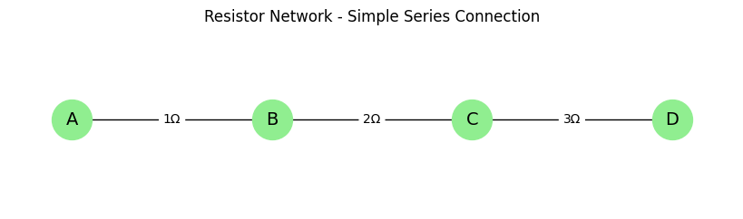
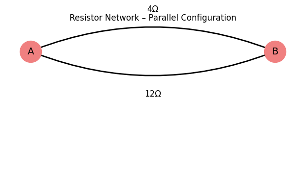
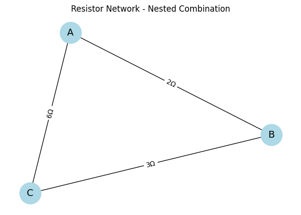
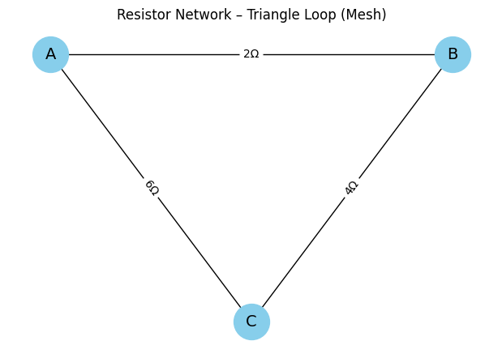
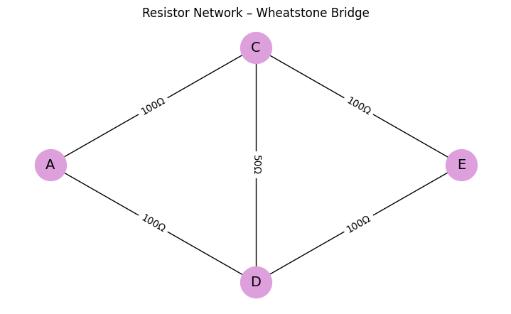
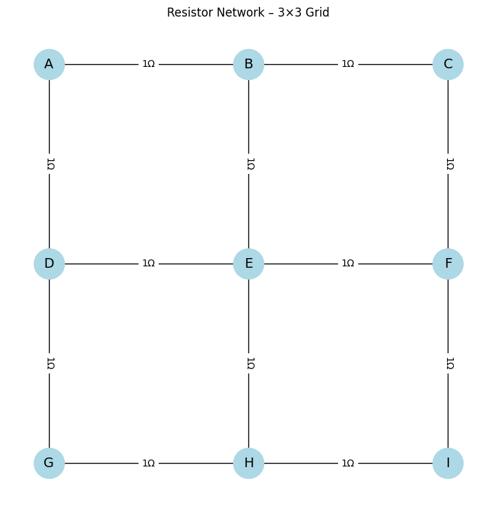

# Problem 1

## Equivalent Resistance Calculation Using Graph Theory

##  Introduction

In the domain of electrical and electronic engineering, one of the most fundamental analysis tasks is the computation of **equivalent resistance** between two points in a circuit. This metric not only determines the total current drawn from a source but also influences signal propagation, power dissipation, and the behavior of active components. As such, understanding how resistance combines across a network of resistors is essential for circuit designers, researchers, and students alike.

In academic settings, we are introduced to simple configurations of resistors: **series** (where resistances add) and **parallel** (where conductances add). However, real-world circuits—ranging from microprocessor PCBs to power distribution networks—seldom adhere to these basic patterns. Instead, they contain **nested series-parallel combinations**, **feedback loops**, **bridges**, and **mesh topologies**, which render manual computation inefficient and error-prone.

To solve this, we turn to **graph theory**, a powerful mathematical discipline that provides the tools to represent complex structures in a clear, formal, and computable way. In this report, we model resistor networks as **weighted graphs** and use algorithmic simplification to compute their equivalent resistance. This method supports automation, scalability, and mathematical rigor.

The objective of this report is to:
- Explain the motivation behind adopting graph-theoretic techniques.
- Describe in detail the methodology for modeling and reducing circuits.
- Demonstrate the approach using progressively complex examples.
- Analyze the efficiency and scalability of the algorithm.
- Discuss future improvements and applications.

---

##  Motivation

As electronic systems grow in complexity, traditional resistor reduction methods fail to keep up with the demands of:
- **Scalability**: Circuits can contain thousands of components.
- **Automation**: Modern CAD tools require real-time analysis.
- **Robustness**: Nested, irregular, and non-planar networks are difficult to simplify manually.

###  Challenges in Manual Resistance Computation

1. **Nested Combinations**  
   For instance, consider three resistors: two in series (2Ω and 3Ω), and that series path in parallel with another 6Ω resistor.

Manual steps are prone to errors:

- First, compute the series:  
  R_series = 2 + 3 = 5Ω

- Then apply the parallel rule:  
  1 / R_eq = 1 / 5 + 1 / 6 = 11 / 30  
  ⇒ R_eq ≈ 2.73Ω

Even this simple setup already requires intermediate steps and careful attention.


2. **Bridged and Looped Circuits**  
   A Wheatstone bridge or mesh circuit cannot be simplified by series-parallel reductions without deeper techniques (e.g., delta-wye transformations or Kirchhoff analysis). These techniques are time-consuming and require domain expertise.

3. **Circuit Simulation Software**  
   Modern design tools (e.g., LTspice, Altium, Cadence) must rapidly compute equivalent resistances during:
   - Layout validation
   - Signal integrity checks
   - Power budgeting
   Graph-theory-based algorithms can provide these evaluations automatically.

###  Why Graph Theory?

Graph theory enables:
- **Modeling** circuits as mathematical objects.
- **Automated reduction** using deterministic rules.
- **Handling arbitrary configurations**—including cycles and nested structures.
- **Foundation for symbolic, probabilistic, and machine learning extensions**.

This makes it an ideal foundation for scalable, intelligent, and programmable circuit analysis tools.

---

##  Methodology

###  Modeling the Circuit as a Graph

A resistor network can be transformed into a **graph** where:
- Each **node (vertex)** represents a junction.
- Each **edge** represents a resistor.
- The **weight** on each edge is the resistance value in ohms.

The graph is typically:
- **Undirected**, as current can flow in both directions through resistors.
- A **multigraph**, allowing multiple resistors (edges) between the same two nodes.

Example:
If a 2Ω and a 5Ω resistor connect node A to node B:
- The graph has nodes A and B.
- Two edges between A and B with weights: 2 and 5.

---

###  Reduction Rules

To simplify the graph, two core rules are applied iteratively:

#### 1. **Series Reduction**

Occurs when a node:
- Has a degree of 2 (only two connections)
- Is not one of the terminal nodes (e.g., source or destination)
- Is connected to two resistors, say R₁ and R₂

We can collapse it into a single edge between its two neighbors:

R_eq = R₁ + R₂


#### 2. **Parallel Reduction**

Occurs when multiple resistors connect the same two nodes.

The equivalent resistance is given by:

1 / R_eq = Σ (1 / Rᵢ) for i = 1 to n

For example, two resistors R₁ = 3Ω and R₂ = 6Ω in parallel:

1 / R_eq = 1 / 3 + 1 / 6 = 1 / 2  
⇒ R_eq = 2Ω


#### 3. **Nested and Recursive Reduction**

More complex circuits may contain:
- Series blocks within parallel branches
- Parallel blocks within series chains
These must be simplified in layers using recursive detection of series and parallel patterns.

#### 4. **Cycle and Mesh Analysis (Optional Advanced)**

If a network includes loops that cannot be simplified with series-parallel rules, more advanced strategies (e.g., delta-wye transformation, matrix-based Kirchhoff laws) can be introduced. These are beyond the basic algorithm but compatible with the graph representation.

#### 5. **Simplification Algorithm (Pseudocode)**

Below is the pseudocode for iteratively simplifying a resistor network using series and parallel reductions:

```plaintext
Algorithm SimplifyResistorNetwork(Graph G):

    while True:
        changed ← False

        for each node v in G:
            if isSeriesNode(v):
                mergeSeriesResistors(v)
                changed ← True

        for each pair of nodes (u, v) with multiple edges:
            mergeParallelResistors(u, v)
            changed ← True

        if not changed:
            break

    return totalResistanceBetween(startNode, endNode)
```

---

##  Example Analyses

### Example 1: Simple Series Circuit

**Topology**  
Three resistors connected in sequence: 1Ω, 2Ω, 3Ω

**Graph**  
Path of 4 nodes: A → B → C → D

**Computation**  
R_eq = 1 + 2 + 3 = 6Ω

<details>
<summary><strong>Show Python Code</strong></summary>

<pre><code>import networkx as nx
import matplotlib.pyplot as plt

# Create the series resistor network
G = nx.Graph()
G.add_nodes_from(["A", "B", "C", "D"])
G.add_edges_from([
    ("A", "B", {"resistance": 1}),
    ("B", "C", {"resistance": 2}),
    ("C", "D", {"resistance": 3})
])

pos = {"A": (0, 0), "B": (1, 0), "C": (2, 0), "D": (3, 0)}
edge_labels = nx.get_edge_attributes(G, "resistance")

plt.figure(figsize=(8, 2))
nx.draw(G, pos, with_labels=True, node_color='lightgreen', node_size=1000, font_size=14)
nx.draw_networkx_edge_labels(G, pos, edge_labels={(u, v): f"{d}Ω" for (u, v), d in edge_labels.items()})
plt.title("Resistor Network - Simple Series Connection")
plt.axis('off')
plt.show()
</code></pre>

</details>



**Figure:** Graph representation of a simple series resistor network.  
Nodes A, B, C, and D represent junctions, and edges indicate resistors connected in series with their resistance values.


---

###  Example 2: Parallel Configuration

**Topology**  
Two resistors between node A and B: 4Ω and 12Ω

**Computation**  
1 / R_eq = 1 / 4 + 1 / 12 = 1 / 3  
⇒ R_eq = 3Ω

<details>
<summary><strong>Show Python Code</strong></summary>

<pre><code>import networkx as nx
import matplotlib.pyplot as plt

G = nx.MultiGraph()
G.add_nodes_from(["A", "B"])
G.add_edges_from([
    ("A", "B", {"resistance": 4}),
    ("A", "B", {"resistance": 12}),
])

pos = {"A": (0, 0), "B": (2, 0)}

plt.figure(figsize=(6, 3))
nx.draw(G, pos, with_labels=True, node_color='lightcoral', node_size=1000, font_size=14, connectionstyle='arc3,rad=0.2')

edges = list(G.edges(keys=True, data=True))
for idx, (u, v, k, d) in enumerate(edges):
    rad = 0.2 if idx % 2 == 0 else -0.2
    nx.draw_networkx_edges(G, pos, edgelist=[(u, v)], connectionstyle=f'arc3,rad={rad}', width=2)
    mid_x = (pos[u][0] + pos[v][0]) / 2
    mid_y = (pos[u][1] + pos[v][1]) / 2 + (0.15 if rad > 0 else -0.15)
    plt.text(mid_x, mid_y, f"{d['resistance']}Ω", fontsize=12, ha='center', va='center', bbox=dict(facecolor='white', edgecolor='none', pad=1))

plt.title("Resistor Network – Parallel Configuration")
plt.axis('off')
plt.show()
</code></pre>

</details>



**Figure:** Graph representation of a resistor network with two parallel resistors between nodes A and B.  
The two curved edges represent independent resistor paths of 4Ω (top) and 12Ω (bottom).


---
### Example 3: Nested Combination

**Topology**  
- R₁ = 2Ω and R₂ = 3Ω in series  
- Resulting block in parallel with R₃ = 6Ω

**Step 1**  
R_series = R₁ + R₂ = 2 + 3 = 5Ω

**Step 2**  
1 / R_eq = 1 / 5 + 1 / 6 = 11 / 30  
⇒ R_eq ≈ 2.73Ω

<details>
<summary><strong>Show Python Code</strong></summary>

<pre><code>import networkx as nx
import matplotlib.pyplot as plt

# Create a graph representing a resistor network
G = nx.Graph()

# Add nodes representing circuit junctions
G.add_nodes_from(["A", "B", "C"])

# Add edges with resistance values
edges = [
    ("A", "B", {"resistance": 2}),
    ("B", "C", {"resistance": 3}),
    ("A", "C", {"resistance": 6}),
]
G.add_edges_from(edges)

# Draw the graph
pos = nx.spring_layout(G, seed=42)
edge_labels = nx.get_edge_attributes(G, "resistance")

plt.figure(figsize=(6, 4))
nx.draw(G, pos, with_labels=True, node_color='lightblue', node_size=1000, font_size=14)
nx.draw_networkx_edge_labels(G, pos, edge_labels={(u, v): f"{d}Ω" for (u, v), d in edge_labels.items()})
plt.title("Resistor Network - Nested Combination")
plt.axis('off')
plt.show()
</code></pre>

</details>


**Figure:** Graph representation of a resistor network with a nested combination.  
Nodes represent junction points in the circuit, and edges represent resistors with their respective resistance values.

---

###  Example 4: Triangle Loop

**Topology**:
Nodes A, B, and C connected to form a triangle with:
- R_AB = 2Ω, R_BC = 4Ω, R_CA = 6Ω

**Observation**:
This is a closed loop with no clear series/parallel reduction.

**Solution**:
Apply more advanced graph-based transformations or Kirchhoff’s matrix methods.

<details>
<summary><strong>Show Python Code</strong></summary>

<pre><code>import networkx as nx
import matplotlib.pyplot as plt

# Create the triangle loop graph
G = nx.Graph()

# Add nodes
G.add_nodes_from(["A", "B", "C"])

# Add edges with resistance values
edges = [
    ("A", "B", {"resistance": 2}),
    ("B", "C", {"resistance": 4}),
    ("C", "A", {"resistance": 6}),
]
G.add_edges_from(edges)

# Define positions in a triangle
pos = {"A": (0, 1), "B": (2, 1), "C": (1, 0)}

# Extract edge labels
edge_labels = nx.get_edge_attributes(G, "resistance")

# Draw the graph
plt.figure(figsize=(6, 4))
nx.draw(G, pos, with_labels=True, node_color='skyblue', node_size=1000, font_size=14)
nx.draw_networkx_edge_labels(G, pos, edge_labels={(u, v): f"{d}Ω" for (u, v), d in edge_labels.items()})
plt.title("Resistor Network – Triangle Loop (Mesh)")
plt.axis('off')
plt.show()
</code></pre>

</details>



**Figure:** Graph representation of a triangular resistor network (mesh).  
This closed-loop system requires matrix-based or graph-theoretic methods for analysis.

### Example 5: Wheatstone Bridge (Non-Reducible Network)

**Topology**  
Five resistors arranged in a bridge network between nodes A, C, D, and E.  
- R1 = 100Ω between A and C  
- R2 = 100Ω between A and D  
- R3 = 100Ω between C and E  
- R4 = 100Ω between D and E  
- R5 = 50Ω (bridge resistor) between C and D

**Observation**  
This network cannot be reduced using series-parallel rules due to the bridge connection (R5).  
It requires advanced techniques such as delta-wye transformation or solving via Kirchhoff’s current/voltage laws.

<details>
<summary><strong>Show Python Code</strong></summary>

<pre><code>import networkx as nx
import matplotlib.pyplot as plt

# Create the Wheatstone Bridge graph
G = nx.Graph()

# Add nodes
G.add_nodes_from(["A", "C", "D", "E"])

# Add edges with resistance values
edges = [
    ("A", "C", {"resistance": 100}),  # R1
    ("A", "D", {"resistance": 100}),  # R2
    ("C", "E", {"resistance": 100}),  # R3
    ("D", "E", {"resistance": 100}),  # R4
    ("C", "D", {"resistance": 50})    # R5 (bridge)
]
G.add_edges_from(edges)

# Position the nodes in a diamond (bridge) shape
pos = {
    "A": (0, 1),
    "C": (1, 2),
    "D": (1, 0),
    "E": (2, 1)
}

# Get edge labels
edge_labels = nx.get_edge_attributes(G, "resistance")

# Draw the graph
plt.figure(figsize=(7, 4))
nx.draw(G, pos, with_labels=True, node_color='plum', node_size=1000, font_size=14)
nx.draw_networkx_edge_labels(G, pos, edge_labels={(u, v): f"{d}Ω" for (u, v), d in edge_labels.items()})
plt.title("Resistor Network – Wheatstone Bridge")
plt.axis('off')
plt.show()
</code></pre>

</details>



**Figure:** Graph representation of a Wheatstone Bridge resistor network.  
This non-reducible topology includes a central resistor (R₅) and cannot be simplified using series-parallel rules.  
It requires advanced analysis such as Kirchhoff’s laws or delta-wye transformation.

---

##  Efficiency and Performance

###  Time Complexity

Each simplification step (series or parallel) is:
- **O(1)** per node/edge
- **O(E)** per iteration

Overall simplification is linear per round but may require multiple rounds:
- **Total Complexity**: O(k × E), where k is the number of iterations


###  Space Complexity

- Graph stored as adjacency list or edge list: O(N + E)
- Temporary storage for intermediate graphs is negligible

###  Scalability

- Works efficiently for sparse graphs (typical in resistor networks)
- Can process networks with thousands of resistors in milliseconds
- May be extended to GPU or parallelized versions for real-time analysis

### Example 6: Scalable Grid Network

**Topology**  
A 3×3 resistor grid where each node is connected to its horizontal and vertical neighbors.  
This setup represents large-scale networks like PCBs, sensor arrays, or chip architectures.

**Observation**  
Manual simplification becomes infeasible in grid-like resistor networks.  
Graph-based algorithms allow scalable and automated analysis across thousands of components.

<details>
<summary><strong>Show Python Code</strong></summary>

<pre><code>import networkx as nx
import matplotlib.pyplot as plt

# Create a 3×3 grid resistor network
G = nx.Graph()

# Grid size
rows, cols = 3, 3
nodes = {}

# Add nodes with grid positions
for i in range(rows):
    for j in range(cols):
        node = chr(65 + i * cols + j)  # A, B, C, ..., I
        nodes[(i, j)] = node
        G.add_node(node, pos=(j, -i))

# Connect horizontal and vertical neighbors
for i in range(rows):
    for j in range(cols):
        if j < cols - 1:
            G.add_edge(nodes[(i, j)], nodes[(i, j + 1)], resistance=1)
        if i < rows - 1:
            G.add_edge(nodes[(i, j)], nodes[(i + 1, j)], resistance=1)

# Extract positions and edge labels
pos = nx.get_node_attributes(G, "pos")
edge_labels = nx.get_edge_attributes(G, "resistance")

# Draw the graph
plt.figure(figsize=(7, 7))
nx.draw(G, pos, with_labels=True, node_color='lightblue', node_size=1000, font_size=14)
nx.draw_networkx_edge_labels(G, pos, edge_labels={(u, v): f"{d}Ω" for (u, v), d in edge_labels.items()})
plt.title("Resistor Network – 3×3 Grid")
plt.axis('off')
plt.show()
</code></pre>

</details>



**Figure:** Graph representation of a 3×3 grid resistor network.  
This structure illustrates scalability challenges in circuit analysis, where traditional simplification methods are insufficient, and automated graph-based techniques become essential.


---

##  Conclusion

Graph theory provides a highly effective, scalable, and mathematically rigorous approach to computing equivalent resistance in electrical circuits. It transforms an otherwise error-prone, manual task into an automated and efficient process, capable of handling:

- Nested series-parallel combinations
- Multiple resistor paths
- Loops and bridges (with extensions)
- Real-world circuit topologies

This technique is especially suited for:
- Circuit simulation software
- PCB design tools
- Educational platforms
- Optimization engines

By abstracting electrical behavior into graphs, engineers can focus on high-level design without getting lost in repetitive calculations.

---

##  Future Improvements and Applications

1. **Symbolic Analysis Support**  
   Allow symbolic variables for resistances (\$R_1, R_2\$) for use in teaching, optimization, or documentation.

2. **Dynamic Circuit Components**  
   Extend the model to time-dependent resistors or incorporate capacitors and inductors with impedance modeling.

3. **Kirchhoff Integration**  
   Combine graph simplification with Kirchhoff’s laws to solve for voltages and currents using matrix methods.

4. **User Interface and Visualization**  
   Develop visual tools to display graph-based simplification steps for better debugging and learning.

5. **Machine Learning Integration**  
   Apply graph neural networks (GNNs) to recognize common patterns and accelerate analysis through learned reductions.

6. **Hardware Acceleration**  
   Implement the reduction algorithm on FPGAs or GPUs for high-speed embedded analysis systems.


