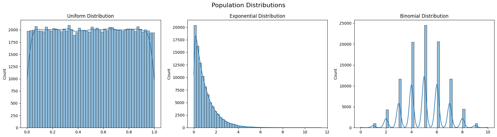
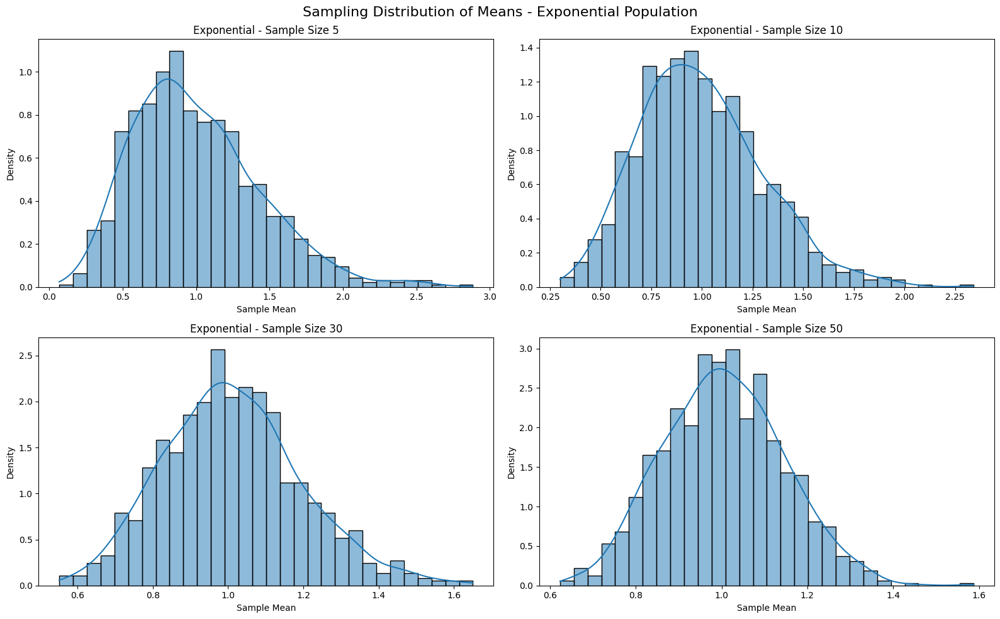
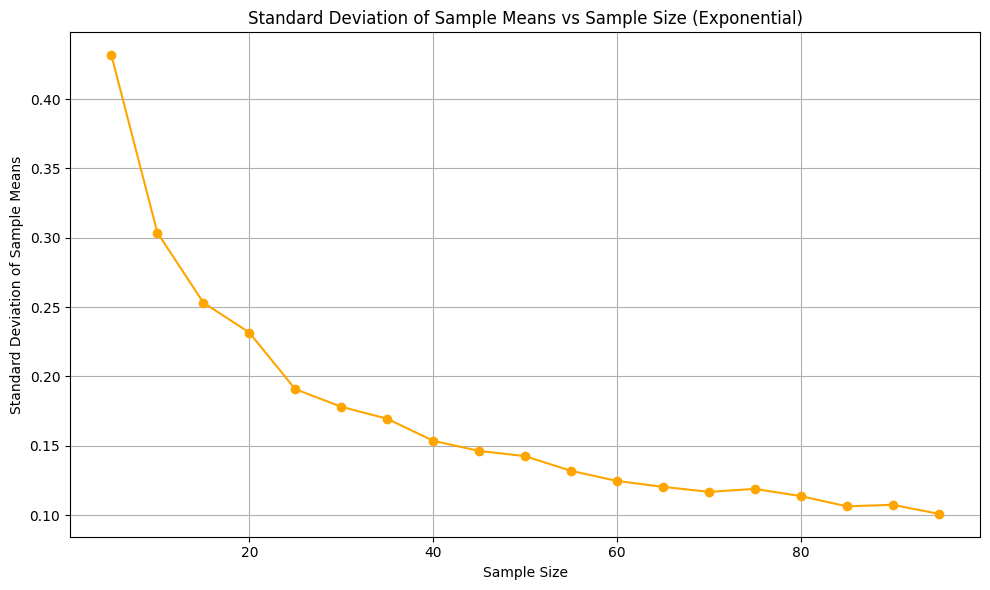
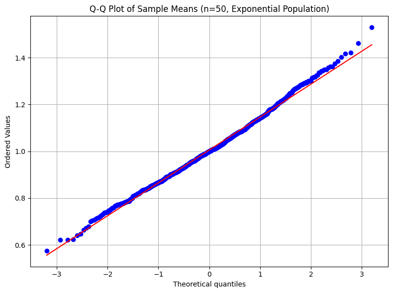
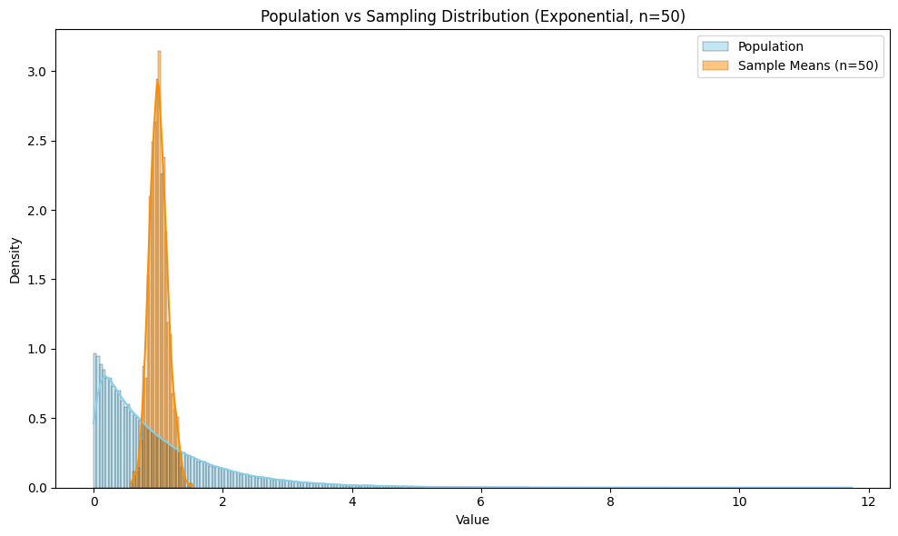
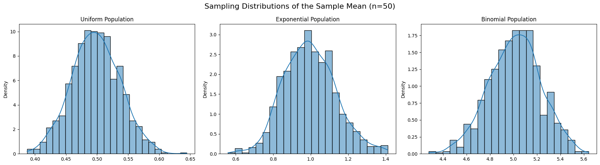

# Problem 1
# Central Limit Theorem (CLT) - Simulation and Exploration Report

## 1. Introduction

The Central Limit Theorem (CLT) is one of the most powerful and fundamental theorems in the field of probability and statistics. It states that, given a sufficiently large sample size from any population with a finite level of variance, the sampling distribution of the mean of all samples from the population will be approximately normally distributed, regardless of the shape of the population distribution.

This concept is foundational in inferential statistics because it allows us to use normal probability models for estimation and hypothesis testing, even when the underlying population distribution is not normal. The CLT provides a critical bridge between descriptive statistics and inferential procedures.

It is especially important in real-world contexts, where the true population distribution is unknown or not easily accessible. The CLT provides the theoretical justification for using sample data to estimate population parameters and for constructing confidence intervals. Moreover, the CLT underpins many statistical methods, including t-tests, ANOVA, and regression analysis.

By observing the behavior of sample means from various population types, this report demonstrates how the CLT holds under different conditions, thereby reinforcing its robustness and general applicability.

## 2. Motivation

The motivation behind studying the Central Limit Theorem through simulations is rooted in both pedagogical and practical purposes. For students and learners, seeing is believing. Simulations offer a concrete way to understand how abstract statistical principles manifest in real-world data scenarios.

From a practical perspective, nearly all statistical inference relies, directly or indirectly, on the Central Limit Theorem. For example, when constructing confidence intervals or conducting hypothesis tests, we typically assume that the sampling distribution of the mean is normal. This assumption is critical in many industries, including healthcare, manufacturing, finance, and technology.

Understanding how and why the CLT works not only enhances theoretical knowledge but also builds trust in the statistical tools used daily in these fields. Furthermore, it helps practitioners make informed decisions, especially when dealing with limited data and unknown population distributions.

## 3. Objectives

The main objective of this report is to empirically demonstrate the Central Limit Theorem using computational simulations. We aim to:

* Simulate populations with different underlying distributions, including uniform, exponential, and binomial.
* Generate multiple random samples from these populations and calculate their sample means.
* Visualize the distribution of these sample means to assess their conformity to a normal distribution as sample size increases.
* Examine the influence of sample size and population variance on the shape and spread of the sampling distribution.
* Link the observed behavior to the theoretical expectations outlined by the CLT.

This multi-faceted approach enables a comprehensive exploration of the CLT’s implications and practical applications.

## 4. Libraries and Tools

Python has been selected for this simulation because of its robust ecosystem for scientific computing and data visualization. The libraries used are:

* **NumPy**: Provides powerful tools for numerical computations and random sampling.
* **Matplotlib**: Used for creating detailed and customized plots.
* **Seaborn**: Built on Matplotlib, it offers more sophisticated and aesthetically pleasing statistical visualizations.

These tools allow for efficient data generation, sampling, and graphical analysis, making them ideal for simulating and exploring statistical phenomena such as the CLT.

## 5. Population Distributions

In order to test the Central Limit Theorem, we begin with three distinct types of population distributions:

* **Uniform Distribution**: This distribution is symmetric and has equal probability for all outcomes within a specified range. It serves as a simple yet effective model for randomness.
* **Exponential Distribution**: Often used to model time between events in a Poisson process, this distribution is highly skewed and highlights the power of CLT in dealing with non-normal populations.
* **Binomial Distribution**: A discrete probability distribution representing the number of successes in a fixed number of independent trials. It allows us to test the CLT in a context where the underlying distribution is not continuous.

By analyzing these different population types, we can observe how the CLT behaves under various conditions and degrees of skewness.

<strong>Show Python Code</strong>

<pre><code>import numpy as np
import matplotlib.pyplot as plt
import seaborn as sns

# Set random seed for reproducibility
np.random.seed(42)

# Create population data
uniform_population = np.random.uniform(0.0, 1.0, 100000)
exponential_population = np.random.exponential(scale=1.0, size=100000)
binomial_population = np.random.binomial(n=10, p=0.5, size=100000)

# Plot histograms of the population distributions
plt.figure(figsize=(18, 5))

plt.subplot(1, 3, 1)
sns.histplot(uniform_population, kde=True, bins=50)
plt.title('Uniform Distribution')

plt.subplot(1, 3, 2)
sns.histplot(exponential_population, kde=True, bins=50)
plt.title('Exponential Distribution')

plt.subplot(1, 3, 3)
sns.histplot(binomial_population, kde=True, bins=50)
plt.title('Binomial Distribution')

plt.suptitle('Population Distributions', fontsize=16)
plt.tight_layout()
plt.savefig('population_distributions.png')  # Save figure
plt.show()
</code></pre>

*Figure 1: Histograms of Uniform, Exponential, and Binomial distributions. These show the starting point before sampling is applied.*

## 6. Sampling Distributions

For each population, we conduct repeated sampling to construct empirical sampling distributions of the sample mean. Sampling is done randomly and with replacement, mimicking real-world statistical sampling.

Sample sizes of 5, 10, 30, and 50 are chosen to observe how the sample size affects the shape of the distribution of the sample mean. For each sample size, the process is repeated 1,000 times to ensure a stable estimate of the sampling distribution.

As we increase the sample size, we expect the sampling distribution to become increasingly bell-shaped and symmetric, even when the original population is not.

## 7. Simulation and Visualization

Using Python and the libraries mentioned above, we simulate 1,000 samples for each sample size from each population. The sample means are recorded, and their distribution is plotted using histograms and kernel density estimates.

The goal of visualization is to make the convergence to normality evident. In the case of the exponential distribution, for instance, we begin with a heavily skewed population, but by the time the sample size reaches 30 or 50, the distribution of the sample means approximates a normal distribution.

These visualizations not only confirm the CLT but also provide a tangible understanding of its implications. They show how, despite the shape of the original distribution, the sampling distribution of the mean tends to normality as the sample size increases.

<strong>Show Python Code</strong>

<pre><code>import numpy as np
import matplotlib.pyplot as plt
import seaborn as sns

# Set seed for reproducibility
np.random.seed(42)

# Exponential population
exponential_population = np.random.exponential(scale=1.0, size=100000)

# Sampling function
def sampling_distribution(population, sample_size, num_samples=1000):
    return [np.mean(np.random.choice(population, size=sample_size)) for _ in range(num_samples)]

# Sample sizes to visualize
sample_sizes = [5, 10, 30, 50]
fig, axs = plt.subplots(2, 2, figsize=(16, 10))

# Flatten axes to avoid indexing issues
axs = axs.flatten()

# Plot each sampling distribution
for i, size in enumerate(sample_sizes):
    sample_means = sampling_distribution(exponential_population, size)
    sns.histplot(sample_means, kde=True, stat="density", bins=30, ax=axs[i])
    axs[i].set_title(f'Exponential - Sample Size {size}')
    axs[i].set_xlabel('Sample Mean')
    axs[i].set_ylabel('Density')

fig.suptitle('Sampling Distribution of Means - Exponential Population', fontsize=16)
plt.tight_layout()
plt.savefig('sampling_exponential.png')  # Save the figure
plt.show()
</code></pre>

*Figure 2: Sampling distributions of the sample mean from an exponential population. As the sample size increases, the distribution becomes more normal-shaped, illustrating the Central Limit Theorem.*

## 8. Observations and Analysis

The simulations reveal several key observations:

* **For the uniform distribution**, the sample means quickly converge to a normal distribution even at smaller sample sizes.
* **For the exponential distribution**, which is heavily right-skewed, the sampling distribution becomes more symmetric and bell-shaped as the sample size increases. This showcases the CLT’s ability to normalize highly skewed data.
* **For the binomial distribution**, the results depend on the parameters of the distribution. With a large number of trials, the binomial distribution approximates a normal distribution due to the De Moivre–Laplace theorem, which is itself a form of the CLT.

We also observe that the spread of the sampling distribution decreases with increasing sample size. This is consistent with the formula:

$$
\text{Standard Error} = \frac{\sigma}{\sqrt{n}}
$$

This formula illustrates that as the sample size increases, the standard error of the mean decreases, leading to tighter, more reliable estimates.

<strong>Show Python Code</strong>

<pre><code>import numpy as np
import matplotlib.pyplot as plt

# Set seed and population
np.random.seed(42)
exp_population = np.random.exponential(scale=1.0, size=100000)

# Function for sampling distribution
def sampling_distribution(population, sample_size, num_samples=1000):
    return [np.mean(np.random.choice(population, size=sample_size)) for _ in range(num_samples)]

# Calculate standard deviations for increasing sample sizes
sample_sizes = np.arange(5, 100, 5)
std_devs = [np.std(sampling_distribution(exp_population, size)) for size in sample_sizes]

# Plot
plt.figure(figsize=(10, 6))
plt.plot(sample_sizes, std_devs, marker='o', color='orange')
plt.title('Standard Deviation of Sample Means vs Sample Size (Exponential)')
plt.xlabel('Sample Size')
plt.ylabel('Standard Deviation of Sample Means')
plt.grid(True)
plt.tight_layout()
plt.savefig('std_error_vs_sample_size.png')
plt.show()
</code></pre>

*Figure 3: As sample size increases, the standard deviation of the sample means decreases. This demonstrates the relationship predicted by the Central Limit Theorem.*

These findings strongly support the theoretical underpinnings of the CLT and demonstrate its robustness across different data conditions.

<strong>Show Python Code</strong>

<pre><code>import numpy as np
import matplotlib.pyplot as plt
import scipy.stats as stats

# Set seed and generate population
np.random.seed(42)
exp_population = np.random.exponential(scale=1.0, size=100000)

# Sampling function
def sampling_distribution(population, sample_size, num_samples=1000):
    return [np.mean(np.random.choice(population, size=sample_size)) for _ in range(num_samples)]

# Generate sample means (n=50)
sample_means = sampling_distribution(exp_population, sample_size=50)

# Q-Q Plot
plt.figure(figsize=(8, 6))
stats.probplot(sample_means, dist="norm", plot=plt)
plt.title("Q-Q Plot of Sample Means (n=50, Exponential Population)")
plt.grid(True)
plt.tight_layout()
plt.savefig('qq_plot_sample_means.png')
plt.show()
</code></pre>

*Figure 4: Q-Q plot comparing the distribution of sample means (n=50) from an exponential population to a theoretical normal distribution. The linear alignment of points confirms the approximation of normality, as predicted by the Central Limit Theorem.*

## 9. Real-World Applications

The Central Limit Theorem has wide-ranging applications across numerous fields. Some of the most prominent include:

* **Quality Control in Manufacturing**: Engineers use sample means to monitor production processes. The assumption that these sample means are normally distributed allows for the construction of control charts and specification limits.
* **Medical Research and Clinical Trials**: Researchers use sample means to compare the effects of treatments. The CLT allows for the use of t-tests and confidence intervals, even when the population distribution is unknown.
* **Financial Modeling**: In finance, returns of assets are often aggregated across portfolios. According to the CLT, the average return of a large number of assets tends toward a normal distribution, which simplifies risk modeling.
* **Public Opinion Polling**: Survey organizations collect data from a subset of the population to make inferences about the whole. The CLT ensures that the sample mean or proportion will approximate a normal distribution, enabling the calculation of margins of error and confidence intervals.

These examples highlight the practical significance of the CLT. Whether making business decisions, conducting scientific research, or interpreting public opinion, the reliability of statistical inference often hinges on this powerful theorem.

<strong>Show Python Code</strong>

<pre><code>import numpy as np
import matplotlib.pyplot as plt
import seaborn as sns

# Set seed and create exponential population
np.random.seed(42)
exp_population = np.random.exponential(scale=1.0, size=100000)

# Sampling function
def sampling_distribution(population, sample_size, num_samples=1000):
    return [np.mean(np.random.choice(population, size=sample_size)) for _ in range(num_samples)]

# Get sample means
sample_means = sampling_distribution(exp_population, sample_size=50)

# Overlay plot
plt.figure(figsize=(10, 6))
sns.histplot(exp_population, kde=True, color='skyblue', label='Population', stat='density')
sns.histplot(sample_means, kde=True, color='darkorange', label='Sample Means (n=50)', stat='density')
plt.title('Population vs Sampling Distribution (Exponential, n=50)')
plt.xlabel('Value')
plt.ylabel('Density')
plt.legend()
plt.tight_layout()
plt.savefig('population_vs_sample_means.png')
plt.show()
</code></pre>

*Figure 5: Comparison between the original exponential population distribution and the distribution of sample means (n=50). Despite the skewness of the population, the sampling distribution is nearly normal. This illustrates the practical power of the Central Limit Theorem.*

## 10. Summary and Conclusions

<strong>Show Python Code</strong>

<pre><code>import numpy as np
import matplotlib.pyplot as plt
import seaborn as sns

# Set seed and generate populations
np.random.seed(42)
uniform_pop = np.random.uniform(0.0, 1.0, 100000)
exp_pop = np.random.exponential(scale=1.0, size=100000)
binom_pop = np.random.binomial(n=10, p=0.5, size=100000)

# Sampling function
def sampling_distribution(population, sample_size=50, num_samples=1000):
    return [np.mean(np.random.choice(population, size=sample_size)) for _ in range(num_samples)]

# Compute sample means
uniform_means = sampling_distribution(uniform_pop)
exp_means = sampling_distribution(exp_pop)
binom_means = sampling_distribution(binom_pop)

# Plot
fig, axs = plt.subplots(1, 3, figsize=(18, 5))
sns.histplot(uniform_means, kde=True, stat='density', ax=axs[0])
axs[0].set_title('Uniform Population')

sns.histplot(exp_means, kde=True, stat='density', ax=axs[1])
axs[1].set_title('Exponential Population')

sns.histplot(binom_means, kde=True, stat='density', ax=axs[2])
axs[2].set_title('Binomial Population')

plt.suptitle('Sampling Distributions of the Sample Mean (n=50)', fontsize=16)
plt.tight_layout()
plt.savefig('sampling_comparison.png')
plt.show()
</code></pre>

*Figure 6: Side-by-side comparison of sample mean distributions (n=50) from three distinct populations: uniform, exponential, and binomial. Regardless of the original population shape, the sampling distributions converge to a bell-shaped, symmetric form — a visual confirmation of the Central Limit Theorem.*

This report demonstrates, through simulation, the power and elegance of the Central Limit Theorem. Despite varying population shapes — from uniform and symmetric to exponential and skewed — the sampling distribution of the sample mean consistently approaches normality as the sample size increases.

The results validate key theoretical expectations:

* Regardless of the original population distribution, the sample mean distribution becomes approximately normal given a large enough sample size.
* The variance of the sample mean decreases with increased sample size, providing more precise estimates.
* Even with small sample sizes, noticeable progress toward normality can be observed, especially with symmetric distributions.

This empirical approach reinforces not only the conceptual understanding of the CLT but also its critical role in real-world statistical practice. From enabling confidence intervals and hypothesis tests to supporting models in engineering, finance, and health, the CLT forms the foundation upon which much of modern data analysis is built.

Going forward, exploring the CLT in more complex or non-ideal scenarios — such as non-independent data, high-leverage outliers, or infinite variance distributions — can further deepen our understanding of its limitations and strengths.

The Central Limit Theorem remains a testament to the power of large numbers and the beauty of statistical convergence. Its applications are both theoretically profound and practically indispensable.
