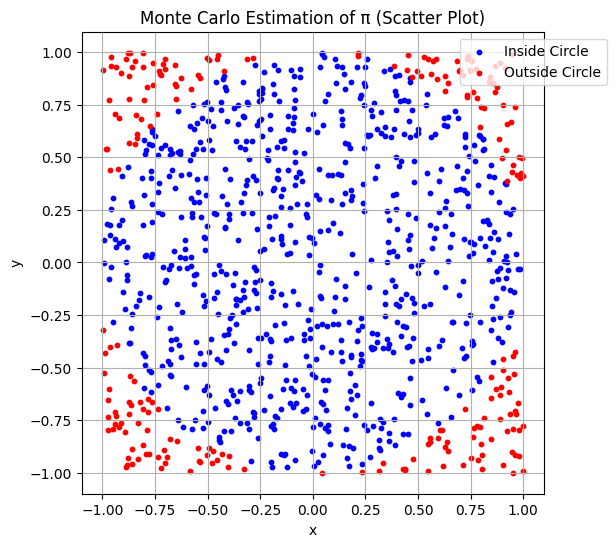
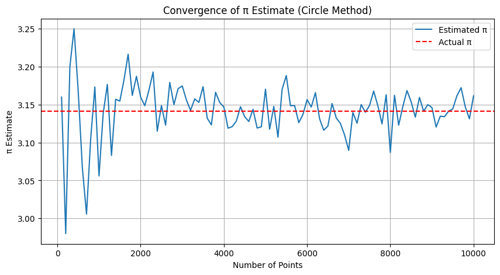
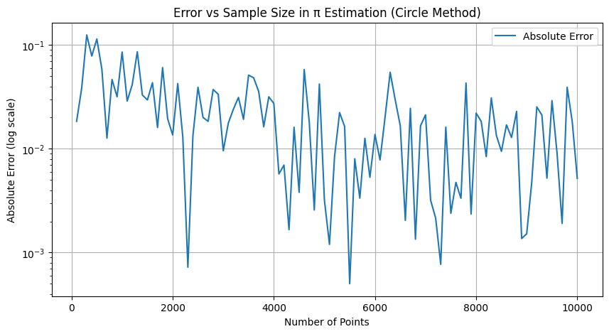
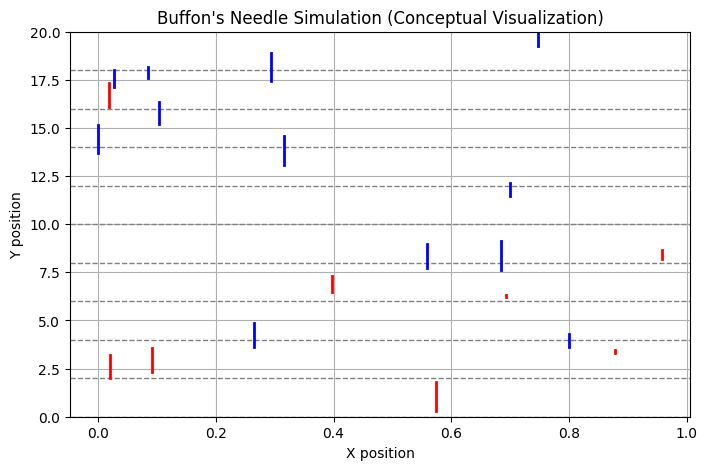
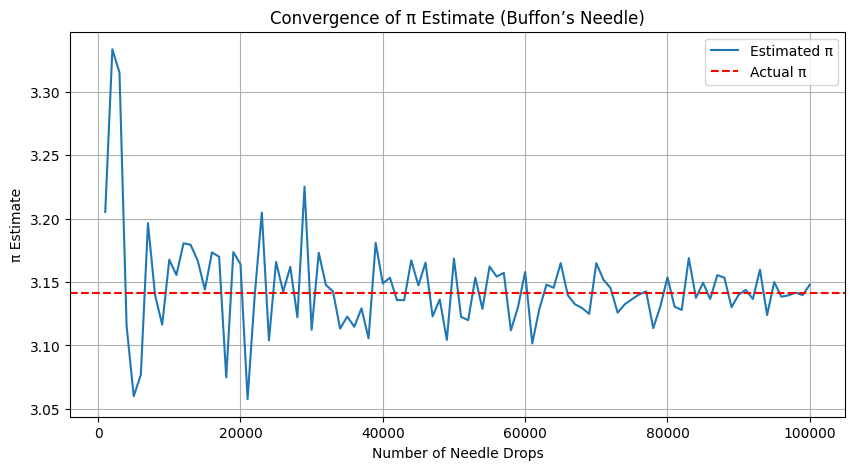

# Problem 2

# Estimating π Using Monte Carlo Methods

## Introduction

Monte Carlo methods are a family of computational algorithms that utilize repeated random sampling to approximate complex mathematical quantities or solve problems that are otherwise analytically intractable. These stochastic techniques leverage the power of probability and statistics to estimate values with increasing accuracy as the number of trials grows, making them invaluable in areas where traditional deterministic approaches fall short or become computationally prohibitive.

The concept of Monte Carlo simulation traces its roots back to the mid-20th century and has since found widespread application across diverse scientific fields including physics, finance, engineering, biology, and artificial intelligence. By embracing randomness, Monte Carlo methods provide not only numerical solutions but also deep insights into the probabilistic structure underlying many natural and engineered systems.

One of the most elegant and historically significant examples of a Monte Carlo application is the estimation of the mathematical constant π (pi). Defined as the ratio of a circle’s circumference to its diameter, π appears ubiquitously in mathematics, geometry, trigonometry, and various scientific disciplines. While π can be calculated to extraordinary precision through infinite series, iterative algorithms, and transcendental function evaluations, estimating π through stochastic methods serves as both a pedagogical tool and a compelling demonstration of fundamental probabilistic principles.

The Monte Carlo estimation of π exemplifies how randomness can be harnessed to approximate deterministic constants by transforming geometric or physical problems into probabilistic ones. This report explores two classical Monte Carlo approaches in detail:

1. The first method involves generating random points within a square enclosing a circle and calculating the proportion that falls inside the circle to approximate π.

2. The second method, known as Buffon’s Needle experiment, uses the probability of a needle crossing parallel lines when dropped randomly to estimate π, bridging physical randomness with geometric probability.

Through careful analysis, simulation, and visualization of these methods, this report aims to highlight the convergence behavior, computational considerations, and the educational value of Monte Carlo simulations. Ultimately, it demonstrates the profound ability of randomness to reveal underlying mathematical truths and lays the groundwork for understanding more complex stochastic modeling techniques.

---

## Motivation

The goal of estimating π through Monte Carlo simulations is not primarily to discover a new or more precise value of this mathematical constant, but rather to demonstrate how randomness and probabilistic techniques can be systematically employed to converge upon accurate and meaningful results. This process provides an excellent educational framework to explore and understand several fundamental concepts in applied mathematics, computational science, and statistics.

One of the key principles illustrated through these simulations is the **law of large numbers**, which states that as the number of independent trials increases, the sample average of outcomes tends to stabilize and approach the expected theoretical value. This principle underpins much of statistical inference and is foundational to Monte Carlo methods.

Another important concept is **geometric probability**, where spatial properties such as areas, lengths, or angles are interpreted probabilistically. This approach allows us to convert geometrical problems into ones of chance, thus opening the door to simulation-based estimation.

Monte Carlo simulations also provide valuable insights into **statistical convergence**, helping to understand how variability in results decreases with larger sample sizes, and how computational cost grows with precision demands. This balance is crucial in practical applications where computational resources are limited.

Beyond its theoretical and educational merits, Monte Carlo simulation is widely applicable across diverse fields:

- In **finance**, it is used to model risk, price complex derivatives, and simulate market behaviors under uncertainty.
- In **physics**, Monte Carlo methods simulate particle interactions, quantum phenomena, and thermodynamic systems.
- In **engineering**, these techniques assist in reliability analysis, safety assessment, and optimization problems.
- **Computer graphics** leverages Monte Carlo ray tracing to render realistic lighting and shadows.
- In **biostatistics** and **epidemiology**, simulations model disease spread, population dynamics, and treatment outcomes.

Starting with a straightforward simulation like π estimation establishes a strong conceptual foundation for engaging with these advanced and impactful applications. It demonstrates how simple stochastic experiments can illuminate complex mathematical and physical realities, making Monte Carlo methods an essential tool in modern computational science.

---

## Method 1: Circle-Based Estimation

### Theoretical Background

A square with side length 2 is drawn, centered at the origin. A circle of radius 1 is inscribed within it. Any point $(x, y)$ randomly selected within the square satisfies $-1 \leq x, y \leq 1$.

A point lies inside the circle if:

$x^2 + y^2 \leq 1$

The area of the square is:

$A_{\text{square}} = 2 \times 2 = 4$

The area of the circle is:

$A_{\text{circle}} = \pi \times r^2 = \pi$

The probability that a randomly generated point lies within the circle is:

$P = \frac{A_{\text{circle}}}{A_{\text{square}}} = \frac{\pi}{4}$

By generating $N$ random points and counting the number $M$ that fall inside the circle, we can estimate π using the formula:

$\pi \approx 4 \cdot \frac{M}{N}$

As $N$ increases, this estimate becomes more accurate due to the law of large numbers.

<strong>Show Python Code</strong>

<pre><code>import numpy as np
import matplotlib.pyplot as plt

np.random.seed(0)
N = 1000
x = np.random.uniform(-1, 1, N)
y = np.random.uniform(-1, 1, N)
inside = x**2 + y**2 <= 1

plt.figure(figsize=(6, 6))
plt.scatter(x[inside], y[inside], s=10, color='blue', label='Inside Circle')
plt.scatter(x[~inside], y[~inside], s=10, color='red', label='Outside Circle')
plt.title('Monte Carlo Estimation of π (Scatter Plot)')
plt.xlabel('x')
plt.ylabel('y')
plt.gca().set_aspect('equal')
plt.legend(loc='upper right', bbox_to_anchor=(1.15, 1))
plt.grid(True)
plt.show()
</code></pre>

*Figure 1: Scatter plot showing random points inside (blue) and outside (red) the unit circle for Monte Carlo estimation of π. The legend is positioned outside the plot to avoid overlap.*

### Estimation Formula

The estimation of π relies on the ratio of points that fall inside the circle compared to the total number of points generated in the square. Formally:

$$
\pi \approx 4 \times \frac{M}{N}
$$

where:

- \(M\) is the number of points that lie inside the circle,
- \(N\) is the total number of points generated within the square.

This formula arises because the ratio of the circle's area to the square's area is \(\frac{\pi}{4}\), so multiplying the observed ratio by 4 provides an estimate for \(\pi\).

---

### Analysis

The circle-based method is simple, visual, and computationally efficient. Its main characteristics include:

- **Convergence rate**: The error in the estimate decreases approximately as $\frac{1}{\sqrt{N}}$.
- **Implementation**: Straightforward, with minimal geometric or trigonometric complexity.
- **Efficiency**: Well-suited for parallel processing and high-speed computation.

However, despite its simplicity, the method requires a very large number of samples to achieve high precision due to the slow convergence of random sampling.

<strong>Show Python Code</strong>

<pre><code>import numpy as np
import matplotlib.pyplot as plt

sample_sizes = np.arange(100, 10001, 100)
pi_estimates = []

for num_points in sample_sizes:
    x_coords = np.random.uniform(-1, 1, num_points)
    y_coords = np.random.uniform(-1, 1, num_points)
    points_inside_circle = x_coords**2 + y_coords**2 <= 1
    pi_estimate = 4 * np.sum(points_inside_circle) / num_points
    pi_estimates.append(pi_estimate)

plt.figure(figsize=(10, 5))
plt.plot(sample_sizes, pi_estimates, label='Estimated π')
plt.axhline(np.pi, color='r', linestyle='--', label='Actual π')
plt.title('Convergence of π Estimate (Circle Method)')
plt.xlabel('Number of Points')
plt.ylabel('π Estimate')
plt.legend()
plt.grid(True)
plt.show()
</code></pre>

*Figure 2: Convergence of the π estimate as the number of random points increases.*

<strong>Show Python Code</strong>

<pre><code>import numpy as np
import matplotlib.pyplot as plt

true_pi = np.pi
sample_sizes = np.arange(100, 10001, 100)
errors = []

for n in sample_sizes:
    x = np.random.uniform(-1, 1, n)
    y = np.random.uniform(-1, 1, n)
    inside = x**2 + y**2 <= 1
    pi_estimate = 4 * np.sum(inside) / n
    error = abs(pi_estimate - true_pi)
    errors.append(error)

plt.figure(figsize=(10, 5))
plt.plot(sample_sizes, errors, label='Absolute Error')
plt.yscale('log')
plt.title('Error vs Sample Size in π Estimation (Circle Method)')
plt.xlabel('Number of Points')
plt.ylabel('Absolute Error (log scale)')
plt.legend()
plt.grid(True)
plt.show()
</code></pre>

*Figure 3: Absolute error of the Monte Carlo π estimate decreases as the number of random points increases. The logarithmic scale on the y-axis highlights the rate of error reduction, demonstrating the convergence behavior of the estimation method.*

---

## Method 2: Buffon's Needle

### Theoretical Background

Buffon’s Needle is a classic problem in geometric probability. The setup consists of a plane with parallel lines spaced $D$ units apart. A needle of length $L$ is dropped randomly onto the plane.

If $L \leq D$, the probability that the needle crosses a line is given by:

$P = \frac{2L}{\pi D}$

By simulating $N$ needle drops and observing $H$ crossings, we can rearrange the formula to estimate π:

$\pi \approx \frac{2L \cdot N}{D \cdot H}$

A needle crosses a line when the perpendicular distance from its center to the nearest line is less than or equal to:

$\frac{L}{2} \cdot \sin(\theta)$

where $\theta$ is the angle between the needle and the lines.

<strong>Show Python Code</strong>

<pre><code>import matplotlib.pyplot as plt
import numpy as np

D = 2  # Distance between parallel lines
L = 1.5  # Needle length

plt.figure(figsize=(8, 5))

# Draw parallel lines
for i in range(0, 10):
    plt.axhline(i * D, color='gray', linestyle='--', linewidth=1)

# Draw needles with random positions and angles
np.random.seed(1)
for _ in range(20):
    theta = np.random.uniform(0, np.pi)
    y_center = np.random.uniform(0, D * 10)
    y1 = y_center - (L / 2) * np.sin(theta)
    y2 = y_center + (L / 2) * np.sin(theta)
    x = np.random.uniform(0, 1)
    color = 'blue' if int(y1 // D) != int(y2 // D) else 'red'
    plt.plot([x, x], [y1, y2], color=color, linewidth=2)

plt.title("Buffon's Needle Simulation (Conceptual Visualization)")
plt.xlabel('X position')
plt.ylabel('Y position')
plt.ylim(0, D * 10)
plt.grid(True)
plt.show()
</code></pre>

*Figure 4: Conceptual visualization of Buffon's Needle experiment with needles crossing parallel lines.*

---

### Analysis

Compared to the circle method, Buffon’s Needle is more complex but conceptually rich.

- **Convergence rate**: Similar theoretical convergence to the circle method ($\propto \frac{1}{\sqrt{N}}$), but in practice slower due to greater variance.
- **Complexity**: Requires trigonometric functions and careful simulation of both orientation and position.
- **Educational value**: Strong, due to its historical background and link between geometry and probability.

The method demonstrates how physical simulations can be used to derive mathematical constants, making it particularly useful for teaching.

<strong>Show Python Code</strong>

<pre><code>import numpy as np
import matplotlib.pyplot as plt

D = 2.0  # distance between lines
L = 1.0  # needle length

sample_sizes = np.arange(1000, 100001, 1000)
pi_estimates = []

for n in sample_sizes:
    theta = np.random.uniform(0, np.pi / 2, n)
    x_center = np.random.uniform(0, D / 2, n)
    crosses = x_center <= (L / 2) * np.sin(theta)
    hits = np.sum(crosses)
    if hits == 0:
        pi_estimate = np.nan  # avoid division by zero
    else:
        pi_estimate = (2 * L * n) / (D * hits)
    pi_estimates.append(pi_estimate)

plt.figure(figsize=(10, 5))
plt.plot(sample_sizes, pi_estimates, label='Estimated π')
plt.axhline(np.pi, color='r', linestyle='--', label='Actual π')
plt.title('Convergence of π Estimate (Buffon’s Needle)')
plt.xlabel('Number of Needle Drops')
plt.ylabel('π Estimate')
plt.legend()
plt.grid(True)
plt.show()
</code></pre>

*Figure 5: Convergence of the π estimate as the number of needle drops increases.*

---

## Comparison of Methods

| Feature               | Circle-Based Method           | Buffon’s Needle Method        |
|----------------------|-------------------------------|-------------------------------|
| Conceptual Simplicity| High                          | Medium                        |
| Implementation       | Simple                        | Moderate                      |
| Visual Intuition     | Strong                        | Moderate                      |
| Convergence Rate     | Faster                        | Slower                        |
| Variance             | Low                           | Higher                        |
| Educational Value    | High                          | Very High                     |

---

## Applications of Monte Carlo Methods

While estimating π is an introductory exercise, the Monte Carlo approach it demonstrates is fundamental to modern computation. Real-world applications include:

- **Physics**: Simulation of atomic interactions, radiation transport, and thermodynamic systems.
- **Finance**: Estimating risk, pricing complex derivatives, simulating market behavior.
- **Engineering**: Reliability analysis, optimization under uncertainty, and structural safety.
- **Computer Graphics**: Global illumination, ray tracing, and rendering techniques.
- **Biostatistics**: Epidemiological simulations, clinical trial modeling, population dynamics.
- **Artificial Intelligence**: Probabilistic reasoning, reinforcement learning, and Monte Carlo Tree Search.

These applications often require millions or billions of random samples, making efficiency and scalability essential.
## Real-World Applications

Monte Carlo methods, while elegantly demonstrated through the estimation of π, have profound and far-reaching applications in many real-world fields. Their ability to model complex systems through probabilistic simulations makes them indispensable tools in science, engineering, finance, and beyond.

### Physics

In physics, Monte Carlo simulations are extensively used to model particle interactions, nuclear reactions, and statistical mechanics. For example, they help simulate the paths of photons or neutrons in materials, which is crucial in nuclear reactor design and medical imaging technologies such as PET scans.

### Finance

The financial industry relies heavily on Monte Carlo methods for risk assessment and option pricing. Complex derivatives that lack closed-form solutions are often evaluated through stochastic simulations, enabling traders and analysts to estimate potential gains, losses, and the probability of various market scenarios.

### Engineering

Engineering disciplines apply Monte Carlo techniques to reliability analysis and safety assessments. For example, structural engineers use these methods to simulate stress responses in bridges or buildings under variable load conditions, helping to predict failure probabilities and optimize design.

### Computer Graphics

In computer graphics, Monte Carlo integration underpins advanced rendering algorithms such as ray tracing. These methods simulate the behavior of light in virtual environments to create photorealistic images, accounting for shadows, reflections, and refractions in complex scenes.

### Biology and Medicine

Monte Carlo simulations are used in modeling the spread of infectious diseases, patient outcomes in clinical trials, and molecular interactions in drug discovery. These probabilistic models enable researchers to forecast epidemics, optimize treatment protocols, and understand biochemical processes.

### Artificial Intelligence and Machine Learning

Monte Carlo methods power several AI algorithms, including Monte Carlo Tree Search used in game playing (e.g., AlphaGo) and probabilistic inference in Bayesian networks. They enable machines to make decisions under uncertainty and learn from complex data distributions.

---

These diverse applications showcase the versatility and power of Monte Carlo simulations beyond academic exercises, highlighting their vital role in solving real-world challenges through computational probability.

---

## Conclusion

Monte Carlo methods offer an elegant and robust framework for estimating mathematical values through the use of randomness and probabilistic reasoning. The estimation of π via random point sampling within a geometric shape or through physical needle-dropping simulations such as Buffon’s Needle experiment exemplifies how fundamental mathematical constants and truths can be approached through simple stochastic processes.

The circle-based method stands out for its computational efficiency and intuitive visual representation. It is fast to implement, easily understood, and serves as an excellent educational tool for introducing concepts of probability, geometry, and numerical approximation. Its convergence properties make it practical for a wide range of applications where approximate values suffice.

In contrast, Buffon’s Needle method, while more complex and slower in convergence, holds great historical and conceptual significance. It beautifully bridges physical randomness and geometric probability, illustrating how seemingly unrelated phenomena can provide insights into the same underlying constants. This method encourages a deeper appreciation of probability theory’s versatility and its applications in physical sciences.

Both methods collectively reinforce essential principles in mathematical modeling and computational science:

- Randomness, when harnessed properly, can serve as a reliable tool to approximate deterministic values.
- Increasing the number of trials reduces variance and leads to increasingly stable and accurate estimates.
- Simple probabilistic experiments can unveil profound mathematical insights that resonate across disciplines.

Mastering these Monte Carlo techniques establishes a solid foundation for tackling more sophisticated problems in scientific research, engineering design, quantitative finance, machine learning, and beyond. They demonstrate that randomness and computation, far from being obstacles, are powerful allies in our quest to understand and quantify the complexities of the natural and artificial worlds.

