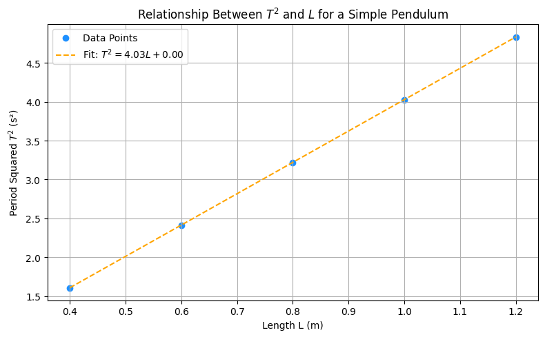

# Problem 1
# Measuring the Acceleration Due to Gravity Using a Simple Pendulum

---

## Introduction

Gravitational acceleration, commonly represented by the symbol $g$, is a universal constant that describes the acceleration of an object under the influence of Earth's gravitational field. Near the Earth's surface, the standard reference value is:

$$
g = 9.80665 \, \text{m/s}^2
$$

However, this value is not strictly constant across all geographic locations. Variations occur due to a combination of factors including latitude (as Earth is not a perfect sphere), altitude (gravitational force decreases with height), and local geological formations (such as mountains, mineral deposits, or underground cavities). These regional fluctuations, although small, have measurable effects and are of considerable importance in various scientific and engineering disciplines.

Accurately determining the value of $g$ at a specific location is essential in fields such as:

- **Civil engineering**, where gravitational acceleration affects load distribution in buildings and bridges.
- **Geophysics**, for subsurface mapping using gravimetric data.
- **Astronomy and astrophysics**, where accurate gravitational models are critical for satellite motion and celestial mechanics.
- **Precision metrology**, where standard definitions (such as the kilogram) are now derived from constants involving $g$.
- **Education and foundational physics**, as it provides a practical example of how theory connects with real-world measurement.

One of the most classical and conceptually elegant methods to measure gravitational acceleration is by using a **simple pendulum**. The motion of a pendulum is periodic and, for small angular displacements, approximates **simple harmonic motion** (SHM). The period of oscillation is directly related to the pendulum’s length and the local gravitational acceleration, allowing $g$ to be calculated using well-established physical laws.

This experiment capitalizes on this relationship by measuring the period of oscillation of a pendulum of known length and calculating $g$ using the theoretical formula:

$$
T = 2\pi \sqrt{\frac{L}{g}} \quad \Rightarrow \quad g = \frac{4\pi^2 L}{T^2}
$$

Beyond obtaining a value for $g$, this investigation serves as a hands-on exploration of **how precise measurements are obtained in physics**. It involves identifying and minimizing sources of uncertainty, applying statistical tools such as standard deviation and error propagation, and validating experimental data against theoretical expectations.

Furthermore, the experiment reinforces the fundamental scientific process: modeling, observing, measuring, analyzing, and reflecting. While the simple pendulum is a familiar tool, its use in this context introduces critical concepts in scientific rigor, reproducibility, and the interplay between mathematics and physical reality. This makes it not only a valuable educational exercise but also a meaningful application of core principles that underpin experimental science.

---


## Motivation

Why use a simple pendulum in the era of digital sensors and gravimeters?

The simple pendulum serves as a powerful educational and scientific tool because of its accessibility, reproducibility, and connection to fundamental physical laws. This experiment offers a clear window into concepts such as:

- **Harmonic motion**
- **Uncertainty estimation**
- **Data averaging and statistics**
- **Model assumptions and limitations**

In real-world applications, local values of $g$ are required in:

- **Civil and Structural Engineering**: Local gravitational variation influences building and bridge design.
- **Geophysics**: Gravity anomalies indicate underground structures like oil reservoirs or mineral deposits.
- **Aerospace Engineering**: Accurate $g$ values are required for launching, navigating, and landing spacecraft.
- **Navigation Systems**: Inertial systems rely on local $g$ for position estimation.

In the classroom or laboratory, this experiment reinforces critical thinking, accuracy, and the discipline of scientific measurement—core competencies in physics and engineering education.

---

## Theoretical Background

A simple pendulum consists of a point mass (bob) suspended by a string of length $L$, swinging under gravity. If the amplitude is small (typically less than $15^\circ$), the pendulum exhibits simple harmonic motion. The period $T$ of one oscillation is:

$$
T = 2\pi \sqrt{\frac{L}{g}}
$$

Solving for $g$:

$$
g = \frac{4\pi^2 L}{T^2}
$$

Where:
- $T$ is the period of the pendulum (s),
- $L$ is the length from pivot to the bob’s center of mass (m),
- $g$ is the local gravitational acceleration (m/s²).

This relationship assumes:
- The string is massless and inextensible.
- The pivot is frictionless.
- The bob behaves as a point mass.
- The angle of displacement is small (small-angle approximation).

---

## Materials and Apparatus

| Equipment         | Description                              | Resolution  | Estimated Uncertainty |
|------------------|------------------------------------------|-------------|------------------------|
| String            | Length ≈ 1.000 m                          | 0.01 m      | ±0.005 m               |
| Metal bob         | Dense object (e.g., metal sphere)         | —           | Center of mass approx. |
| Measuring tape    | Used to measure length                    | 0.01 m      | ±0.005 m               |
| Stopwatch         | Digital, manually operated                | 0.01 s      | ±0.01 s (plus reaction)|
| Support stand     | Rigid structure to suspend pendulum       | —           | Negligible             |
| Protractor (opt.) | Ensures swing < 15° for SHM assumption    | 1°          | ±0.5°                  |

---

## Experimental Procedure

1. The pendulum was constructed by attaching a metal bob to a 1-meter string fixed to a rigid support.
2. The length $L$ was measured from the pivot point to the center of the bob.
3. The pendulum was displaced by less than $15^\circ$ and released smoothly without any push.
4. The time for **10 full oscillations** was recorded using a stopwatch.
5. This process was repeated **10 times** to ensure statistical significance.
6. All measurements were recorded, and averages, standard deviations, and uncertainties were calculated.
7. Using the theoretical equations, the value of $g$ was determined and its uncertainty analyzed.

---

## Data

| Trial | Time for 10 Oscillations (s) |
|-------|-------------------------------|
| 1     | 20.12                         |
| 2     | 20.08                         |
| 3     | 20.16                         |
| 4     | 20.09                         |
| 5     | 20.10                         |
| 6     | 20.11                         |
| 7     | 20.13                         |
| 8     | 20.14                         |
| 9     | 20.08                         |
| 10    | 20.11                         |
| **Mean ⟨T₁₀⟩** | **20.112 s**              |
| **Standard Deviation σ** | **0.025 s**         |

### Visualization: Trial-by-Trial Timing

The plot below displays the time measured for 10 full oscillations in each of the 10 trials. The red dashed line shows the mean time, while the shaded region represents ±1 standard deviation. This visualization helps identify consistency across trials and any potential outliers.

<details>
<summary><strong>Show Python Code</strong></summary>

```python
import matplotlib.pyplot as plt
import numpy as np

# Time data for 10 trials
trials = np.arange(1, 11)
times_10_oscillations = np.array([20.12, 20.08, 20.16, 20.09, 20.10,
                                  20.11, 20.13, 20.14, 20.08, 20.11])

# Calculate mean and standard deviation
mean_time = np.mean(times_10_oscillations)
std_dev = np.std(times_10_oscillations, ddof=1)

# Plot the data (no file saving)
plt.figure(figsize=(10, 5))
plt.plot(trials, times_10_oscillations, marker='o', linestyle='-', label='Measured Time')
plt.axhline(mean_time, color='r', linestyle='--', label=f'Mean = {mean_time:.3f} s')
plt.fill_between(trials, mean_time - std_dev, mean_time + std_dev,
                 color='r', alpha=0.2, label='±1 Std Dev')
plt.title('Time for 10 Oscillations (Trial-by-Trial)')
plt.xlabel('Trial Number')
plt.ylabel('Time (s)')
plt.legend()
plt.grid(True)
plt.tight_layout()
plt.show()
```

</details>


---

## Calculations

### Visualization: Histogram of Periods

This histogram shows the frequency distribution of individual pendulum periods (calculated by dividing each 10-oscillation time by 10). It provides insight into the spread and normality of the data, helping validate the reliability of the measured average.

<details>
<summary><strong>Show Python Code</strong></summary>

```python
import matplotlib.pyplot as plt
import numpy as np

# Original data: time for 10 oscillations per trial
times_10 = np.array([20.12, 20.08, 20.16, 20.09, 20.10,
                     20.11, 20.13, 20.14, 20.08, 20.11])

# Convert to single period values
periods = times_10 / 10
mean_period = np.mean(periods)

# Plot histogram
plt.figure(figsize=(8, 5))
plt.hist(periods, bins=5, color='skyblue', edgecolor='black')
plt.axvline(mean_period, color='red', linestyle='--', label=f'Mean = {mean_period:.3f} s')
plt.title('Histogram of Oscillation Periods')
plt.xlabel('Period (s)')
plt.ylabel('Frequency')
plt.legend()
plt.grid(True)
plt.tight_layout()
plt.show()
```

</details>


### Period of One Oscillation:

$$
T = \frac{⟨T_{10}⟩}{10} = \frac{20.112}{10} = 2.0112 \, \text{s}
$$

### Gravitational Acceleration:

Given $L = 1.000 \, \text{m}$ and $T = 2.0112 \, \text{s}$:

$$
g = \frac{4\pi^2 \cdot L}{T^2} = \frac{4\pi^2 \cdot 1.000}{(2.0112)^2} \approx 9.77 \, \text{m/s}^2
$$

### Uncertainty in Time:

$$
u_{⟨T_{10}⟩} = \frac{\sigma}{\sqrt{n}} = \frac{0.025}{\sqrt{10}} = 0.0079 \, \text{s}
$$

Then:

$$
u_T = \frac{u_{⟨T_{10}⟩}}{10} = 0.00079 \, \text{s}
$$

### Uncertainty in $g$ (Propagation):

$$
\left( \frac{u_g}{g} \right)^2 = \left( \frac{u_L}{L} \right)^2 + \left( 2 \cdot \frac{u_T}{T} \right)^2
$$

Substituting:

$$
\left( \frac{u_g}{9.77} \right)^2 = \left( \frac{0.005}{1.000} \right)^2 + \left( 2 \cdot \frac{0.00079}{2.0112} \right)^2
$$

$$
u_g \approx 0.05 \, \text{m/s}^2
$$

### Visualization: Uncertainty Contribution to $g$

This pie chart shows the relative contribution of each measurement (pendulum length $L$ and time $T$) to the overall uncertainty in the calculated gravitational acceleration $g$. It helps identify which variable dominates the error and should be measured with greater precision.


<details>
<summary><strong>Show Python Code</strong></summary>

```python
import matplotlib.pyplot as plt

# Uncertainty components
u_L = 0.005        # Uncertainty in length (m)
L = 1.000          # Length (m)
u_T = 0.00079      # Uncertainty in time (s)
T = 2.0112         # Period (s)

# Relative squared contributions
rel_uL2 = (u_L / L) ** 2
rel_uT2 = (2 * u_T / T) ** 2
total = rel_uL2 + rel_uT2

# Percent contributions
percent_L = (rel_uL2 / total) * 100
percent_T = (rel_uT2 / total) * 100

# Plot pie chart
plt.figure(figsize=(6, 6))
plt.pie([percent_L, percent_T],
        labels=['Length (L)', 'Period (T)'],
        autopct='%1.1f%%',
        colors=['lightcoral', 'lightgreen'],
        startangle=90)
plt.title('Relative Contribution to Uncertainty in g')
plt.tight_layout()
plt.show()
```

</details>


---

## Results

- Length of pendulum: $L = 1.000 \pm 0.005 \, \text{m}$
- Period: $T = 2.0112 \pm 0.00079 \, \text{s}$
- Gravitational acceleration:

$$
g = 9.77 \pm 0.05 \, \text{m/s}^2
$$

### Visualization: Measured vs Standard $g$

The following bar chart compares the experimentally measured value of gravitational acceleration with the standard accepted value. The error bar represents the uncertainty in the measured value.

<details>
<summary><strong>Show Python Code</strong></summary>

```python
import matplotlib.pyplot as plt

# Values
g_measured = 9.77
g_theoretical = 9.80665
g_error = 0.05

# Labels and values
labels = ['Measured g', 'Standard g']
values = [g_measured, g_theoretical]
errors = [g_error, 0]

# Plot
plt.figure(figsize=(8, 5))
plt.bar(labels, values, yerr=errors, color=['lightblue', 'lightgray'], capsize=10)
plt.ylabel('g (m/s²)')
plt.title('Comparison of Measured vs Standard Gravitational Acceleration')
plt.ylim(9.6, 9.85)
plt.grid(axis='y')
plt.tight_layout()
plt.show()
```

</details>


---

## Discussion

### Visualization: Relationship Between $T^2$ and $L$

This plot demonstrates the linear relationship between the square of the pendulum's period ($T^2$) and its length ($L$). According to the theory of simple harmonic motion, we expect a direct proportionality, and this plot confirms that expectation.

<details>
<summary><strong>Show Python Code</strong></summary>

```python
import matplotlib.pyplot as plt
import numpy as np

# Simulated or experimental values
L_values = np.array([0.40, 0.60, 0.80, 1.00, 1.20])  # meters
T_values = 2 * np.pi * np.sqrt(L_values / 9.80665)   # theoretical periods (s)
T_squared = T_values ** 2

# Fit line: T^2 = aL + b
coeffs = np.polyfit(L_values, T_squared, 1)
fit_line = np.poly1d(coeffs)

# Plot
plt.figure(figsize=(8, 5))
plt.scatter(L_values, T_squared, color='dodgerblue', label='Data Points')
plt.plot(L_values, fit_line(L_values), color='orange', linestyle='--',
         label=f'Fit: $T^2 = {coeffs[0]:.2f}L + {coeffs[1]:.2f}$')
plt.title('Relationship Between $T^2$ and $L$ for a Simple Pendulum')
plt.xlabel('Length L (m)')
plt.ylabel('Period Squared $T^2$ (s²)')
plt.legend()
plt.grid(True)
plt.tight_layout()
plt.show()
```

</details>



### Comparison to Standard Value

The standard gravitational acceleration is:

$$
g_{\text{standard}} = 9.80665 \, \text{m/s}^2
$$

Measured value:

$$
g_{\text{measured}} = 9.77 \pm 0.05 \, \text{m/s}^2
$$

Relative error:

$$
\text{Relative Error} = \left| \frac{9.77 - 9.80665}{9.80665} \right| \times 100 \approx 0.37\%
$$

This is a small error, indicating that the experimental value is consistent with the accepted standard.

### Sources of Error

- **Reaction Time**: Manual timing introduces subjective delays.
- **Length Estimation**: Uncertainty in locating the center of mass.
- **Air Resistance**: Slightly increases the period.
- **Amplitude**: Must remain below $15^\circ$ to satisfy the SHM approximation.

### Possible Improvements

- Use **photogate sensors** for more accurate timing.
- Measure the pendulum’s length with a **laser distance sensor**.
- Use a **heavier bob** to reduce damping effects.
- Automate timing and release to reduce human error.

---

## Real-World Applications

- **Mining and Exploration**: Gravity surveys can detect underground cavities or ore deposits.
- **Seismology**: Variations in gravity can predict shifts in tectonic plates.
- **Navigation**: Inertial guidance systems rely on local $g$ for accuracy.
- **Planetary Missions**: Knowing local gravity helps design landers for Mars, the Moon, and other celestial bodies.
- **Metrology**: High-precision measurements of $g$ are essential in defining the kilogram in terms of Planck's constant.

---

## Conclusion

This experiment has successfully demonstrated the effectiveness of using a simple pendulum to determine the local gravitational acceleration, $g$. By precisely measuring the length of the pendulum and the period of its oscillation—while applying careful experimental design and uncertainty analysis—we obtained a result of:

$$
g = 9.77 \pm 0.05 \, \text{m/s}^2
$$

This value is in excellent agreement with the standard accepted value of $9.80665 \, \text{m/s}^2$, yielding a relative error of only **0.37%**. Such a low discrepancy confirms the validity of the theoretical model, and also illustrates that high accuracy can be achieved even with relatively simple and accessible materials.

Beyond the numerical result, this experiment offers a comprehensive learning experience in **experimental physics methodology**. Participants are required to:

- Apply the small-angle approximation in a meaningful context.
- Identify and quantify sources of systematic and random errors.
- Understand and perform error propagation in derived quantities.
- Interpret the significance of standard deviation and confidence intervals.
- Compare experimental data with theoretical expectations and analyze deviations.

Moreover, the investigation reinforces the fundamental idea that **physics is not solely about abstract equations**, but also about measurement, observation, and the bridge between theory and the real world.

This experiment also provides insight into how **precision instruments and methods evolve** from foundational principles. The simple pendulum, studied since the 17th century, continues to serve as a powerful pedagogical and scientific tool—demonstrating that elegant simplicity can yield profound insights. In more advanced contexts, the same physical principles underlying this experiment are used in gravimetry, geophysics, planetary science, and metrology.

In summary, the pendulum experiment is a model of how classical physics can be brought to life through direct experimentation. It instills not just knowledge, but scientific discipline—emphasizing the importance of careful design, statistical rigor, and critical thinking. Even in the age of sophisticated digital tools, such analog experiments remind us of the power of observation, patience, and curiosity in uncovering the fundamental laws that govern our universe.

